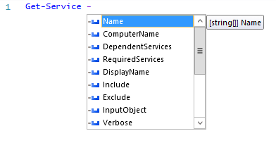
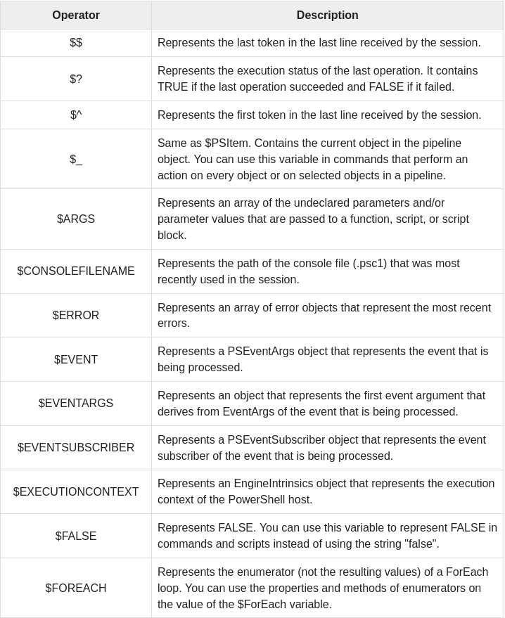
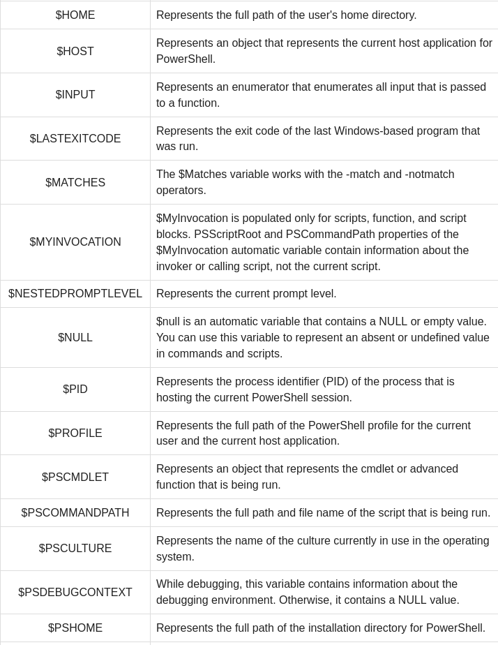
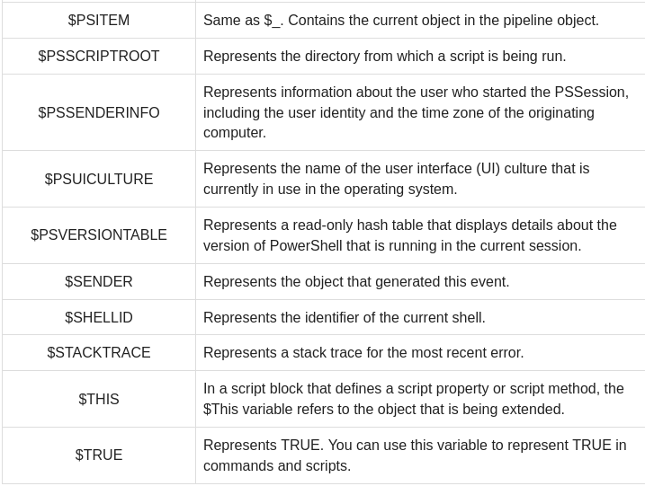
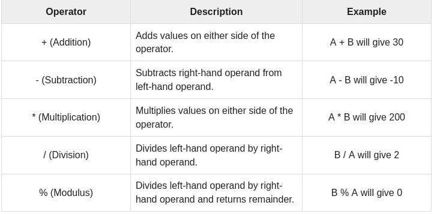
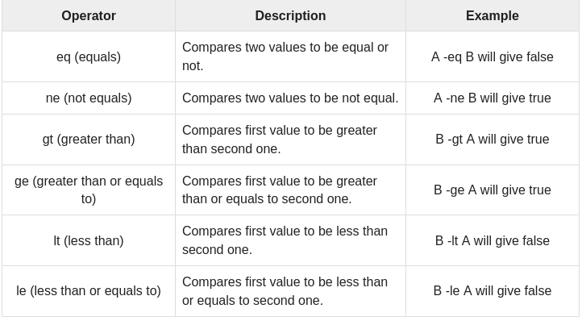
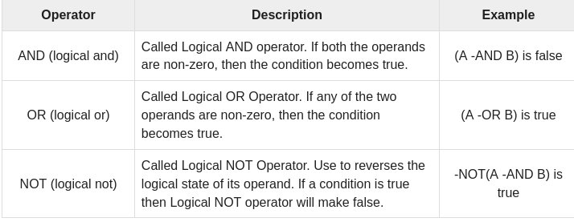

# WINDOWS POWERSHELL SCRIPTING


## PLAN

[POWERSHELL](#powershell)<br>
[LES SCRIPTS](#les-scripts)
- [FORMAT DE CMDLET](#format-de-cmdlet) 
- [LES PARAMETRES](#les-parametres)
- [LES COMMENTAIRES](#les-commentaires)
- [LES OPERATEURS](#les-operateurs)
    - [LES OPERATEURS ARITHMETIQUES](#les-operateurs-arithmetiques)
    - [LES OPERATEURS DE COMPARAISON](#les-operateurs-de-comparaison)<br>
- [LES DROITS D'EXECUTION](#les-droits-d-execution)<br>

[LA CONDITION IF / ELSE](#la-condition-if-/-else)<br>
[LES BOUCLES](#les-boucles)
- [FOR / FOR EACH](#for-/-for-each)
- [WHILE / UNTIL](#while-/-until)
  
[LE SWITCH](#le-switch)<br>
[LES TABLEAUX](#les-tableaux)

## POWERSHELL

Pour l'explication sur les différents SHELL: https://gitlab.com/cours2021/commandes-base-windows#powershell

## LES SCRIPTS

Les scripts interprétables par POWERSHELL sont de type .ps1.
Comme Linux, les scripts contiennent une succession de commandes, sur Windows elles sont appelées cmdlets.
Une cmdlet est une commande PowerShell qui a une fonction prédéfinie, comme un opérateur dans un langage de programmation. Voici quelques informations importantes concernant les cmdlets :

- Il existe des cmdlets système, utilisateur et personnalisés.
- Les cmdlets fournissent des résultats sous forme d’objet ou de tableau d’objets.
- Les cmdlets peuvent obtenir des données à analyser ou transférer des données vers un autre cmdlet par le biais de canaux (je reviendrai sur ces canaux – ou pipes – dans un instant).
- Les cmdlets sont « insensibles à la casse ». C’est-à-dire que les majuscules et minuscules n’ont aucune importance, vous pouvez tout aussi bien taper « Get-ADUser », « get-aduser » ou « gEt-AdUsEr ».
- Si vous voulez utiliser plusieurs cmdlets dans une même chaîne, vous devez les séparer par un point-virgule (;).

### FORMAT DE CMDLET

Un cmdlet se compose toujours d’un verbe (ou d’un mot qui fait office de verbe) et d’un nom, séparés par un trait d’union (c’est la règle « verbe-nom »). Voici quelques exemples de verbes :

- Get — pour obtenir quelque chose
- Set — pour définir quelque chose
- Start — pour exécuter quelque chose
- Stop — pour arrêter quelque chose en cours d’exécution
- Out — pour générer quelque chose
- New — pour créer quelque chose (« new » n’est pas un verbe, mais il fonctionne comme un verbe)

Exemples:
```powershell
Get-services
Get-Process
Get-Content "C:\Windows\System32\drivers\etc\hosts"
```

### LES PARAMETRES

Chaque cmdlet est assorti de plusieurs paramètres qui permettent de personnaliser son action. Dès que vous avez tapé un cmdlet et un trait d’union (-), l’ISE PowerShell propose automatiquement tous les paramètres valides et leurs types:



Exemples:
```powershell
Get-Service -Name W*
```

### LES COMMENTAIRES

Exemples:
```powershell
# Ceci est un commentaire sur une ligne

Get-Services

<# Ceci est un bloc 
de plusieurs lignes 
commenté
#>
```

### LES OPERATEURS







#### LES OPERATEURS ARiTHMETIQUES

Ces opérateurs sont utilisés pour éffectuer des opérations arithmétiques.



#### LES OPERATEURS DE COMPARAISON

Les opérateurs de comparaison sont utilisés pour comparer des valeurs ou des chaînes de caractèteres entre elles ou vis-à-vis d'expréssions régulières (Modèles spécifiques appelés REGEX)

##### COMPARAISON DE VALEURS:



##### COMPARAISON DE CHAINES DE CARACTÈRES:

Les opérateurs correspondants ( -like , -notlike , -match et -notmatch ) recherchent les éléments qui correspondent ou ne correspondent pas à un modèle spécifié:

- Matching<br>	
    -like 	la chaîne correspond au modèle de caractère générique<br>
	-notlike 	la chaîne ne correspond pas au modèle de caractère générique<br>
	-match 	la chaîne correspond au modèle Regex<br>
	-notmatch 	la chaîne ne correspond pas au modèle Regex<br>

- Remplacement<br>	
    -remplacer 	remplace les chaînes correspondant à un modèle Regex<br>

- Containment<br>	
    -contains 	la collection contient une valeur<br>
	-notcontains 	la collection ne contient pas de valeur<br>
	-in 	la valeur se trouve dans une collection<br>
	-NOTIN 	la valeur ne se trouve pas dans une collection<br>

- Type<br>	
    -est 	les deux objets sont du même type<br>
	-IsNot 	les objets ne sont pas du même type<br>

Exemples:
```powershell
"PowerShell" -like "*shell"        # Output: True
"PowerShell" -like  'shell'        # Output: False
"PowerShell" -match 'shell'        # Output: True
# Regex syntax test
"PowerShell" -match    '^Power\w+' # Output: True
```


#### LES OPERATEURS LOGIQUES



### LES DROITS D EXECUTION

Comme sur Linux, les scripts peuvent avoir des droits restreints au niveau de leur éxecution.
On en distingue principalement quatres:

- Restricted — (Mode restreints) qui stoppe tout les scripts en cours d'éxécution
- RemoteSigned — Autorise les scripts créés sur la machine qui les éxécute, pour les scriprs provenants d'autres machines il faut fournir une "trusted publisher's signature".
- AllSigned — Tout les scripts s'éxécuteront tant qu'ils possèdent une "trusted publisher's signature".
- Unrestricted — Aucune restriction sur l'éxécution de script.

pour changer le mode dans la console windows:
```powershell
Set-ExecutionPolicy [mode]
```

Référence: https://docs.microsoft.com/fr-fr/powershell/scripting/samples/sample-scripts-for-administration?view=powershell-7.2

## LA CONDITION IF / ELSE

La structure du IF est similaire que pour Linux:
```powershell
$condition = $true
if ( $condition )
{
    Write-Output "La condition était vrai"
}
```

If / Else:
```powershell
$x = 20
if ( $x -lt 10 )
{
    Write-Output "La valeur de x est plus petite que 10"
}
else
{
    Write-Output "La valeur de x est plus grande que 10"
}
```

If / Else if / Else:
```powershell
$x = 10
if ( $x -lt 10 )
{
    Write-Output "La valeur de x est plus petite que 10"
}
else if ( $x -gt 10 )
{
    Write-Output "La valeur de x est plus grande que 10"
}
else
{
    Write-Output "La valeur de x est 10"
}
```

## LES BOUCLES

### FOR / FOR EACH

Exemple de boucle FOR:
```powershell
for ( $index = 0; $index -lt $tableau.count; $index++)
{
    "Item: [{0}]" -f $tableau[$index]
}
```

Exemple de boucle FOR EACH:
```powershell
foreach ( $element in $tableau )
{
    "Item: [$element]"
}
```

### WHILE / UNTIL

La boucle WHILE:
```powershell
$i=1
Do 
{
    $i
    $i++
}
While ($i -le 10)
```

La boucle UNTIL:
```powershell
$i=1
Do 
{
    $i
    $i++
}
Until ($i -gt 10)
```

## LE SWITCH

Comme dans tout langage à l'exception du mot réservé CASE qui n'apparaît pas.

Exemple:
```powershell
$data = 'un','deux','trois','quatre'
switch( $data )
{
    'un'
    {
        'Tock'
    }
    'trois'
    {
        'Tock'
    }
    Default
    {
        'Tick'
    }
}
```

## LES TABLEAUX

### TABLEAU SIMPLE

Les tableaux en powershell fonctionnent de la même manière qu'en Linux bash, pour obtenir sa taille en indices, une fonction tableau.count éxiste.

Ils peuvent se déclarer de cette manière:
```powershell
$tableau = @('zero','un','deux','trois')
```

ou encore de celle-ci:
```powershell
$tableau = @(
    'zero'
    'un'
    'deux'
    'trois'
)
```

Accéder à un élément d'un index:
```powershell
Write-Output $tableau[0]
```
* Note: En powershell nous pouvons aussi utiliser des index négatif partant de la fin du tableau (dernier index):
```powershell
Write-Output $tableau[-1]
```

Ajouter un élément au tableau à la suite du dernier index:
```powershell
$tableau += 'quatre'
```

Ajouter un élément au tableau à un index spécifique:
```powershell
$tableau[4] = 'quatre'
```

#### LES TABLES DE HASHAGE / TABLEAUX D'OBJETS

Référence: https://docs.microsoft.com/fr-fr/powershell/scripting/learn/deep-dives/everything-about-arrays?view=powershell-7.2