# WINDOWS ADMIN

## PLAN

[INTRODUCTION](#introduction)  
[INSTALLATION](#installation)  
[GESTION](#gestion)
- [UTILISATEURS](#utilisateurs)
- [DISQUES](#disques)
- [FICHIERS](#fichiers)
- [SERVICES](#services) 
  
[VARIABLES D'ENVIRONNEMENT](#variables-d-environnement)  
[REGISTRE WINDOWS](#registre-windows)
- [LES RUCHES SYSTEMES](#les-ruches-systemes)
- [LES RUCHES UTILISATEURS](#les-ruches-utilisateurs)
- [LES CLEFS AUTORUN](#les-clefs-autorun)
- [LES CLEFS APPLICATIVES](#les-clefs-applicatives)
- [LES CLEFS SHELL](#les-clefs-shell)
- [SAUVEGARDER LA BASE DE REGISTRE](#sauvegarder-la-base-de-registre) 

[WINDOWS ADMIN CENTER](#admin-center)
- [INSTALLATION](#installation-admin-center)
- [UTILISATION](#utilisation-admin-center) 

## INTRODUCTION

### AVANT WINDOWS

MS-DOS (abréviation de Microsoft Disk Operating System) est le système d'exploitation de type DOS développé par Microsoft pour l'IBM PC d'abord, puis pour les compatibles PC. Il s'agit d'un système fonctionnant en mode réel, monotâche et mono-utilisateur, et équipé par défaut d'une interface en ligne de commande. Des années 1980 au début des années 1990, il a été le système le plus utilisé sur compatible PC, avant d'être progressivement remplacé par des systèmes d'exploitation plus évolués, notamment Windows.

MS-DOS est longtemps resté la base des systèmes d'exploitation grand public de Microsoft, bien que l'installation de Windows en modifie in-situ des portions de plus en plus grandes. En 1995, date d'apparition de Windows 95, il devient invisible pour les utilisateurs car l'interface graphique était directement exécutée au démarrage. MS-DOS est resté une sous-couche des versions grand-public de Windows (comme Windows 98 et Me) jusqu'à l'avènement de Windows XP qui marque son abandon réel par Microsoft au profit du système NT. Le DOS en était alors à sa version 8.

### WINDOWS

Inspirées d'interfaces comme celles du Xerox Alto, puis du Apple Lisa et du Macintosh d'Apple, les premières versions de Windows, en 16 bits, s'appuyaient sur l'OS existant : MS-DOS. Celui-ci ayant été conçu monotâche, on y lançait Windows comme un simple programme, qui incorporait dès lors quelques-unes de ses fonctions (comme le tracking de la souris au système). La limitation intrinsèque propre au monotâche, ainsi que le côté marginal de Windows 1 (dont les fenêtres ne faisaient que partager l'écran sans superpositions) n'inquiétèrent pas alors le rival Apple, plus préoccupé de la stratégie d'IBM.

#### Xerox Alto:

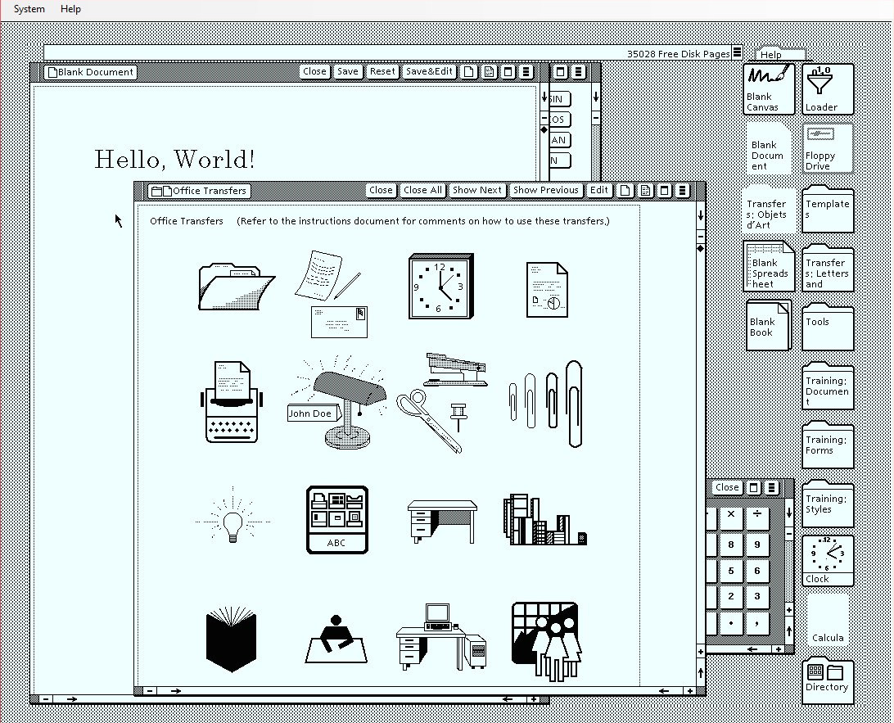

IBM ne pensait pas l'usage du mode graphique viable avec la limitation à 640 K du DOS ni la faible résolution des écrans de l'époque et s'orienta vers un multi-fenêtrage en mode texte, Topview, très réactif, mais gardant l'inconfort du DOS.

La version 2 de Windows (1987) déclencha de la part d'Apple un procès pour contrefaçon. Mais Apple le perdit (en appel) à cause du précédent de l'Alto (contre Digital Research). Apple continua tout de même de menacer Microsoft, ce qui aboutit en 1997 à un règlement à l'amiable : Microsoft produirait Office et Internet Explorer pour Mac OS et prendrait une part des actions Apple à hauteur de 6%.

#### Apple Lisa:

Sorti en 1990, Windows 3 intégra trois versions livrées simultanément : une en mode 8086 (16 bits simples), une seconde en mode 80286 (16 bits avec adressage étendu) et une troisième en mode 80386 (adressage 32 bits). L'appel de la commande win depuis le DOS effectuait quelques tests système et lançait automatiquement la version jugée la plus appropriée, sauf demande expresse de l'utilisateur au moyen de paramètres. La version du DOS était elle aussi testée, afin de substituer autant de fonctions Windows que possible à celle du DOS, qui ne servait plus guère que de lanceur et d'implanter les vecteurs d'appel aux bons endroits. Son usage d'Adobe Type Manager rendait déjà la qualité d'affichage bien meilleure.

#### Windows 3:

La version 3.1 poussa cette qualité un peu plus loin en remplaçant Adobe Type Manager par TrueType. Une version 3.11 (Windows for Workgroups) intégra même de façon native l'usage du réseau local.

Ces versions avaient peu à peu fini par intégrer un noyau, un shell propre similaire au DOS et des utilitaires de gestion du DOS, en plus de l'interface graphique qui donna son nom au système d'exploitation. Elles furent donc considérées comme les successeurs de MS-DOS, avec le confort que chaque périphérique comme chaque application n'avait besoin dès lors que du driver Windows, ce qui simplifiait considérablement la gestion de ceux-ci.

Avec Windows 95, l'OS, épaulé par une importante campagne de publicité grand public, rencontre un grand succès, dû en partie au fait que son éditeur a passé de très nombreux accords d'exclusivité avec les constructeurs d'ordinateurs leur interdisant d'installer un autre système sous peine de sanctions financières5. Il est vendu préinstallé sur la quasi-totalité des ordinateurs personnels.

Windows NT commencé en 1993, permet à Microsoft d'asseoir Windows dans les entreprises, suivi par Windows 2000.

#### windows 2000:

Windows 2000 est un système d'exploitation 32 bits développé et distribué par Microsoft. Le nom Windows 2000 est en fait le nom commercial de la version 5.0 de Windows NT. Elle est sortie le 17 février 2000 et a succédé à Windows NT 4.0, créé 4 ans auparavant en avril 1996.
La presse fut tout de suite unanime pour dire que ce produit était le système d'exploitation le plus stable que Microsoft ait jamais produit.

CONFIGURATION REQUISE :
Un processeur Intel Pentium ou équivalent cadencé à 133 MHz, 32 Mo de RAM, une carte graphique supportant la résolution VGA (640 × 480 pixels en 16 couleur) et 1 Go d'espace disque.

Se suivent Windows Server 2003, Windows Server 2008, Windows Server 2008 R2, Windows Server 2012, Windows Server 2012 R2 et enfin :

Windows Server 2016 est un système d'exploitation pour serveurs x64 de Microsoft, faisant partie de la famille Windows NT destinée aux serveurs d'entreprise. Il est connu aussi sous le nom « Windows Server vNext ».
La première version en Technical Preview est sortie le 1er octobre 2014 en même temps que System Center 2016. La cinquième version de preview est disponible depuis fin avril 2016. Windows Server 2016 est sorti le 5 octobre 2016.

Parmi les nouvelles fonctionnalités figurent l'utilisation de containers (avec fonction d'isolation), les microservices et le cloud hybride.

Il utilise le noyau Windows NT 10.0, au même titre que Windows 10, ce qui fait qu'il ressemble visuellement à Windows 10.

## INSTALLATION

L’installation de Windows server 2016 nécessite quelques pré-requis comme tout OS :

- <a href="https://docs.microsoft.com/fr-fr/windows-server/get-started/hardware-requirements">Configuration minimale

- <a href="https://www.microsoft.com/fr-fr/evalcenter/evaluate-windows-server-2019">Image du l’OS

## GESTION

### UTILISATEURS

#### A) CREATION COMPTE

Les groupes sont utiles car ils facilitent la gestion des droits utilisateur. En effet, au lieu d'attribuer des droits similaires à chaque nouvel utilisateur, vous allez pouvoir créer un groupe avec certains droits, puis ajouter des utilisateurs à ce groupe, ce qui fait gagner du temps et permet une segmentation logique plus aisée.

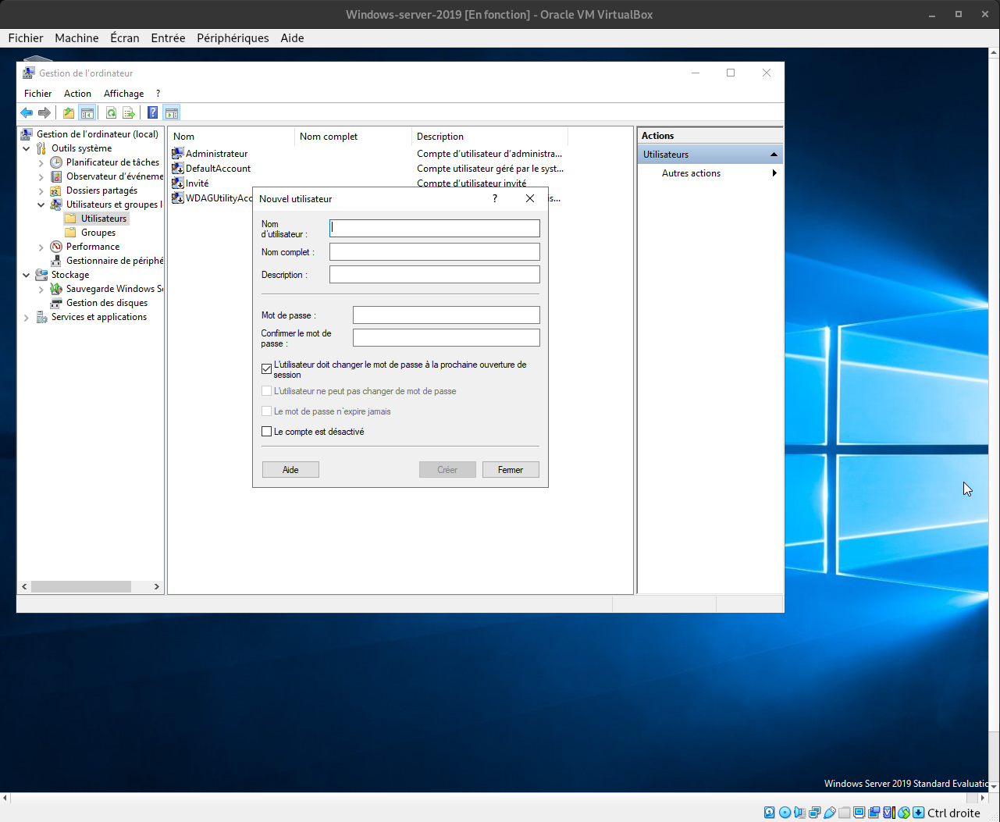
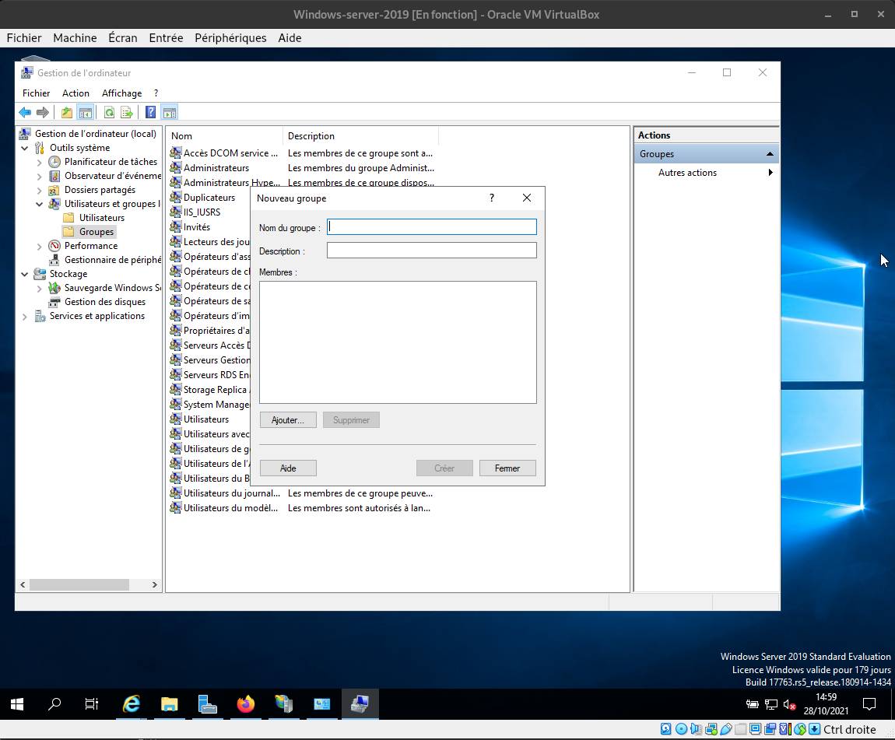

#### B) GESTION DES COMPTES

La gestion des comptes utilisateurs et groupes est dans les outils d'administration -> gestion de l'ordinateur, c'est ici également que se gère les tâches planifiées, les journaux d'évenement, les disques, ainsi que les sauvegarde système en vue d'une éventuelle restauration dans le cadre d'un P.R.E.

## DISQUES

Voici l’interface de gestion des disques où on peut voir le découpage physique par disques, et le
découpage logique à l’intérieur d’un disque : les partitions.

Dans cette interface, nous pouvons créer / supprimer des partitions ainsi que d’en gérer le format de partition, la taille, le nom, etc.

Pour plus d’informations, se référer à la documentation Microsoft :

- <a href="https://support.microsoft.com/fr-fr/windows/aide-de-la-gestion-des-disques-ad88ba19-f0d3-0809-7889-830f63e94405">Pour plus d'informations 

Qu’est-ce que le « hot swap » ?

#### A) MANIPULER LES DISQUES

##### 1) creer partition

Encore une fois, le mode graphique de Windows nous permet d'intéragir simplement avec la souris,
Pour créer une partition, modifier une partition éxistente ou tout autre action sur un disque, un sous-menu est disponible via le clic droit de la souris.

Lors de la créations d'une partition, Windows proposera les formats qu'il prends en charge ainsi qu'un nom et une lettre pour désigner la nouvelle partition.

A la manière de Linux le lettre désigne le point de montage logique pour accéder à la partition dans Windows.

##### 2) redonder le disque 

Le RAID est un ensemble de techniques de virtualisation du stockage permettant de répartir des données sur plusieurs disques durs afin d'améliorer soit les performances, soit la sécurité ou la tolérance aux pannes de l'ensemble du ou des systèmes. 

L'acronyme RAID a été défini en 1987 par l'Université de Berkeley (Californie), dans un article nommé A Case for Redundant Arrays of Inexpensive Disks (RAID), soit « regroupement redondant de disques peu onéreux ». Aujourd'hui, le mot est devenu l'acronyme de Redundant Array of Independent Disks, ce qui signifie « regroupement redondant de disques indépendants ». 
Le coût au mégaoctet des disques durs ayant été divisé par 1 300 000 en 29 ans, aujourd'hui le RAID est choisi pour d'autres raisons que le coût de l'espace de stockage.

Sur Windows, la manipulation se fait par l’intermédiaire du gestionnaire de disques en mode graphique en choisissant l’option Ajouter un disque miroir après un clic droit sur le disque à redonder.

Cette option nécessite au minimum deux disques de taille équivalente en fonction de la redondance désirée, et implique la conversion des disques en type dynamique, soit la perte des données sur les disques.

Pour plus d’informations à propos du principe de redondance de disques et des différents types existants :
https://www.malekal.com/raid-redondance-disques/

##### 2) sauvegarder le disque 

La sauvegarde est une fonctionnalité à activer sur Windows server. Une fois celle-ci disponible dans le gestionnaire de serveur, elle permet de sauvegarder un ou plusieur disque du serveur vers un emplacement local (HDD/DVD) ou vers un emplacement réseau.

 

Ici, il ne reste plus qu’a copier le chemin réseau du lecteur de sauvegarde, choisir le type de contrôle d’accès voulu et enfin lancer la sauvegarde du / des disques.

 

## FICHIERS

#### A) DROITS D'ACCES

La gestion des droits d’accès est inhérent aux compte d’utilisateurs et existent pour plusieurs raisons :
    
- premièrement, distinguer les droits administrateur, car l'administrateur sera le seul à pouvoir modifier les paramètres système de l'OS et les droits des autres utilisateurs.

- deuxièmement, lorsque plusieurs utilisateurs se partagent un même ordinateur, cela permet de séparer l’espace de chacun.

- enfin, si des dossiers sont partagés sur le réseau, cela permet de définir qui a ou n’a pas le droit de consulter ou modifier un fichier.

Essayer de se connecter avec un autre utilisateur et d’explorer le fichier C:\Utilisateurs\administrateur\
→ l’accès est refusé

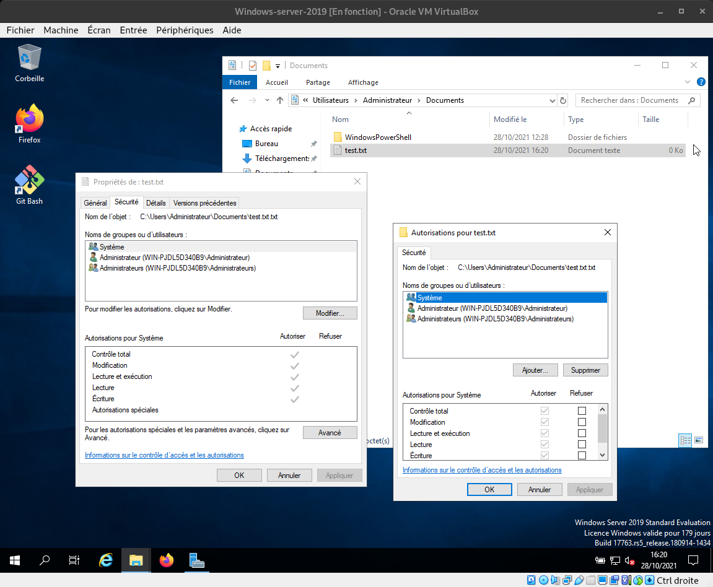 

#### B) LA JOURNALISATION

Windows utilise la journalisation pour pour garder un trace de ce qui se passe sur la machine.
Une fois activé, ce journal permet de connaître les éventuelles raisons de non fonctionnement d'un programme et donc de debuguer celui-ci.

 

#### C) LES VERSIONS DE FICHIERS

Il éxiste une fonctionnalité sur Windows permettant de sauvegarder les fichiers à un instant T, permettant en cas de mauvaise manipulation ou autre de revenir à la version antérieurement sauvegardé.
Cette manipulation s'effectue via un clic droit sur le disque contenant le / les fichier(s) à sauvegarder.

 

Une fois la sauvegarde de version effectué, effacer le contenu du fichier et le sauvegarder (ctr + s). faites un clic doit sur le disque contenant le fichier et sélectionner propriétés, puis aller à l'onglet versions.
Ici s'afficher les différentes versions des fichiers du disque avec la possibilité de l'ouvrir afin de valider avant la restauration.

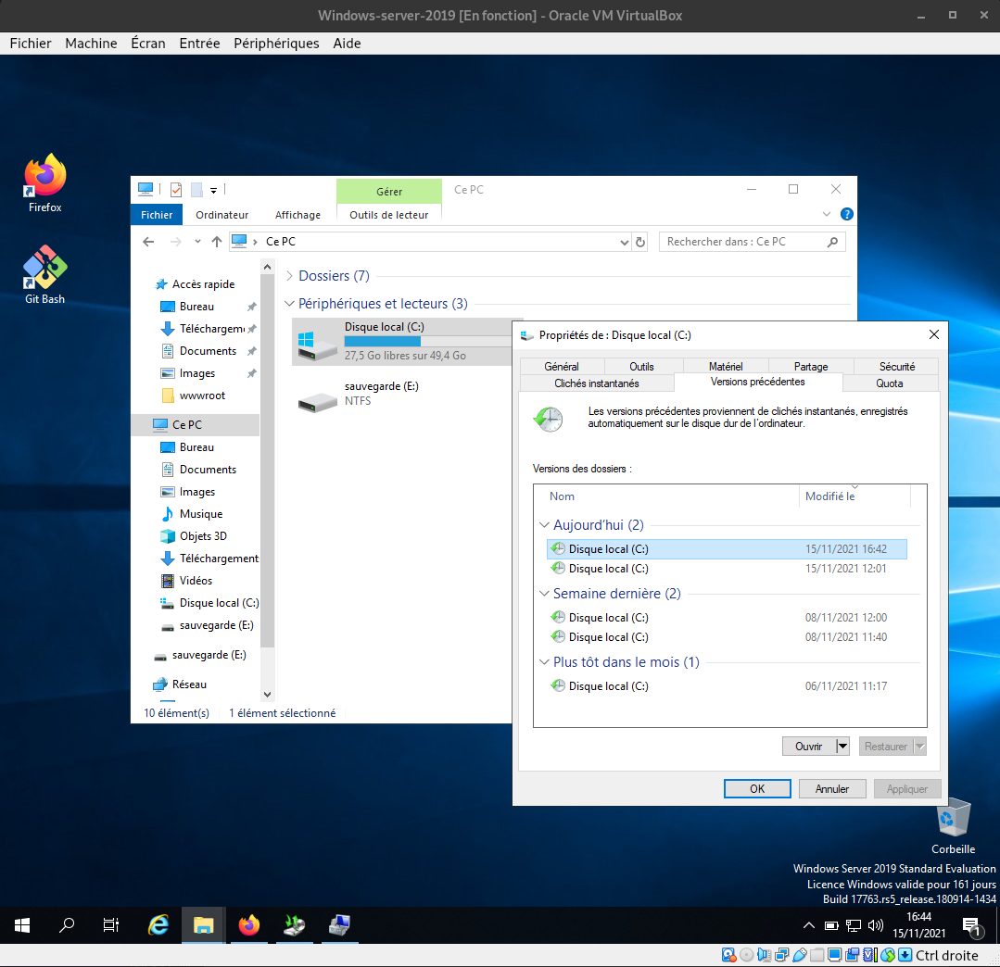 

#### D) LE PARTAGE

Windows offre un système de partage de fichier sur le réseau, conditionné néanmoins par les droits d'accès sur les fichiers (partagé: tout le monde 
Pour partager un disque ou fichier, aller à l'onglet Partage des propriétés du disque ou fichier partagé:

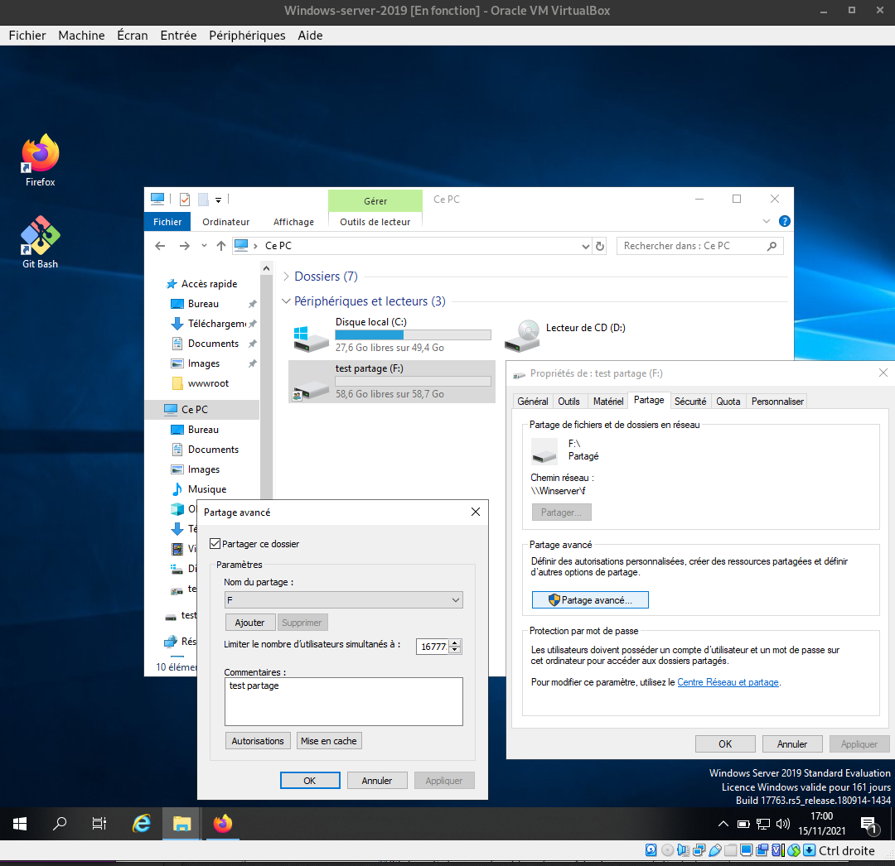 

Une fois le partage configuré, le chemin d'accès s'affiche et la ressource est accéssible via le réseau:

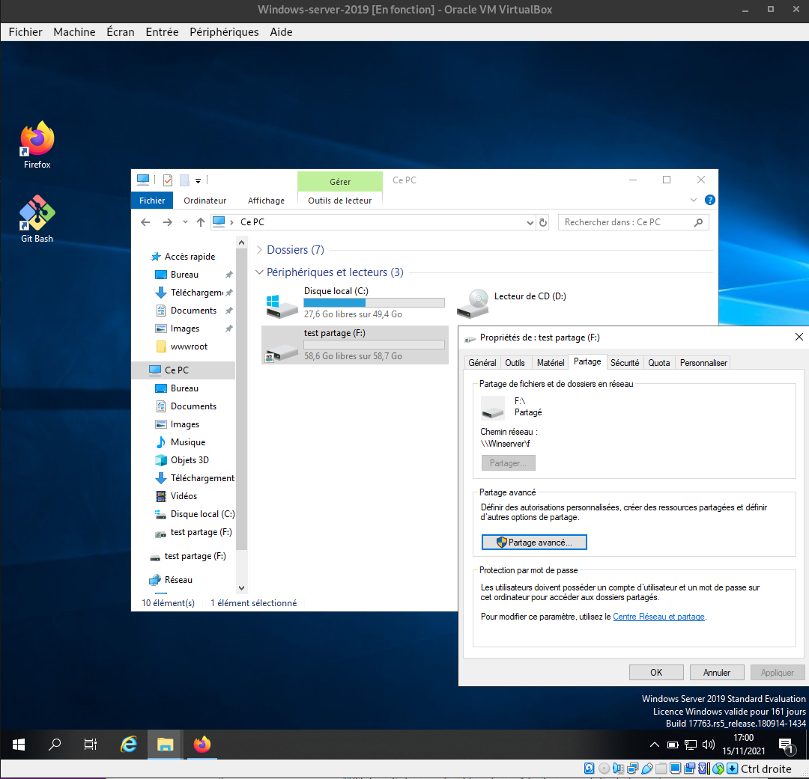 

## SERVICES

Windows liste ces fonctionnalités en tant que services accessibles dans l'outil d'administration, raccourcis services:

 

C'est dans cette rubrique que l'on pourra manipuler les différents services proposés par Windows, les démarrer, les arrêter ou les redémarrer en cas de défaut. 
Le principe est identique aux distributions Linux.

## VARIABLES D ENVIRONNEMENT

Les variables d’environnement de Windows sont les variables stockant des données et qui est propre au Windows installé. D'une installation à une autre, celles-ci sont susceptibles de changer.
Ces variables permettent à Windows de trouver rapidement une donnée importante nécessaire à son exécution.
Par exemple parmi elles, on trouve le chemin des dossiers temporaires, les chemins des différents éxecutables importants.
Pour modifier ces variables, on peut le faire via la commande SET en ligne de commandes ou par l'interface graphique: 

 

 

Parmis les plus utilisées, on trouve:
- %WINDIR% définit le chemin du dossier Windows
- %PROGRAMFILES% définit l'emplacement du dossier Progam Files
- %TEMP% et %TEMP% définissent les chemins du des dossiers des fichiers temporaires.
- %APPDATA% pointe vers le dossier AppData du profil utilisateur courant.
  
Liste complète:
- ALLUSERSPROFILE : stocke le chemin du dossier pour tous les utilisateurs. Par défaut C:\ProgramData
- APPDATA : le chemin de données des applications
- CommonProgramFiles : le chemin communs des applications
- CommonProgramFiles(x86) : même chose mais en version 32-bits
- CommonProgramW6432 : en version 64-bits
- COMPUTERNAME : le nom de l’ordinateur
- DriverData : le répertoire de données des pilotes
- HOMEDRIVE renvoie la lettre de lecteur système. En général C:
- HOMEPATH : le chemin du profil utilisateur
- LOCALAPPDATA : répertoire des données locales des applications
- NUMBER_OF_PROCESSORS : Le nombre de coeur de processeurs
- OS: La version de Windows
- Path : chemin des dossiers où sont des exécutables sont recherchées.
- PROCESSOR_ARCHITECTURE : L’architecture du processeur comme AMD64
- PROCESSOR_IDENTIFIER : L’identifiant du processeur. Ex AMD64 Family 21 Model 112 Stepping 0,AuthenticAMD
- ProgramData : Le dossier de données des applications. Ex : C:\ProgramData
- ProgramFiles : Le dossier d’installation des applications. Ex: C:\Program Files
- ProgramFiles(x86) : Même chose mais en 32-bits. Ex :C:\Program Files (x86)
- ProgramW6432 : Même chose mais en 64-bits : C:\Program Files
- PUBLIC : Le chemin du dossier publique. Par défaut : C:\Users\Public
- SystemDrive : La lettre de lecteur syst_me. En général : C:
- SystemRoot : Le chemin système. En général : C:\WINDOWS
- TEMP : le dossier temporaire de l’utilisateur. ex: C:\Users\maill\AppData\Local\Temp
- TMP : Même chose que précédemment.
- USERDOMAIN : Le nom de l’utilisateur dans le domaine
- USERNAME : Le nom de l’utilisateur
- USERPROFILE : Le chemin du profile
- windir : le répertoire du dossier Windows. En général :C:\WINDOWS

- Schtasks : gestion des tâches planifiées de Windows
- systeminfo : affiche les informations systèmes et matérielles

## REGISTRE WINDOWS

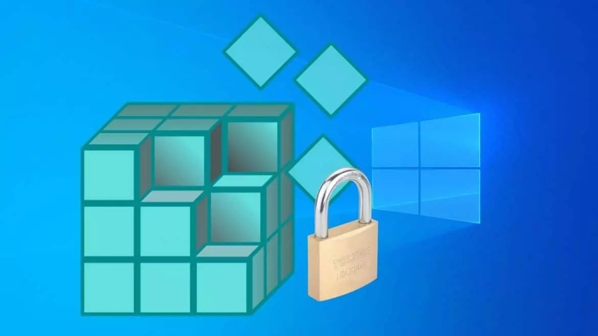

La base de registre Windows ou registre Windows est une base de données structurées où sont stockées un grand nombre d'informations.
Ces informations sont utilisées par Windows et ses composants ainsi que les programmes installés par l'utilisateur pour sauvegarder des informations utiles à leurs fonctionnements.
Cette base de données est invisible à l'utilisateur et est utilisée en arrière plan par Windows.

Le registre Windows contient toute la configuration de Windows.
On y trouve notamment (mais pas seulement):

- Services Windows et les programmes qui se chargent au démarrage,
- Les associations de fichiers,
- Les informations des comptes utilisateurs,
- La configuration matérielle.
- La configuration d'explorer.exe,
- Les policies et restrictions administrateurs
- Toute la configuration utilisateur (fond d'écran, les paramètres de Windows choisies par l'utilisateur etc)
- La configuration des applications. Celles-ci peuvent utiliser la base de registre pour stocker certains éléments de configuration ou de fonctionnement. 

La base de registre Windows se compose d'une arborescence avec des dossiers.
Dans les dossiers se trouvent les clés du registre avec divers formats (Texte, hexadécimal, Dword etc).
A chaque clé, correspond une valeur. Il s'agit de l'information stockée.
Si vous modifiez la valeur, vous modifiez la configuration de Windows ou l'application. 

#### EXEMPLE

nous somme sur la clé HKEY_LOCAL_MACHINE\SOFTWARE\Microsoft\Windows NT\CurrentVersion\Winlogon.
Et celle-ci possède plusieurs valeurs dont Userinit.
Il s'agit du processus qui va se lancer en début de session.
Un programme malveillant peut modifier celle-ci pour se charger et se rendre actif au lancement de Windows.

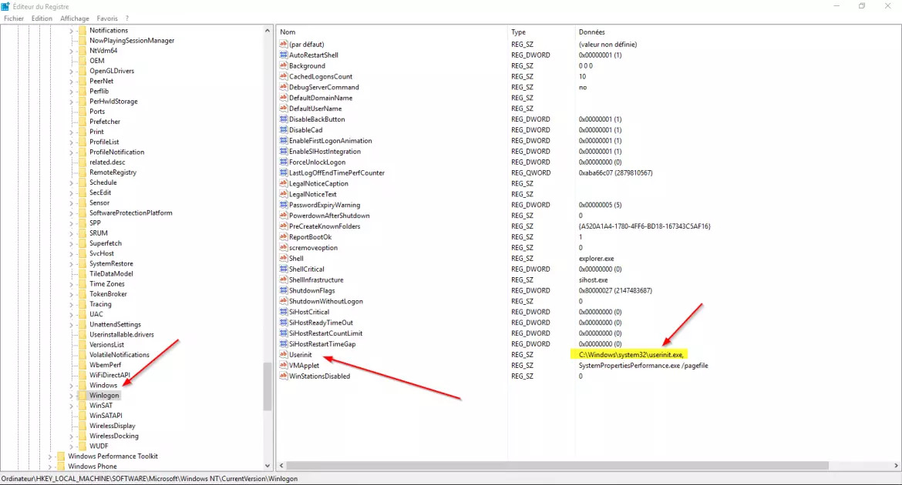

### LES RUCHES SYSTEMES

Elles stockent la configuration communes à tous les utilisateurs, ETdonc à Windows de manière générale.
Elles s'appliquent donc à tous les utilisateurs.

- HKEY_CLASSES_ROOT (appelé HKCR):

Elle contient toutes les associations de fichiers et les informations sur les extensions de fichiers.
Cette branche contient aussi les informations nécessaires à ActiveX, COM.
C'est aussi dans cette branche que seront crées les entrées lorsque .DLL sera enregistrée par le système à l'installation d'un programme.

- HKEY_CURRENT_USER (appelé HKCU) :

Elle définit les paramètres relatifs à l'utilisateur Windows, ils sont classés en six sous-catégories: 
Control panel: c'est le panneau de configuration.
Software: relatifs aux logiciels installés AppEvents: ce sont les sons systèmes (le coin-coin quand vous cliquez) 
Keyboard layout: les paramètres du clavier Remote Access: relatifs aux accès réseau à distance
Network: Configuration du réseau

- HKEY_LOCAL_MACHINE (appelé HKLM) :

elle contient toutes les informations concernant votre machine:
Hardware: contient les informations relatives au matériel (type de processus, carte-mère, type de carte réseau etc..) 
Software: Les configurations des logiciels communes à tous les utilisateurs. Cette partie contient entre autres aussi les informations relatives à la sécurité locales de la machine.
Les valeurs HKLM prévaut sur les valeurs users, afin que l'administrateur puisse imposer les paramètres.
En clair, si vous avez des policies identiques sur HKLM et votre HKEY_USERS, c'est celle de HKLM qui prévôt.

### LES RUCHES UTILISATEURS

C'est la configuration propre à chaque utilisateur.
Elle stocke les données de personnalisations, etc.

- HKEY_USERS (appelé HKU) : Cette partie contient la liste des utilisateurs ( S1-625426-41565625-2456 ) et la configuration des programmes.
Par exemple, si chaque utilisateur personnalise son fond d'écran, Windows stocke cette information ici.
Elle contient aussi des informations sur le profil.

- HKEY_CURRENT_CONFIG (appelé HKCC) : C'est la partie relative à la configuration de l'ordinateur utilisée entre autre par les drivers, la résolution etc.

- HKEY_DYN_DATA (appelé HKDD) : C'est un raccourci vers les éléments utilisés uniquement en mémoire vive dans HKLM\Config. Par exemple les informations volatiles: temporaires jusqu'à la réinitialisation du système.

### LES CLEFS AUTORUN

Les clés Autoruns correspondent aux clés qui permettent de lancer une application au démarrage de Windows ou d'une session utilisateurs.
Ce sont des clés très appréciées par les virus pour charger ces derniers.

Voici la liste des clefs qui sont utilisées pour charger des programmes au démarrage de Windows:

- HKEY_LOCAL_MACHINE\Software\Microsoft\Windows\CurrentVersion\Run
- HKEY_LOCAL_MACHINE\Software\Microsoft\Windows\CurrentVersion\RunOnce
- HKEY_LOCAL_MACHINE\Software\Microsoft\Windows\CurrentVersion\RunServices
- HKEY_LOCAL_MACHINE\Software\Microsoft\Windows\CurrentVersion\RunServicesOnce
- HKEY_CURRENT_USER\Software\Microsoft\Windows\CurrentVersion\Run
- HKEY_CURRENT_USER\Software\Microsoft\Windows\CurrentVersion\Runonce
- HKEY_CURRENT_USER\Software\Microsoft\Windows\CurrentVersion\RunServices
- HKEY_CURRENT_USER\Software\Microsoft\Windows\CurrentVersion\RunServicesOnce

### LES CLEFS APPLICATIVES

HKEY_LOCAL_MACHINE\Software contient les clés des applications installées.
En effet celles-ci peuvent utiliser la base de registre pour stocker des paramètres.
Lorsque vous désinstallez des applications, le setup supprime ces clés.

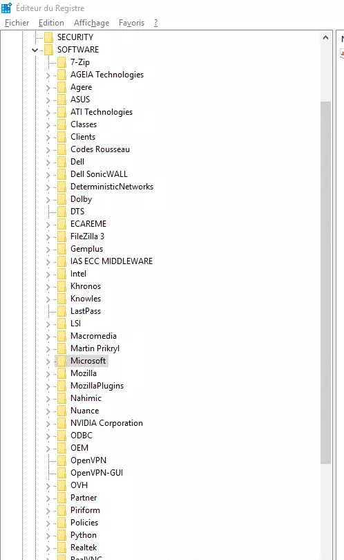

### LES CLEFS SHELL

Démarrage de l'environnement (shell) qui permet notamment de supprimer le menu démarrer et barre des tâches. Celles-ci sont très utilisées par les Trojan Winlock:

- HKEY_LOCAL_MACHINE\SOFTWARE\Microsoft\Windows NT\CurrentVersion\Winlogon\Shell
- HKEY_LOCAL_MACHINE\SOFTWARE\Microsoft\Windows\CurrentVersion\Policies\system\Shell

### LES CLEFS SYSTEM

Les clés System sont très importantes, car elles contiennent les clés Control liées à la configuration matérielle de l'ordinateur et ses profils ainsi que les services Windows.
Dans les sous-clés Control, on peut notamment trouver les clés suivantes :

- Configuration de Windows : HKEY_LOCAL_MACHINE\SYSTEM\CurrentControlSet\Control
- La configuration matérielle : HKEY_LOCAL_MACHINE\SYSTEM\CurrentControlSet\Enum
- Les profils de configuration matériel : HKEY_LOCAL_MACHINE\SYSTEM\CurrentControlSet\Hardware Profiles
- La liste des services Windows : HKEY_LOCAL_MACHINE\SYSTEM\CurrentControlSet\Services
  
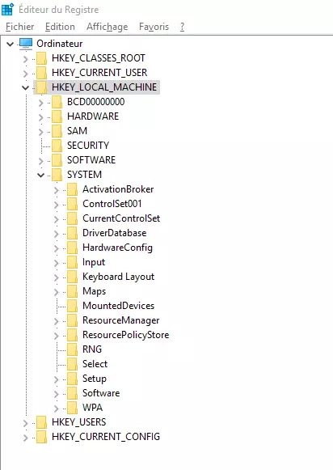

### SAUVEGARDER LA BASE DE REGISTRE

L'éditeur de la base de registre de Windows permet d'exporter et importer des clés du registre assez facilement pour des opérations de modifications ponctuelles.
Depuis l'éditeur du registre Windows, faites un clic droit sur la clé et exporter.

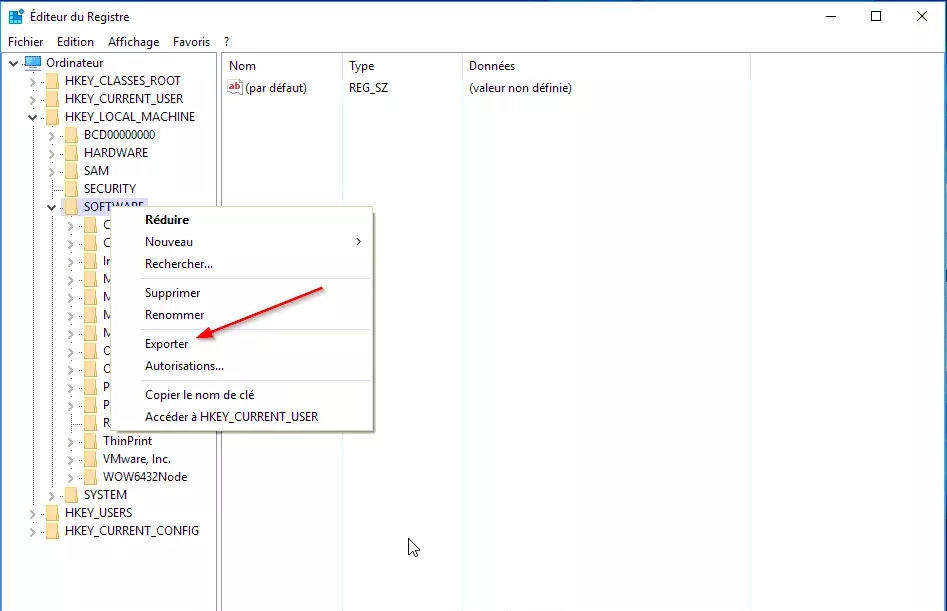

- Pour plus d'information sur la modification de la base de registre via l'éditeur REGEDIT:
https://www.malekal.com/regedit-editeur-du-registre-windows/

## ADMIN CENTER

Windows dispose d'un logiciel pour centraliser la gestion administrative d'une machne Windows server ou même d'un groupe de machines server rattachées.

### INSTALLATION ADMIN CENTER

Pour l'installation, se rendre sur la page de Microsoft pour télécharger le .MSI: 
https://www.microsoft.com/fr-fr/evalcenter/evaluate-windows-admin-center 

Suivre les indications d'installation et choisir de créer un certificat HTTPS pour le port 443.
Après l'installation, l'application est disponible via un navigateur (autre que IE) à l'adresse: https://winserver/

### UTILISATION ADMIN CENTER

Pour plus d'informations à propos de l'admin center: 
https://docs.microsoft.com/fr-fr/windows-server/manage/windows-admin-center/use/get-started

Dans cette fenêtre, le panneau de gauche donne accès aux différents réglages concernant notre serveur décrit dans le premier onglet vue d'ensemble. Cela va des services Azure Kubernetes permettant la gestion automatiser du serveur avec des conteneurs, à l'analiseur de performances, au centre de sécurité, an passant par le pare-feux, les certificats, le stockage et le partage de fichier.