# LE RESEAU


## PLAN

- [LE RESEAU](#le-reseau)
  - [PLAN](#plan)
  - [DEFINITION](#definition)
  - [NOTIONS](#notions)
    - [ADRESSE IP](#adresse-ip)
      - [LES CLASSES D'ADRESSE](#les-classes-dadresse)
    - [LE PORT RESEAU](#le-port-reseau)
      - [DEFINITION](#definition-1)
    - [UTILISATION](#utilisation)
    - [LISTE DES SERVICES RESEAUX / PORTS](#liste-des-services-reseaux--ports)
    - [ADRESSE MAC](#adresse-mac)
    - [DHCP](#dhcp)
    - [DNS](#dns)
  - [LA NORME OSI](#la-norme-osi)
    - [DETAIL DES COUCHES](#detail-des-couches)
      - [COUCHE APPLICATIVE 7:](#couche-applicative-7)
      - [COUCHES 5 - 6:](#couches-5---6)
      - [COUCHE TRANSPORT 4:](#couche-transport-4)
      - [LIAISON DES DONNÉES 3:](#liaison-des-données-3)
      - [SWITCHS ET BRIDGES 2:](#switchs-et-bridges-2)
      - [COUCHE PHYSIQUE 1:](#couche-physique-1)
  - [LES EQUIPEMENTS](#les-equipements)
    - [LE ROUTEUR](#le-routeur)
      - [DEFINITION:](#definition-2)
      - [COMPOSITION:](#composition)
      - [TABLE DE ROUTAGE](#table-de-routage)
      - [EXEMPLE D'UTILISATION:](#exemple-dutilisation)
    - [SWITCH](#switch)
      - [DEFINITION:](#definition-3)
    - [HUB](#hub)
      - [DEFINITION:](#definition-4)
    - [BRIDGE](#bridge)
      - [DEFINITION:](#definition-5)
    - [ADRESSE IP](#adresse-ip-1)
  - [ADRESSAGE RESEAU](#adressage-reseau)
    - [ADRESSE DU RESEAU](#adresse-du-reseau)
    - [MASQUE RESEAU ET SOUS RESEAU](#masque-reseau-et-sous-reseau)
      - [ADRESSE MAC OU PHYSIQUE](#adresse-mac-ou-physique)
      - [TYPE DE RESEAU:](#type-de-reseau)
  - [ALLER PLUS LOIN:](#aller-plus-loin)
    - [LE DHCP:](#le-dhcp)
      - [DEFINITION](#definition-6)
      - [LE FONCTIONNEMENT](#le-fonctionnement)
    - [L'IP STATIQUE](#lip-statique)
    - [VPN (VIRTUAL PRIVATE NETWORK):](#vpn-virtual-private-network)
      - [LES DIFFERENTES SOLUTIONS CLIENT](#les-differentes-solutions-client)
  - [EXERCICES](#exercices)
    - [1) EXEMPLE CONCRET](#1-exemple-concret)
    - [2) ADRESSE RESEAU, MACHINE OU BROADCAST?](#2-adresse-reseau-machine-ou-broadcast)
    - [3) CALCUL DE SOUS RESEAUX](#3-calcul-de-sous-reseaux)
        - [RESEAU 192.168.0.0:](#reseau-19216800)
        - [RESEAU 192.168.4.0:](#reseau-19216840)
        - [RESEAU 192.168.20.1:](#reseau-192168201)
    - [4) DECOUPAGE RESEAU EN SOUS RESEAU](#4-decoupage-reseau-en-sous-reseau)
    - [5) IP ET MASQUE](#5-ip-et-masque)
    - [6) MISE EN SITUATION](#6-mise-en-situation)
  - [SOURCES](#sources)

## DEFINITION

[reseau informatique](https://fr.wikipedia.org/wiki/R%C3%A9seau_informatique)

## NOTIONS

Le réseau comme toute "spécialité" informatique possède son propre jargon. Détaillons les principales:

### ADRESSE IP

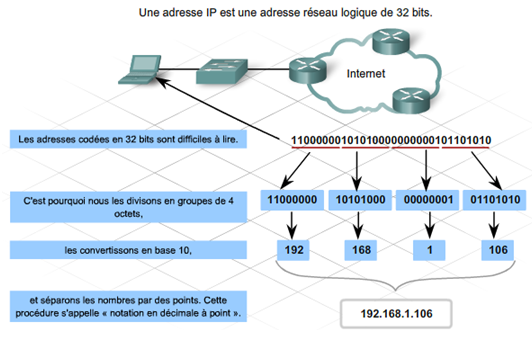

ADRESSE IP est une adresse de 32 bits, répartis en 4 fois 8 bits (octets). Cette adresse est un identifiant réseau.On peut ensuite la diviser en deux portions : 
la portion du réseau et la portion hôte. La première identifie le réseau sur lequel est la machine et la deuxième identifie la machine en elle-même. Pour identifier ces deux parties, 
chaque adresse est liée à un masque de sous-réseau. Ce qui permet de définir sur quel réseau elle se trouve.

#### LES CLASSES D'ADRESSE

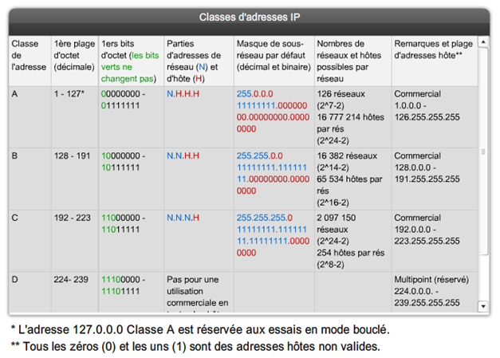

Pour différencier différentes tailles de réseau et permettre de mieux identifier des adresses, 
on a séparé les adressesIP en cinq classes:

- Classe A : Cette classe est faite pour les très grands réseaux. Seul le premier octet est utilisé pour la partie réseau, ce quilaisse donc trois octets pour la partie hôte. 
    Ce premier octet est compris entre 1 et 126. Cette classe peut accueillir plusieurs millions d'hôtes.
  
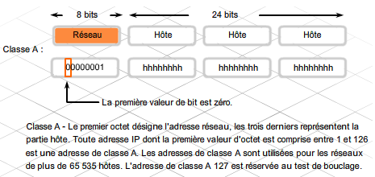

- Classe B : Cette classe est faite pour les moyens et grands réseaux. Les deux premiers octets sont utilisés pour la partie réseauet les deux suivants pour la partie hôte. 
    Le premier octet est compris entre 128 et 191. Cette classe peut accueillirplusieurs dizaines de milliers d'hôtes.

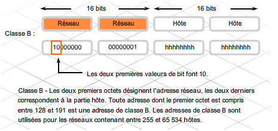

- Classe C : Cette classe est faite pour les petits réseaux puisqu'elle ne peut accueillir que 254 hôtes. 
Les trois premiers octets étant employés pour la partie réseau, il n'en reste qu'un seul pour la partie hôte. Le premier octet est compris entre192 et 223.


- Classe D : C'est une classe utilisée pour le multicasting. Le premier octet de cette classe est compris entre 224 et 239.

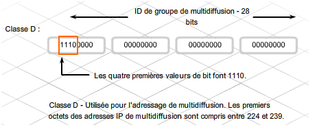

- Classe E : Cette classe a été définie comme étant une classe pour les ordinateurs de recherche. Le premier octet de cetteclasse est compris entre 240 et 255.

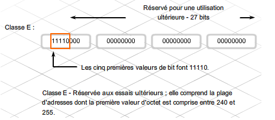


### LE PORT RESEAU

#### DEFINITION

Dans le protocole TCP et UDP, un port réseau est un peu comme une porte à laquelle l'application d'un équipement se connecte à un autre équipement distant par le réseau.
Lorsqu'un équipement se connecter à un autre distant :

1) Il ouvre un port réseau sur la machine, on parle de port local.<br>
2) Puis il se connecte au port d'un équipement distant, on parle alors de port distant.

Quand il s'agit d'une connexion entrant, on inverse, le port local devient le port distant et le port distant est le port local.
Enfin notez que la notion de local et distant s'applique aussi sur l'adresse IP.

Ainsi dans le cadre du protocole Internet, un port est associé à une adresse IP de l'hôte, ainsi qu'au type de protocole utilisé pour la communication.

Un port spécifique est identifié par :

- son numéro, communément appelé numéro de port,
- l'adresse IP à laquelle il est associé,
- le protocole utilisé pour la communication (TCP ou UDP)

Chaque machine possède 65 536 ports distincts.

### UTILISATION

Les ports sont des numéros qui correspondent en général à un service applicatifs réseaux spécifiques.
Par exemple, le port 80 et 443 correspondent à HTTP et HTTPS.
Le port 22 est pour le SSH, etc.
Le port étant lié à une adresse IP, il est séparé par le caractère :

Ainsi par exemple, 172.217.22.131:443 correspondent à l'adresse 172.217.22.131 sur le port 443.
On retrouve cette notation assez fréquemment.
Par exemple, la commande netstat retourne l'IP avec le port séparé par :.
On trouve aussi l'état de connexions et donc du port, voir le paragraphe suivant.

### LISTE DES SERVICES RESEAUX / PORTS

Voici les principaux services réseaux avec la liste des ports.
Ainsi par convention, des services applicatifs réseaux utilisent des ports bien définis. On peut alors parler de ports standards.
Par exemple, pour le HTTP, c'est le port 80 et HTTPS 443.
Que vous installez Apache2 ou Nginx comme serveur WEB, il utilisera ces ports par défaut.
De même pour les MTA, que vous utilisez Postfix, Exim ou Exchange, ils utilisent les ports standards des protocoles SMTP et POP3.

Puis vient les applications réseaux spécifiques, comme un logiciel de sauvegarde, de prise en main à distance, un serveur de jeux ou une console d'administration qui utilise son propre port.
Par exemple, BatteNet utilise le port 1119, Syslog peut utiliser le port 514, etc.
En général, les éditeurs utilisent un port libre non utilisé par des services réseaux et internet standard.

Cette infographique reprend la liste des ports réseaux communs avec les services qui correspondent.


A noter que les systèmes d'exploitations embarquent un fichier services qui permet de faire la correspondance entre les ports et services.
C'est pour cela que parfois, au lieu d'avoir le numéro du port, on a le nom du service à la place.

- Dans Windows : C:\Windows\System32\drivers\etc\services
- Dans Linux : /etc/services

### ADRESSE MAC

L'adresse mac est une adresse de 48 bits de 12 chiffres hexadécimaux. Cette adresse est un identifiant physique,stockée dans la mémoire de la carte réseau. 
Elle identifie donc l'interface réseau de la machine.


### DHCP

Dynamic Host Configuration Protocol (DHCP)Ce protocole permet de configurer automatiquement les paramètres réseau d'une machine dès son entrée dans le réseau.
Il attribue automatiquement l'adresse IP, le masque de sous-réseau, la passerelle et aussi le serveur DNS.Ce protocole passe par le protocole TCP/IP.
Pour plus d'informations sur le DHCP: 

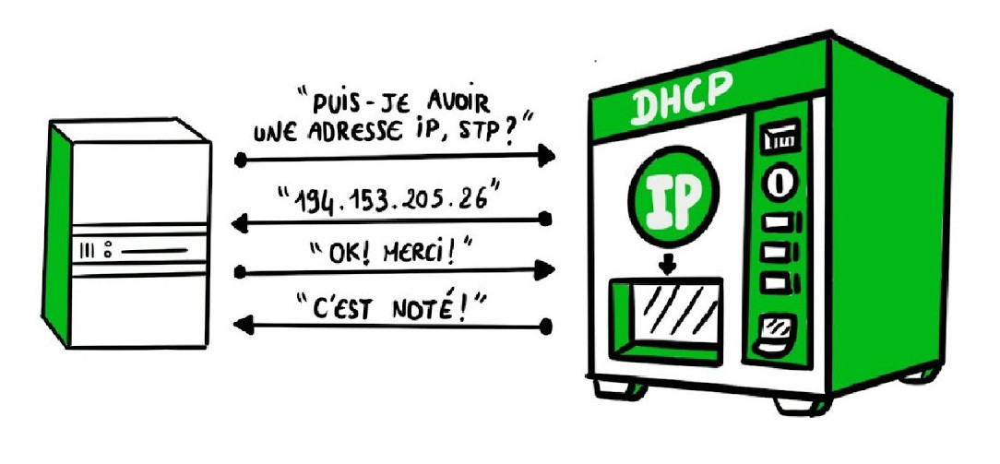

### DNS

Le Domain Name System, généralement abrégé DNS, qu'on peut traduire en « système de noms de domaine », est le service informatique distribué utilisé pour traduire les noms de domaine Internet en adresse IP ou autres enregistrements.En fournissant dès les premières années d'Internet.(1983)

concrètement, vous payer un service pour que le nom de domaine www.monsite.com pointe vers l'IP publiquede votre serveur.

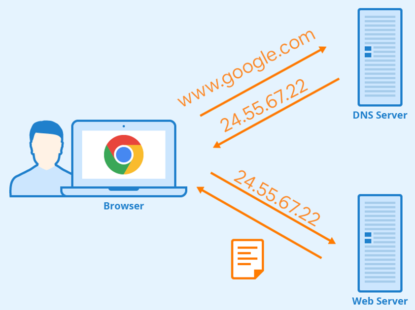


## LA NORME OSI

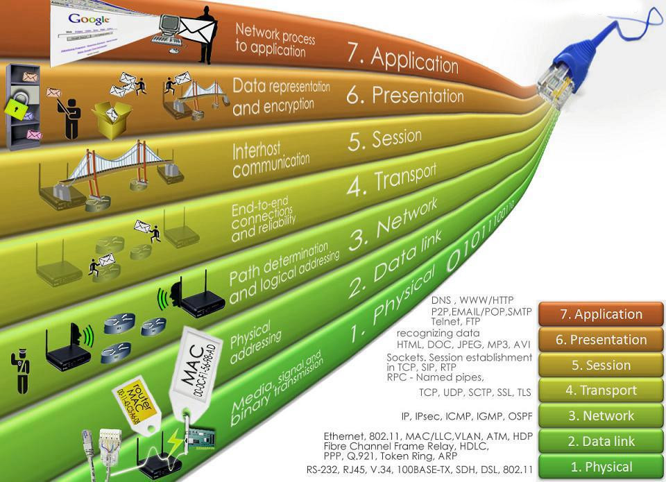

Le modèle OSI (de l'anglais Open Systems Interconnection) est une norme de communication, en réseau, de tous les systèmes informatiques. 
C'est un modèle de communications entre ordinateurs proposé par l'ISO (Organisation internationale de normalisation) qui décrit les fonctionnalités nécessaires 
à la communication et l'organisation de ces fonctions.


- La couche 7 : Application
La couche application est responsable de la communication entre le réseau et les applications. Elle offre le service réseau à l'application qui le demande. 
Elle est différente des autres couches, car elle n'offre pas de service aux autres couches.

- La couche 6 : Présentation
Cette couche s'occupe surtout de traduire les données pour que les deux systèmes puissent communiquer entre eux et se comprendre. Par exemple si un envoie de l'ASCII et l'autre du DCB, 
la couche va s'occuper de traduire dans les deux sens.

- La couche 5 : Session
Cette session établit, gère et termine les communications entre deux systèmes. Elle s'occupe aussi de synchroniser les dialogues entre les hosts. Elle assure la communication et la gestion 
des paquets entre deux stations.

- La couche 4 : Transport
Cette couche divise les données de l'envoyeur, puis les rassemble chez le récepteur. La couche transport assure la fiabilité et la régulation du transfert de données. 
C'est la couche tampon en quelque sorte, car elle se trouve entre les couches purement réseau et les couches qui elles se référent plus aux applications.

- La couche 3 : Réseau
Cette couche gère la connectivité entre deux systèmes qui peuvent être localisés dans différents endroits géographiques et dans différents réseaux. 
La couche liaison de données assure un transit fiable des données sur une liaison physique. Elle se réfère aux adresses réseau donc IP

- La couche 2 : Liaison de données
Cette couche définit comment les données sont formatées et comment on accède au réseau. Elle est responsable de « dire » comment un appareil correspond avec un autre 
alors qu'ils sont sur différents réseaux et médias. Elle se réfère à l'adressage physique donc aux adresses MAC.

- La couche 1 : Physique
La couche physique est la couche de bas niveau, c'est la couche la plus basique du modèle, elle contient toutes les spécifications électriques, mécaniques pour l'activation, 
la maintenance entre le lien physique et le système. Par exemple, les distances de transmission, le voltage, les connecteurs physiques, le type de média.


### DETAIL DES COUCHES

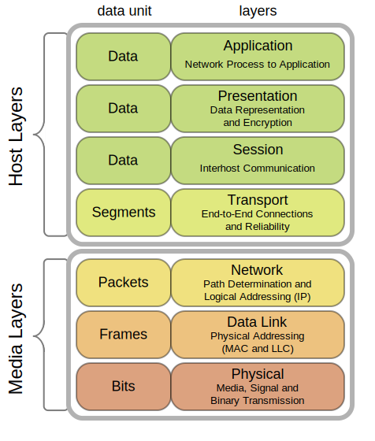

#### COUCHE APPLICATIVE 7:

C'est la couche qui est la raison des autres, c'est pour elle que l'on achemine et transforme les données.
Elle est là pour représenter les applications pour lesquelles nous allons mettre en œuvre des communications.


#### COUCHES 5 - 6:

le modèle OSI est un modèle théorique. Le modèle sur lequel s'appuie Internet aujourd'hui est le modèle TCP/IP.
Or, ce modèle n'utilise pas les couches 5 et 6, donc... on en tient pas compte.


#### COUCHE TRANSPORT 4:

Cette couche est le cœur du protocole TCP/IP. C'est une couche très importante du protocole TCP/IP.
Il y a deux protocoles qui œuvrent sur cette couche :
- UDP : ce protocole est plus rapide que le TCP, mais il n'exécute aucun contrôle quand au fait que le paquetsoit arrivé à destination ou pas. C'est un protocole non orienté connexion.
- TCP : ce protocole est un plus lent, mais il va s'occuper de contrôler que le paquet arrive bel et bien àdestination. Ce protocole est orienté connexion. À la suite, 
vous trouverez les caractéristiques du protocoleTCP.Caractéristiques du TCP-IP- Orienté Connexion : le protocole crée une liaison entre les deux périphériques voulant se parler
- Full Duplex : on peut parler et écouter en même temps
- Contrôle des erreurs : il vérifie que les paquets ne sont pas corrompus
- Numérotation des paquets pour que la remise en ordre de ceux-ci soit plus aisée- Contrôle de flux : Si l'envoyeur surcharge le buffer, il va lui dire d'arrêter l'envoi.

Voici quelques applications du TCP/IP :
- FTP : emploi du TCP pour envoyer des fichiers
- TFTP : emploi de l'UDP pour envoyer des fichiers, c'est un peu plus rapide que le FTP, et c'est donc employédans les cas ou ce n'est pas trop grave de perdre un paquet
- Telnet : permet de se connecter à distance sur un autre périphérique
- SMTP : permet l'envoi de mail


#### LIAISON DES DONNÉES 3:

Détermine le parcours des données et l'adressage logique par l'intermédiaire des adresses IP.
C'est cette couche qui au niveau du réseau va s'assurer que les données arrive à l'endroit voulu.


#### SWITCHS ET BRIDGES 2:

Les bridges et les switchs sont des appareils de niveau 2 sur le modèle OSI, avec eux, on peut réduire la taille des domaines de collisions. 
Cela, en utilisant une table d'adresses et en envoyant le message seulement à l'adresse correcte et empêchant ainsi d'avoir plusieurs paquets passant en même temps.
La grande différence des switchs et des bridges est l'hardware, dans un switch, le code est optimisé. Donc un switch peut opérer à de plus grandes vitesses que le bridge et permet plus de choses, mais est plus cher. Voilà ce que permet le switch de plus que le bridge :
- des multiples communications simultanées
- des communications full-Duplex (dans les deux sens contrairement aux talkiewalkies)
- l'accès à la totalité de la bande passante par tous les appareils connectés 
- possibilité d'associer une vitesse spécifique sur chaque port, 
ce qui permet de connecter des machines dedifférentes vitesses derrière le switch.

Le switch a une procédure bien définie pour la communication:
- le switch reçoit une frame sur un port 
- le switch entre l'adresse MAC source et le port du switch qui a reçu la trame, dans la table MAC 
- si l'adresse de destination est inconnue, le switch envoie la frame sur tous les ports,
sinon il l'envoie sur le port correspondant à l'adresse de destination dans la table MAC 
- le PC de destination répond 
- là encore, le switch écrit dans la table MAC, l'adresse du répondeur et le numéro du port correspondant
- maintenant, si le destinataire ou l'envoyeur était inconnu, si le cas se représente où un message est envoyé à l'un des deux, le switch pourra l'envoyer directement sur le bon port.


#### COUCHE PHYSIQUE 1:

Un câble à paire torsadée est un câble dans lequel passent des fils de cuivres. C'est le média le plus employé denos jours. C'est un câble utilisé pour câbler des courtes distances.
Ces câbles ne peuvent couvrir qu'au maximum100 mètres.Un câble à paire torsadée est composé de 2 éléments :
- des brins de cuivre entrelacés
- d'une enveloppe isolante autour.

Il en existe plusieurs catégories :
- Catégorie 1 : utilisé pour les communications téléphoniques, inutilisables pour le transfert de données
- Catégorie 2 : transmission de données à 4 Mbps
- Catégorie 3 : transmission de données à 10 Mbps
- Catégorie 4 : utilisé dans les réseaux Token Ring, transmission à 16 Mbps
- Catégorie 5 : transmission de données à 100 Mbps
- Catégorie 5 : transmission de données à 1 Gbps
- Catégorie 6 : consiste en 4 paires de 24 gauges de cuivre, 1 Gbps
- Catégorie 7 : transmission de données à 10 Gbps.V-A-1 

- UTP C'est un câble à paire torsadée tout simple, sans aucun blindage. Il est fait de quatre paires de brins. Il est très utilisépour les téléphones, car il est plus petit qu'un câble STP.V-A-2 
- STP L'ensemble des paires torsadées est entouré d'un blindage. Il est plus utilisé dans les réseaux Ethernet que l'UTP,car il permet de réduire les effets électromagnétiques sur le câble grâce à son blindage. Il existe encore une autrevariante, le SSTP, qui rajoute un blindage supplémentaire sur chaque paire.Le blindage permet de réduire les interférences, donc le mélange de signaux électriques et il permet des transfertsà des débits plus importants et sur des distances plus grandes


## LES EQUIPEMENTS

### LE ROUTEUR

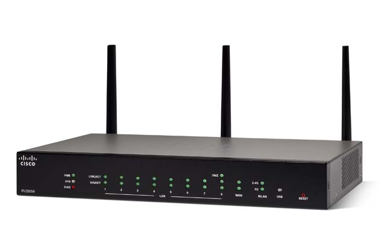

#### DEFINITION:

Un routeur est un équipement réseau informatique assurant le routage des paquets. Son rôle est de faire transiter des paquets d'une interface réseau vers une autre, au mieux, selon un ensemble de règles.
La fonction de routage traite les adresses IP et les dirige selon l'algorithme de routage et sa table associée, cette dernière contient la correspondance des adresses réseau avec les interfaces physiques du routeur où sont connectés les autres réseaux.

#### COMPOSITION:

Un routeur moderne se présente comme un boîtier regroupant carte mère, microprocesseur, mémoire ROM, RAM ainsi que les ressources réseaux nécessaires (Wi-Fi, Ethernet…). On peut donc le voir comme un ordinateur minimal dédié, dont le système d'exploitation peut être un Linux allégé. De même, tout ordinateur disposant des interfaces adéquates (au minimum deux, souvent Ethernet) peut faire office de routeur s'il est correctement configuré (certaines distributions Linux minimales spécialisent la machine dans cette fonction).

#### TABLE DE ROUTAGE

La table de routage est inhérente à chaque machine pour déterminer la topologie du réseau et comment communiquer avec les autres appareils du réseau via les routes.<br>
La table de routage contient :
- les adresses du routeur lui-même ;
- les adresses des sous-réseaux auxquels le routeur est directement connecté ;
- les routes statiques, c'est-à-dire configurées explicitement par l'administrateur ;
- les routes dynamiques, apprises par des protocoles de routage dynamique comme BGP, OSPF, IS-IS, etc. ;
- une route par défaut.

Quand plusieurs routes sont possibles, la route la plus spécifique sera utilisée, c'est-à-dire celle qui aura le préfixe le plus long. Si plusieurs routes avec le même préfixe existent, l'arbitrage a lieu en fonction du type de route : les routes directement connectées auront la priorité sur les autres, les routes statiques et dynamiques sont départagées par une distance administrative paramétrable. Si tous les paramètres sont égaux, le routeur pourra distribuer le trafic entre ces routes ou n'en utiliser qu'une seule.

La route par défaut indiquera comment acheminer le trafic qui ne correspond à aucune entrée dans la table de routage. En l'absence de route par défaut, le routeur éliminera un paquet dont la destination n'est pas connue.

Un ordinateur connecté à un réseau local connaîtra typiquement la route directement connectée (le sous-réseau) et une route par défaut vers le routeur du sous-réseau. Un routeur de la default-free zone d'Internet disposera de plusieurs centaines de milliers de routes dynamiques, et pas de route par défaut.

Ci-dessous, un exemple typique de ce à quoi pourrait ressembler une table de routage IPv4 sur un ordinateur connecté à Internet via une box : 

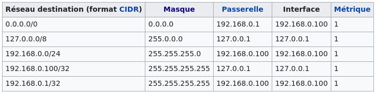

#### EXEMPLE D'UTILISATION:


### SWITCH

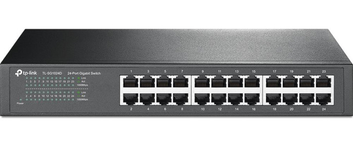

#### DEFINITION:

Un commutateur réseau (en anglais switch), est un équipement qui relie plusieurs segments (câbles ou fibres) dans un réseau informatique et de télécommunication et qui permet de créer des circuits virtuels. La commutation est un des deux modes de transport de trame au sein des réseaux informatiques et de communication, l'autre étant le routage. 

Dans les réseaux locaux (LAN), il s'agit le plus souvent d'un boîtier disposant de plusieurs ports RJ45 (entre 4 et plusieurs centaines), il a donc la même apparence qu'un concentrateur (hub).

Le commutateur établit et met à jour une table, dans le cas du commutateur pour un réseau Ethernet il s'agit de la table d'adresses MAC, qui lui indique sur quels ports diriger les trames destinées à une adresse MAC donnée, en fonction des adresses MAC source des trames reçues sur chaque port. Le commutateur construit donc dynamiquement une table qui associe numéro de port et adresses MAC.

Lorsqu'il reçoit une trame destinée à une adresse présente dans cette table, le commutateur renvoie la trame sur le port correspondant. Si le port de destination est le même que celui de l'émetteur, la trame n'est pas transmise. Si l'adresse du destinataire est inconnue dans la table, alors la trame est traitée comme un broadcast, c'est-à-dire qu'elle est transmise à tous les ports du commutateur à l'exception du port d'émission.

### HUB

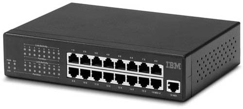

#### DEFINITION:

En utilisant un hub, chaque équipement attaché à celui-ci partage le même domaine de diffusion ainsi que le même domaine de collision. Comme dans tout segment de réseau Ethernet, une seule des machines connectées peut y transmettre à la fois. Dans le cas contraire, une collision se produit, les machines concernées doivent retransmettre leurs trames après avoir attendu un temps calculé aléatoirement par chaque émetteur.

Ce dispositif est un répéteur de données ne permettant pas de protection particulière des données et transmettant les trames à toutes les machines connectées par opposition au commutateur réseau (en anglais switch) qui dirige les données uniquement vers la machine destinataire. Ceci le rend vulnérable aux attaques par Analyseur de paquets. Il permet également d'étendre un réseau local (LAN) mais ne permet pas de le transformer en un réseau étendu (WAN).

### BRIDGE

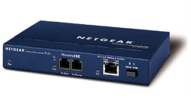

#### DEFINITION:

Un pont est un équipement informatique d'infrastructure de réseaux de type passerelle. Dans les réseaux Ethernet, il intervient en couche 2 du modèle OSI (liaison). Son objectif est d'interconnecter deux segments de réseaux distincts, soit de technologies différentes, soit de même technologie, mais physiquement séparés à la conception pour diverses raisons (géographique, extension de site etc.).

Le pont possède au moins deux interfaces réseau. Pour chacune il gère une liste d'adresse source de niveau 2. Il y a normalement dans cette liste une adresse par équipement physiquement connecté au pont.

Lorsqu'une trame se présente sur une interface il analyse l'adresse (niveau 2) du destinataire, consulte ses tables d'adresse et envoie la trame sur l'interface où se trouve l'adresse du destinataire. Le pont est dit transparent car il ne change pas l'adresse source des trames qu'il retransmet. Contrairement à un routeur qui change l'adresse source de niveau 2 de la trame qu'il route.


### ADRESSE IP

Autrement appelée adresse IP, cette adresse est codée en binaire sur 4 octets de 8 bits chacun.
Le binaire est un système de numération en base 2. Globalement, cela veut dire qu'on ne peut compter qu'avec 1 et 0, contrairement au système de numération décimal que nous avons l'habitude d'utiliser dans lequel on se sert des chiffres de 0 à 9.

        192    .    168    .    0      .    48         --> Adresse IP numérique


     11000000  . 10101000  . 00000000  . 00110000      --> Adresse en binaire (4 octets)


     2p7  2p6  2p5  2p4  2p3  2p2  2p1  2p0            --> puissances de 2

     128  64   32   16   8     4    2    1


## ADRESSAGE RESEAU

Comme nous le savons, une valeur binaire peut être soit 0, soit 1. Un bit peut donc coder deux valeurs, 
deux bits peuvent coder quatre valeurs, trois bits 8 valeurs, etc.
On en déduit donc que x bits peuvent coder 2 puissance x valeurs, ce qui nous donne pour un octet: 2 puissance 8 soit 256 valeurs.

Pourtant, un maximum de 254 adresses sont disponibles pour adresser des machines sur un même réseau, c'est parcequ'il faut retirer l'adresse du réseau (la première) et l'adresse du broadcast (la dernière), 256 - 2 = 254.


### ADRESSE DU RESEAU

exemple: dans le réseau 192.168.0.0, deux adresses sont indisponibles pour adresser un hôte:

- 192.168.0.0 -> c'est l'adresse qui identifie le réseau

- 192.168.0.255 -> c'est l'adresse réservé au broadcast

Le routeur quand il va recevoir une adresse de Broadcast, va envoyer le message dans tous les périphériques du réseau concerné. 
On peut aussi utiliser l'adresse de Broadcast « générale », c'est-à-dire envoyer un message à tous les périphériques de tous les réseaux connectés sur le même réseau que nous.
pour cela, il suffit d'employer l'adresse 255.255.255.255


### MASQUE RESEAU ET SOUS RESEAU

Si nous voulons créer un sous-réseau, il nous faut quelquechose pour "expliquer" au routeur si l'adresse correspond à un réseau ou à un sous réseau. C'est ici qu'intervient le masque de sous-réseau.

Un masque de sous-réseau (désigné par subnet mask, netmask ou address mask en anglais) est un masque distinguant les bits d'une adresse IPv4 utilisés pour identifier le sous-réseau de ceux utilisés pour identifier l'hôte.

Les masques de sous-réseau utilisent la même représentation que celles des adresses IPv4. En IPv4, une adresse IP est codée sur 4 octets, soit 32 bits (représentés en notation décimale à point). Un masque de sous-réseau possède lui aussi 4 octets. Bien que la norme IPv4 n'interdise pas que la partie significative du masque contienne des bits à 0, on utilise en pratique des masques constitués (sous leur forme binaire) d'une suite de 1 suivis d'une suite de 0, il y a donc 32 masques réseau possibles.

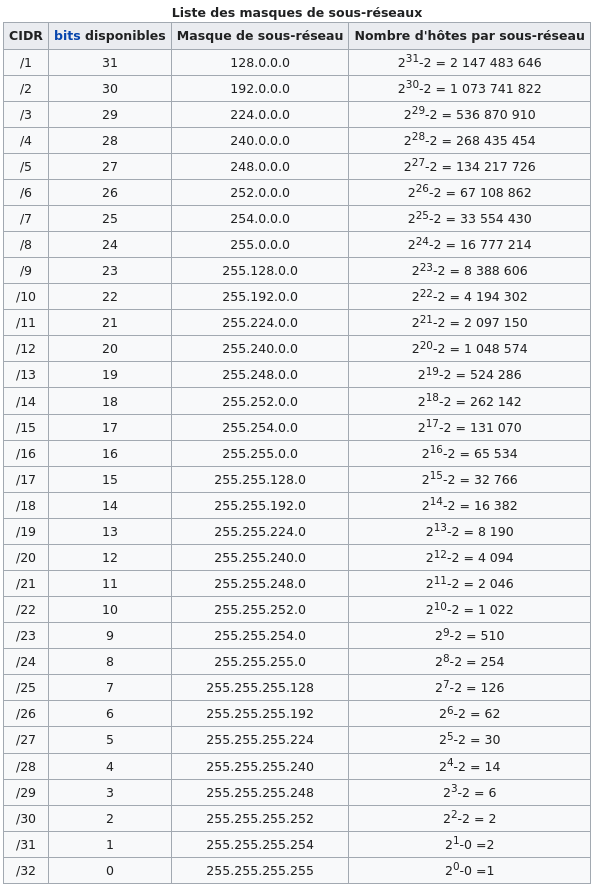

L'adresse du sous-réseau est obtenue en appliquant l'opérateur ET binaire entre l'adresse IPv4 et le masque de sous-réseau. L'adresse de l'hôte à l'intérieur du sous-réseau est quant à elle obtenue en appliquant l'opérateur ET entre l'adresse IPv4 et le complément à un du masque.

Exemple:

Pour l'adresse 192.168.1.2 et le masque 255.255.255.0:

192.168.1.2 & 255.255.255.0 = 192.168.1.0 --> adresse réseau appartenance
192.168.1.2 & 0.0.0.255     = 0.0.0.2     --> adresse de la machine sur le réseau

soit en binaire :

          11000000.10101000.00000001.00000010
        & 11111111.11111111.11111111.00000000
        = 11000000.10101000.00000001.00000000

          11000000.10101000.00000001.00000010
        & 00000000.00000000.00000000.11111111
        = 00000000.00000000.00000000.00000010         

Référence de calcul:

0 ET 0 = 0<br>
0 ET 1 = 0<br>
1 ET 0 = 0<br>
1 ET 1 = 1

Autrement dit, il suffit pour obtenir l'adresse du sous-réseau de conserver les bits de l'adresse IPv4 là où les bits du masque sont à 1 (un certain nombre de bits en partant de la gauche de l'adresse). La partie numéro d'hôte est, elle, contenue dans les bits qui restent (les plus à droite).

Une forme plus courte est connue sous le nom de « notation CIDR » (Classless Inter-Domain Routing). Elle donne le numéro du réseau suivi par une barre oblique (ou slash, « / ») et le nombre de bits à 1 dans la notation binaire du masque de sous-réseau. Le masque 255.255.224.0, équivalent en binaire à 11111111.11111111.11100000.00000000, sera donc représenté par /19 (19 bits à la valeur 1, suivis de 13 bits 0). 

Principe:


Subdiviser un réseau en sous-réseaux consiste (entre autres) à rajouter des bits 1 au masque de réseau, afin de former un masque de sous-réseau. À partir de la connaissance de l'adresse IPv4 et du masque de sous-réseau il est possible de calculer le nombre d'interfaces que l'on peut numéroter à l'intérieur de chaque sous-réseau. En notant bNID le nombre de bits à 1 dans le masque de réseau et bSID le nombre de bits à 1 supplémentaires dans le masque de sous-réseau, le nombre de sous-réseaux possibles est donné par 2bSID, et le nombre d'hôtes par sous-réseau est 2bHID-2, deux adresses de ce sous-réseau étant réservées au sous-réseau lui-même et au broadcast et ne pouvant pas être utilisées pour numéroter une interface.

> Site calcul https://ip-calculator.legaragenumerique.fr/<br>  
Nous pouvons choisir d'obtenir le masque de sous-réseaux an fonction de deux critères: 
- Le nb de sous réseaux voulu
- Le nb d'hôtes par réseaux voulu


#### ADRESSE MAC OU PHYSIQUE

l'adresse MAC est l'adresse physique de votre machine et est unique, celle-ci est de type hexadécimale, elle peux donc prendre 16 valeurs:
(0, 1, 2, 3, 4, 5, 6, 7, 8, 9, a, b, c, d, e, f). Elle est codée sur 6 octets, soit 2 octets de plus 
que l'adresse IP.

1 octet = 8 bits, donc 48 bits = 48/8 octets = 6 octets.
L'adresse MAC est codée sur 6 octets.

Sachant que l'adresse MAC est codée sur 48 bits, elle peut prendre 2 puissance 48 valeurs
(2 puissance 48 = 281 474 976 710 656 valeurs)


#### TYPE DE RESEAU:

- Le réseau LAN:

Un réseau LAN, pour Local Area Network, désigne un ensemble d’ordinateurs appartenant à la même organisation reliés entre eux par un réseau dans une zone géographique limitée. 
Le réseau local est donc la forme la plus simple de réseau et peut compter plusieurs centaines d’utilisateurs. 
On distingue deux modes de fonctionnement pour les réseaux LAN :

En environnement peer to peer, c’est-à-dire d’égal à égal où chaque ordinateur joue un rôle similaire.
En environnement client/serveur, où un ordinateur central fournit des services réseaux aux autres utilisateurs.

- Le réseau WAN:

Un réseau WAN, pour Wide Area Network, est un réseau étendu ou régional. 
Ce type de réseau informatique est généralement constitué de plusieurs sous-réseaux (LAN) 
et couvre une grande zone géographique comme un pays, ou un continent. 
Le type de liaison entre les sites et les technologies employées va conditionner les débits disponibles 
sur un WAN. Des routeurs permettent de déterminer le trajet le plus approprié pour atteindre un nœud du réseau. 
Le réseau WAN le plus connu et le plus grand est le réseau Internet.

## ALLER PLUS LOIN:

### LE DHCP:

#### DEFINITION

Un serveur DHCP (ou service DHCP) est un serveur (ou service) qui délivre des adresses IP aux équipements qui se connectent sur le réseau. 
La plupart du temps, les cartes réseaux de ces équipements sont en attente d’une adresse IP leur permettant de communiquer sur le réseau. 
En même temps qu’il envoie l’adresse, le service DHCP envoie quelques informations complémentaires concernant le réseau sur lequel est branché l’hôte qui reçoit cette adresse.

DHCP est l’abréviation de Dynamic Host Configuration Protocol (en français : Protocole de Configuration Dynamique d’Hôte.
La conception initiale d’IP supposait la préconfiguration de chaque ordinateur connecté au réseau avec les paramètres TCP/IP adéquats : 
c’est l’adressage statique (nommée également IP fixe).
Sur des réseaux de grandes dimensions ou étendues, où des modifications interviennent souvent, l’adressage statique engendre une lourde charge de maintenance et des risques d’erreurs.

#### LE FONCTIONNEMENT

Les cartes réseaux des ordinateurs (ou plus généralement de tous les équipements qui sont branchés sur un réseau : 
ordinateur, smartphone, object connectés, etc …) doivent être paramétrées pour recevoir automatiquement des adresses lorsque l’ordinateur démarre ou que l’on le connecte au réseau. Par défaut c’est le cas, car c’est la méthode la plus simple pour obtenir une adresse IP. 
vous n’avez pas attribué d’adresse IP à votre ordinateur. N’est-ce pas ? Eh oui, votre box internet remplit ce rôle de serveur DHCP sans que vous le sachiez !

Je vous rappelle que l’adresse IP doit être unique sur un réseau donc le serveur DHCP (ou service DHCP) va gérer les adresses et n’attribuer que des adresses non utilisées à tout nouvel hôte qui en fait la demande.

En fait, le serveur DHCP (ou service DHCP) va délivrer un bail DHCP à l’ordinateur qui en fait la demande. 
(et uniquement à ceux qui en font la demande, et non pas à tous les ordinateurs qui se connectent sur le réseau).

Dans ce bail, il y a entre autres 3 choses utiles:

- Une durée de vie (durée du bail)
- Une adresse IP.
- Les paramètres du réseau.

3) Durée de vie d’un bail DHCP:

    Le serveur DHCP (ou service DHCP) m’a donné une adresse IP, 
    mais elle est limitée dans le temps (4h, 6h, … cela dépend du réglage de l’administrateur du service).
    Pourquoi donner une durée au bail DHCP plutôt que donner une adresse à vie ?

        --> Un des intérêts du DHCP, c’est justement que les baux (un bail = des baux), sont limités dans le temps, 
        car une fois le délai écoulé, l’adresse IP est à nouveau disponible.

    Alors que se passe-t-il à expiration du délai ?

        --> Si l’ordinateur est toujours connecté, alors il recevra un nouveau bail. Cela est complètement transparent. 
        (en fait le renouvellement est fait avant l’expiration)
        Si l’ordinateur n’est plus présent sur le réseau, alors l’adresse est disponible pour un autre ordinateur.

Avantages de ce système ?

Avec ce système, les adresses sont tournantes, c’est à dire qu’un réseau peut accueillir plus d’ordinateurs 
(pas tous en même temps, bien évidemment) 
que si tous les ordinateurs avaient une adresse fixe.
Pour vous faire comprendre, prenons l’exemple d’un parking :

Imaginons un parking de 100 places dans une entreprise.

- 1er cas -> Adresses IP fixes,  nous sommes pas en DHCP :
Les 100 places sont réservées pour des personnes bien précises, le nom est affiché sur la place de parking . 
Et les 100 places sont prises même s’il n’y a pas de voiture dessus !

- 2ème cas -> Nous sommes en DHCP :
Sur 100 places, nous avons décidé de n’en affecter que 10 à des personnes bien précises, comme au-dessus, le nom est affiché sur ces 10 places.
Il reste donc 90 places, qui sont disponibles. (la plage du serveur est alors de 90 places)  Et on peut accueillir plus de personnes différentes car toutes les personnes ne sont pas toutes présentes en même temps.
Bien évidemment, quand le parking est plein, il est plein.
Pour le DHCP c’est pareil, s’il ne reste plus d’adresse IP de disponible, vous ne pourrez pas connecter l’ordinateur au réseau.

Dans le cas où l’entreprise comprendrait 150 salariés, la 2ème solution est la meilleure, s’ils ne sont pas tous au travail au même moment.

On dit que les adresses distribuées par ce service sont dynamiques, (par opposition aux adresses statiques, 
celles que l’on enregistre directement sur l’ordinateur), c’est à dire quelles peuvent changer d’une fois à l’autre.
Si je reprends l’exemple de mon parking, les salariés qui n’ont pas de place réservée, peuvent garer leur véhicule sur des emplacements libre mais différents chaque jour.

Une adresse IP seule ne suffit pas, elle doit être accompagnée d’un masque de sous-réseau. C'est le serveur DHCP (ou service DHCP) gère et envoie également ce masque.

### L'IP STATIQUE

L'inverse de l'IP dynamique est l'IP statique, celle-ci est fixe et n'est attribué uniquement à l'appareil qui l'a "réservée".
Celle-ci peux se configurer de deux manières:
- Via le routeur/modem qui peux attribuer une IP statique à un adresse mac d'un équipement.
- Via l'appareil lui-même qui va "requêter"  une certaine IP qui si elle est dispnible lui sera attribué à sa connexion.

Sur Linux, on peux attribuer une IP statique via les fichiers /etc/network/interfaces:

```code
# The loopback network interface
auto lo
iface lo inet loopback
 
# The primary network interface
auto enp0s5
iface enp0s5  inet static
 address 192.168.2.236
 netmask 255.255.255.0
 gateway 192.168.2.254
 dns-domain sweet.home
 dns-nameservers 192.168.2.254
```

### VPN (VIRTUAL PRIVATE NETWORK):

Un réseau VPN permet de créer un tunnel par exemple depuis votre maison jusqu'à l'entreprise via l'Internet. Par cetunnel vous serez virtuellement dans le réseau de votre entreprise 
tout en étant physiquement chez vous. Pour faire une liaison, il faut passer par le réseau public.
Le VPN créer un réseau virtuel entre votre machine et une autre ou des autres en passant par internet, mais pour les machines,
elles se trouvent sur le même réseau.

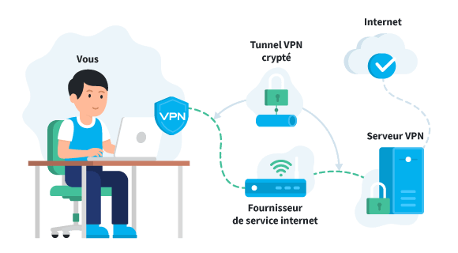

#### WIREGUARD VPN

##### INSTALLATION ET CONFIGURATION SERVEUR (Linux):

###### Update et installation:
```bash
sudo apt update
sudo apt install wireguard
```

###### Création des clefs:
```bash
wg genkey | sudo tee /etc/wireguard/privatekeyserveur | wg pubkey | sudo tee /etc/wireguard/publickeyserveur
```

###### Création de la configuration serveur:
```bash
sudo nano /etc/wireguard/wg0.conf
```

Dans ce fichier de configuration, CLEF_PRIVEE_SERVEUR et INTERFACE_RESEAU sont à renseigner (remplacer):  

```bash
[Interface]
# Adresse interne du serveur
Address = 10.0.0.1/24
ListenPort = 51820
# Clef privée du serveur
PrivateKey = 'CLEF_PRIVEE_SERVEUR'

[Peer]
# Ajouter les clients
PublicKey = 'CLE_PUBLIQUE_CLIENT_1'
AllowedIPs = 10.0.0.2/32

[Peer]
# Ajouter les clients
PublicKey = 'CLE_PUBLIQUE_CLIENT_2'
AllowedIPs = 10.0.0.3/32

# Routing vers l'interface réseau
PostUp = iptables -A FORWARD -i %i -j ACCEPT; iptables -t nat -A POSTROUTING -o 'INTERFACE_RESEAU' -j MASQUERADE
PostDown = iptables -D FORWARD -i %i -j ACCEPT; iptables -t nat -D POSTROUTING -o 'INTERFACE_RESEAU' -j MASQUERADE
```

La 'CLEF_PRIVEE_SERVEUR' s'obtient avec la commande:

```bash
cat /etc/wireguard/privatekey
```

L' 'INTERFACE_RESEAU' s'obtient avec la commande:

```bash
ip -o -4 route show to default | awk '{print $5}'
```

Enfin, on protège l'accès aux fichiers sensibles: 
 
```bash
sudo chmod 600 /etc/wireguard/{privatekey,wg0.conf}
```

Configuration de "l'IP forwarding":  

```bash
sudo nano /etc/sysctl.conf
```

```bash
net.ipv4.ip_forward=1
```

Vérifier que le fichier /proc/sys/net/ipv4/ip_forward contienne le chiffre 1:  

```bash
cat /proc/sys/net/ipv4/ip_forward
1
```

###### Démarrer le serveur:  

```bash
sudo wg-quick up wg0
```

Pour activer le serveur au démarrage du système:  
```bash
sudo systemctl enable wg-quick@wg0.service
```

**NOTE:   
* Si le serveur se trouve dérrière un routeur ou box internet, ne pas oublier de faire la redirection de port (ici dans l'exemple, le 51820) de la box vers l-IP du serveur.  
L'adresse publique du serveur devient alors celle du routeur/box dans la configuration client:  
        Endpoint = SERVER_IP_ADDRESS:51820**


##### INSTALLATION ET CONFIGURATION CLIENT:

###### LINUX:

###### Update et installation:

```bash
sudo apt update
sudo apt install wireguard
```

###### Création des clefs pour le client:

```bash
wg genkey | sudo tee /etc/wireguard/clients/client.key | wg pubkey | sudo tee /etc/wireguard/clients/client.key.pub
```
###### création de la configuration:

```bash
nano /etc/wireguard/wg0.conf
```

Configuration:
```bash
/etc/wireguard/wg0.conf

[Interface]
# Clef privée du client
PrivateKey = 'CLIENT_PRIVATE_KEY'
# Adresse interne du client (en cohérence avec l'IP interne du serveur)
Address = 10.0.0.2/24
# Optionnel
DNS = 8.8.8.8

[Peer]
# Clef publique du serveur
PublicKey = 'SERVER_PUBLIC_KEY'
# Adresse IP publique du serveur
Endpoint = 'SERVER_IP_ADDRESS':51820
# Pour filtrer
AllowedIPs = 0.0.0.0/0
```
###### Configuration de "l'IP forwarding":

```bash
sudo nano /etc/sysctl.conf
```

```bash
/etc/sysctl.conf

net.ipv4.ip_forward=1
```

###### Sécurisation des fichiers sensibles:

```bash
sudo chmod 600 /etc/wireguard/{privatekey,wg0.conf}
```

###### Pour démarrer la connection:

```bash
sudo wg-quick up wg0
```

###### Installation d'un plugin pour Gnome

- Installer l'extension [Wireguard Indicator, by Gregos-Winus](https://extensions.gnome.org/extension/3160/wireguard-indicator/)   
- Suivez les indications données en cliquant sur l'applet en haut à droite.  

##### WINDOWS:

###### Télécharger l'application à l'adresse:

https://download.wireguard.com/windows-client/wireguard-installer.exe

###### Créer une nouvelle config:

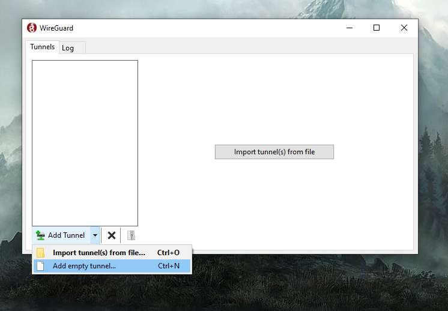

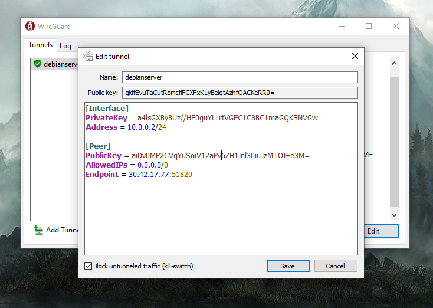

###### Configuration:  

Appliquer la configuration suivante en renseignant CLEF-PRIVEE_CLIENT, IP_PUBLIQUE_SERVEUR et CLEF_PUBLIQUE_SERVEUR:  
```bash
/etc/wireguard/clients/client.conf

[Interface]
PrivateKey = 'CLIENT_PRIVATE_KEY'
Address = 10.0.0.2/24

[Peer]
PublicKey = 'SERVER_PUBLIC_KEY'
Endpoint = 'SERVER_IP_ADDRESS':51820
AllowedIPs = 0.0.0.0/0
```

Note: La port et les adresses IP internes au réseau peuvent également être modifiées (en cohérence avec la configuration du serveur)

##### Ajouter un client (SERVEUR):

* NOTE: Via ligne de commande, la commande ne tient pas après l'arret du serveur, privilégier l'ajout du client dans la configuration serveur.

Commande à effectuer SUR LE SERVEUR:  
```bash
sudo wg set wg0 peer 'CLEF_PUBLIQUE_CLIENT' allowed-ips 'IP_INTERNE_CLIENT'
```

La CLEF_PUBLIQUE_CLIENT s'obtient SUR LE CLIENT avec la commande:
```bash
sudo cat /etc/wireguard/publickey
```

Pour l'IP interne, elle doit être cohérente avec l'adresse IP interne du serveur.
Dans cet exemple, le serveur a pour IP interne 10.0.0.1 et le client 10.0.0.2

Après l'ajout d'un client redémarrer le serveur:
```bash
sudo wg-quick down wg0
sudo wg-quick up wg0
```

- Génération d'un QR code pour client Android (a effectuer sur le serveur):
```bash
sudo apt install qrencode
qrencode -t ansiutf8 < /etc/wireguard/clients/client.conf
```


##### Accès partage SAMBA:

Pour accéder au partage samba d'une machine sur le même réseaux que le serveur:

###### A) pour un client Windows:

* Dans le barre d'adresse de l'explorateur windows, entrer l'adresse de la machine partageant du contenu via samba:

```bash
\\ADRESSEIP.LOCALE.MACHINE.SAMBA\
```

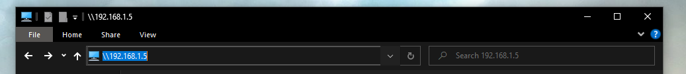

* Entrer les acréditations (nom d'utilisateur et mot de passe de la session utilisateur) de la machine partageant le contenu samba lors de l'apparition de la fenêtre contextuelle.

<!---->

###### B) pour un client Linux:
* Dans l'explorateur de fichiers, choisir autre emplacements; en bas de la fenêtre, un champs de connexion serveur attend une URL, y entrer l'adresse de la machine partageant du contenu via samba:  

```bash
smb://ADRESSEIP.LOCALE.MACHINE.SAMBA/
```

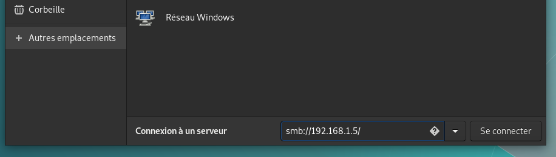

* Enfin, appuyer sur "se connecter"

**Attention, sur Linux les slashs sont inversés par rapport à Windows.**


#### LES DIFFERENTES SOLUTIONS CLIENT

- Le VPN SSL
Aussi appelé « clientless », car il ne nécessite pas l'installation d'un logiciel client ; un navigateur Web compatible avec l’ouverture des sessions HTTPS SSL/TLS est suffisant.
Un tunnel VPN SSL ne permet pas de véhiculer différents protocoles de communication comme le VPN IPsec, mais des solutions existent ainsi :

Pour le protocole RDP, l'ouverture d'un bureau distant utilisera l'accès Web aux services Bureau à distance (RD Web Access) qui permet d’accéder aux programmes RemoteApp et aux services Bureau à distance.

- Le VPN IPsec
L'installation d'un logiciel « agent » est nécessaire afin d’établir un tunnel vers un serveur VPN.
Un Tunnel VPN IPsec permet de véhiculer différents protocoles de communication tels que SSH, RDP, SMB, SMTP, IMAP, etc. 

## EXERCICES

### 1) EXEMPLE CONCRET

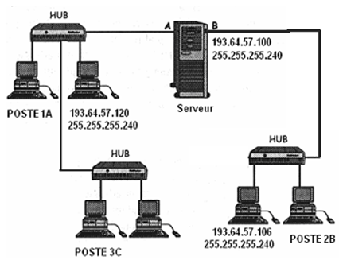

- Combien de réseau(x) comporte donc cette structure ?
- Quel est le nombre maximal d'hôte de sous réseaux qu’on peut installer avec cette configuration ?
- Quelle fonction joue le poste serveur dans cette architecture ?

### 2) ADRESSE RESEAU, MACHINE OU BROADCAST?

Considérer les adresses suivantes, compte-tenu des masques de sous réseau, sont-ce des adresses réseau, de macine ou de broadcast?

- 192.168.0.15/255.255.255.0
- 192.168.1.0/255.255.255.0
- 192.168.1.0/255.255.254.0
- 10.8.65.29/255.255.255.224
- 10.8.65.31/255.255.255.224
- 10.0.0.255/255.255.254.0

### 3) CALCUL DE SOUS RESEAUX

##### RESEAU 192.168.0.0:
- J'ai besoin de 3 sous réseaux, quelle est le masque de sous reseau à appliquer?
Qu'elles sont les adresses de ces trois sous réseaux?

##### RESEAU 192.168.4.0:
- Je veux pouvoir accueillir 30 machines par sous réseaux, quelle est le masque à appliquer?
Combien de sous réseaux vais-je obtenir?

##### RESEAU 192.168.20.1:
- Je veux pouvoir accueillir 8 machines par sous réseau, quelle est le masque de sous reseau à appliquer?

### 4) DECOUPAGE RESEAU EN SOUS RESEAU
- On veut découper le réseau 195.84.90.0 en 8 sous-réseaux. Quelle est la valeur du masque de sous-réseau, et pour chaque sous-réseau, indiquez :
- l’adresse du sous-réseau
- l’adresse de broadcast

### 5) IP ET MASQUE
- Quelles adresses IP se trouvent sur le même sous-réseau que 130.12.127.231 si le masque de sous-réseau est 255.255.192.0?

- 130.12.63.232
- 130.22.130.1
- 130.12.64.23
- 130.12.167.127

### 6) MISE EN SITUATION

Une entreprise possède un parc informatique de 1000 machines.
En plus de la direction qui ne nécessite qu'un seul sous réseau, l'entreprise est divisée en 10 départements qui nécessitent chacuns au moins 5 sous réseaux.
- En partant du réseau 192.1.0.0, quel masque de sous réseau appliquer pour satisfaire tout le monde?
- Combien de sous réseaux ce masuqe va t'il créer?
- En terme d'équipements réseau, combien va t-il falloir de switchs pour réaliser les branchements cohérents avec l'archtecture voulue?


## SOURCES

- https://www.inetdoc.net/articles/index.html#net-sect
