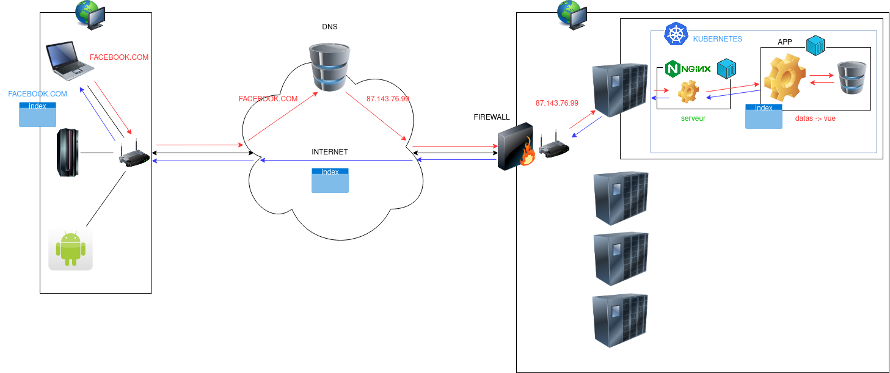
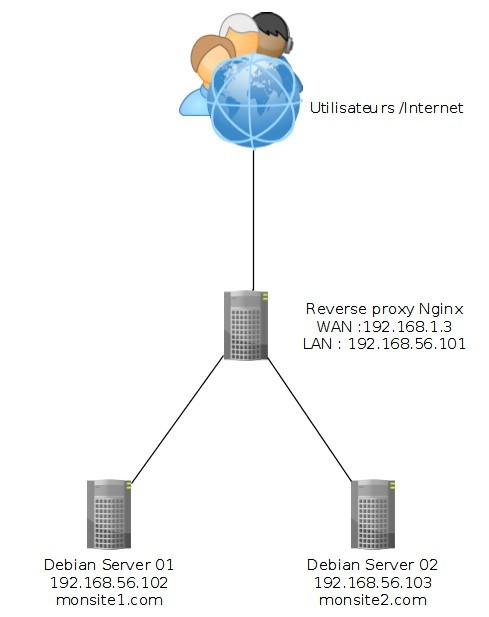
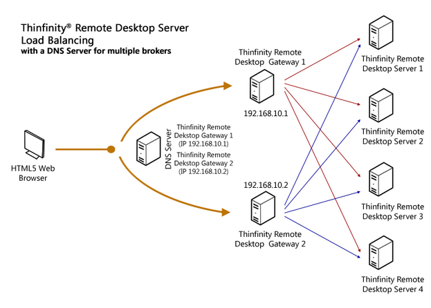

# SERVEURS WEB


## PLAN

<!-- TOC -->

- [SERVEURS WEB](#serveurs-web)
    - [PLAN](#plan)
    - [DEFINITION](#definition)
    - [EXEMPLES DE SERVEURS LOGICIEL](#exemples-de-serveurs-logiciel)
    - [UTILISATION](#utilisation)
        - [EXEMPLE D'ARCHITECTURE POUR UN SERVEUR PRIVE](#exemple-darchitecture-pour-un-serveur-prive)
        - [EXEMPLE D'ARCHITECTURE POUR UN SERVEUR PUBLIQUE](#exemple-darchitecture-pour-un-serveur-publique)
    - [NGINX](#nginx)
        - [DEFINITION](#definition)
        - [UTILISATION](#utilisation)
        - [INSTALLATION](#installation)
        - [CONFIGURATION](#configuration)
            - [CONFIGURATION HTTP](#configuration-http)
            - [CONFIGURATION HTTPS](#configuration-https)
                - [OPENSSL](#openssl)
                - [CERTBOT POUR AUTOMATISER LE HTTPS](#certbot-pour-automatiser-le-https)
                    - [DEFINITION](#definition)
                    - [UTILISATION](#utilisation)
        - [LES LOGS:](#les-logs)
        - [LE REVERSE PROXY](#le-reverse-proxy)
            - [LE LOAD BALANCING](#le-load-balancing)
                - [POURQUOI LE LOAD BALANCING?](#pourquoi-le-load-balancing)
                - [LES TYPES DE LOAD BALANCING](#les-types-de-load-balancing)
            - [LES SERVEURS DE SECOURS](#les-serveurs-de-secours)
        - [UTILISATION](#utilisation)
    - [APACHE](#apache)
        - [DEFINITION](#definition)
        - [INSTALLATION](#installation)
        - [CONFIGURATION](#configuration)
            - [HTTPS](#https)
        - [UTILISATION](#utilisation)
    - [AUTRES REFERENCES](#autres-references)
    - [EXERCICES](#exercices)
        - [PREMIER BLOC SERVEUR](#premier-bloc-serveur)
        - [MULTISITE](#multisite)
        - [APACHE CONFIG](#apache-config)
        - [LOAD BALANCING](#load-balancing)
        - [LES LOGS](#les-logs)

<!-- /TOC -->

## DEFINITION

Quand on parle de serveur web, on voit souvent une grosse machine connecté à internet reçevant, traitant et renvoyant les réponses aux requêtes qui lui parviennent.

En réalité, un serveur est une machine dédiée qui à pour mission de fournir un service ou des services via le réseau aux machines qui en font la demande.  
Un serveur peux être de type interne / privé, officiant sur un LAN d'entreprise (intranet) ou de type public, connecté au WAN (internet).

Les différents types de service fournis par un serveur sont:
- Hébergement de ressources statiques, celles-ci sont servies telle quelles sans traitement au préalable, cela va de pages web statiques, à des fichiers (images, vidéos, tableaux excel, etc), à des sites dynamiques construit à la demande (sites PHP, Java par exemple).
- DNS, offrant aux machines la résolution des noms de domaines en adresses IP afin d'orienter ces dernières vers le bon serveur.
- Impréssion, reçevant des requêtes quant à des documents à imprimer, puis transmet aux imprimantes concernés auquelles ils sont connectés.
- Base de données, ces serveurs permettent de décentraliser le stockage de l'information vis-à-vis d'un serveur applicatif afin d'optimiser celui-ci.
- Applicatif, assurant un environnement adéquate pour le fonctionnement d'un type d'application. 
- [Proxy](https://fr.wikipedia.org/wiki/Proxy) qui va jouer le rôle de médiateur entre deux machines communiquant sur le modèle client-serveur souvent à des fins de sécurité. Il est utilisé également pour filtrer les accès d'un réseau interne LAN vers le réseau WAN (internet).
- [Reverse proxy](https://fr.wikipedia.org/wiki/Proxy_inverse) qui jouera le même rôle qu'un proxy dans le sens inverse afin de rediriger les requêtes venant du réseau WAN sur un réseau interne (LAN) vers un serveur en particulier.

Dans le cas des serveurs web, la machine hébergeant les ressources nécessite une application logiciel de type serveur pour répondre aux requêtes des machines clientes.  
On distingue donc le seveur physique hébergeant les ressources du serveur logiciel, application permettant la communication entre les machines sous le modèle client-serveur.  


## EXEMPLES DE SERVEURS LOGICIEL

CERN httpd est le premier serveur HTTP, inventé en même temps que le World Wide Web, en 1990 au CERN de Genève. Il est rapidement devenu obsolète en raison de l'évolution exponentielle des fonctionnalités du protocole.

Quelques serveurs HTTP :

- Apache HTTP Server de la Apache Software Foundation, successeur du NCSA HTTPd
- Apache Tomcat de la Apache Software Foundation, évolution de Apache pour J2EE
- BusyBox httpd, utilisé dans le domaine de l'informatique embarquée, et notamment avec OpenWRT5
- Google Web Server de Google
- Internet Information Services (IIS) de Microsoft
- lighttpd de Jan Kneschke
- Monkey web server de Eduardo Silva Pereira, dédié au noyau Linux, permettant d'utiliser pleinement ses fonctionnalités
- nginx d'Igor Sysoev
- Hiawatha de Hugo Leisink
- NodeJS sous MIT Licence conçu par Ryan Lienhart Dahl en lignes de programmation en JavaScript
- Sun Java System Web Server de Sun Microsystems (anciennement iPlanet de Netscape, puis Sun ONE de Sun Microsystems)
- Tengine, fork de nginx, de Taobao (9e rang mondial Alexa en juillet 2014)
- Zeus Web Server de Zeus Technology
- Gunicorn est un serveur web HTTP WSGI écrit en Python pour Unix
- Zazouminiwebserver, serveur extrêmement léger (environ 500 kilooctets), sous environnement Microsoft Windows.
- Abyss Web Server, un serveur gratuit, multi-plateforme (Linux, Windows, MacOS, BSD), permettant un paramétrage très facile via une interface graphique multilingue.


## UTILISATION

### EXEMPLE D'ARCHITECTURE POUR UN SERVEUR PRIVE


> Note: Ici, le serveur joue le rôle de proxy pour les machines clientes se connectant à internet, il doit être équipé d'un firewall par sécurité ainsi que d'un sysème de logs pour consigner les connexions entrantes et sortantes dans le tape backup.

### EXEMPLE D'ARCHITECTURE POUR UN SERVEUR PUBLIQUE



> Note: En rouge, nous pouvons voir le chemin de la requête de la machine cliente vers le serveur d'application et en bleu la réponse du serveur d'application vers la machine cliente. 

## NGINX

[](https://nginx.org/en/docs/)

### DEFINITION

Nginx (engine-X) est un logiciel open-source de serveur web codé en langage C ainsi qu'un proxy inverse écrit par Igor Sysoev, dont le développement a débuté en 2002 pour les besoins d'un site russe à très fort trafic (Rambler)

### UTILISATION

Outre le fait d'être un serveur HTTP, NGINX peut être configuré pour être un serveur mandataire inverse (en anglais : reverse proxy) Web et un serveur proxy de messagerie électronique (IMAP / POP3).  
L'utilisation la plus fréquente de NGINX est de le configurer comme un serveur Web classique pour servir des fichiers statiques et comme un proxy pour les requêtes dynamiques typiquement acheminées en utilisant une interface FastCGI vers un ou des serveurs applicatifs avec un mécanisme de répartition de charge. 

Il est aussi très utilisé en production pour servir des applications en Ruby on Rails grâce au module Phusion Passenger. La plupart des sites en Ruby on Rails à fort trafic utilisent NGINX (par exemple basecamp ou encore LinuxFr.org).

### INSTALLATION

```bash
sudo apt-get install nginx
```

### CONFIGURATION

La configuration de Nginx se situe sous /etc/nginx :
- Le  fichier  /etc/nginx/nginx.conf  :  fichier  de  configuration  globale  du  serveur.  Les  paramètres impactent l’ensemble du serveur.
- le répertoire sites-available : contient les fichiers de configuration des sites.
- le répertoire sites-enabled : contient des liens symboliques vers les fichiers de sites-available,
ce qui permet d’activer ou de désactiver les sites.
- le répertoire conf.d : répertoire contenant les paramètres communs à tous les sites

Exemple de lien symbolique pour activer une configuration pour un "virtual host":
```bash
ln -s /etc/nginx/site-available/exemple.com /etc/nginx/sites-enabled/exemple.com
```

> Note: Une fois le lien symbolique créé, il faut redémarrer le service nginx pour que celui-ci recharge les configurations actives dans le dossier sits-enabled/ via la commande:
```bash
sudo systemctl restart nginx
```

Explications de différentes directives:
- user Définit l'utilisateur et le groupe propriétaires du processus.
Si le groupe n’est pas spécifié, le groupe du même nom que
l’utilisateur est utilisé.
- worker_processes Définit le nombre de processus. La valeur optimale dépend
de nombreux facteurs comme le nombre de coeurs CPU, les
spécificités des disques durs, etc. En cas de doute, la
documentation de nginx propose comme valeur de départ le
nombre équivalent au nombre de coeurs CPU disponibles (la
valeur auto essaiera de le déterminer).
- pid Définit un fichier pour stocker la valeur du pid.
- worker_connections Fixe le nombre maximum de connexions simultanées
qu’un processus worker peut ouvrir (vers le client et vers les
serveurs mandatés).
- tcp_nopush tcp_nopush est indissociable de l’option sendfile. Elle permet
d'optimiser la quantité d’information envoyée en une
seule fois. Les paquet ne sont envoyés que lorsque ils ont
atteints leur taille maximale.
- tcp_nodelay Activer tcp_nodelay force l’envoi immédiat des données
contenues dans la socket, quelle que soit la taille du paquet,
ce qui est le contraire de ce que fait tcp_nopush.
- sendfile Optimiser l’envoi de fichiers statiques (option inutile dans
le cadre d’une configuration en proxy-inverse).
Si sendfile est activée, nginx s’assure que tous les paquets
soient bien remplis avant d’être envoyés au client (grâce à
tcp_nopush), puis, quand arrive le dernier paquet, nginx
désactive tcp_nopush, et force l’envoi des données avec
tcp_nodelay.
- keepalive_timeout temps maximum avant fermeture d’une connexion
inactive.
- types_hash_max_size Nginx entretient des tables de hashage contenant des
informations statiques. Permet de définir la taille maximale
de la table de hachage.
- include Inclure un autre fichier ou d’autres fichiers qui
correspondent au modèle fourni dans la configuration.
- default_type Type MIME par défaut d’une requête.
- ssl_protocols Versions du protocole TLS acceptés.
- ssl_prefer_server_ciphers Préférer l’utilisation de la cipher suite du serveur plutôt que
celle du client.
- access_log Configurer les journaux d’accès (voir paragraphe "gestion
des logs").
- error_log Configurer les journaux d’erreurs (voir paragraphe "gestion
des logs").
- gzip Le module ngx_http_gzip_module est un filtre compressant
les données transmises au format gzip.
- gzip_disable Désactiver gzip en fonction d’une expression régulière.

La  configuration  du  premier  serveur  en  écoute  sur  le  port  80  se  situe  sous  /etc/nginx/sites-available/default. Ce fichier est inclue au fichier nginx.conf grâce à la directive include
/etc/nginx/sites-enabled/*;

#### CONFIGURATION HTTP

La configuration "vanilla" d'un bloc serveur HTTP pour Nginx:
```code
# Configuration du premier bloc server en écoute sur le port 80
server {
    # port d'écoute IPV4
    listen 80;
    # port d'écoute IPV6
    listen [::]:80;

    # chemin du repertoire racine sur le serveur
    root /var/www/html;
    # fichiers index que le serveur doit servir dans le repertoire racine
    index index.html index.htm index.nginx-debian.html;

    # nom de domaine concerné par le bloc serveur   
    server_name _;

    # traitement de l'URI: ce qui suit le nom de domaine
    location / {
        try_files $uri $uri/ =404;
    }
}
```

#### CONFIGURATION HTTPS

Le protocole HTTPS repose sur le SSL (Secure Socket Layer) qui est un protocole de sécurité qui permet de sécuriser les échanges d'informations entre des appareils reliés à un réseau interne ou à Internet.
Développé par l'entreprise américaine Netscape au milieu des années 1990, le SSL repose sur un procédé de cryptographie par clef publique. Sa mission se résume à la création d'un canal de communication sécurisé entre un client et un serveur.

##### OPENSSL

Si on veut utiliser le HTTPS il nous faut donc créer des clefs dont l'emplacement serat renseigné dans la configuration du "virtualhost" d'Apache pour que celui-ci propose une clef publique lors de la transaction avec le client.

Pour ceci, on utilise le Openssl:
```bash
sudo apt install openssl
```

- D'abord, on génère une clef privée:
```bash
openssl genrsa -out /etc/ssl/private/private.key 4096
```

- puis, on éffectue une demande de certificat à partir de la clef:
```bash
openssl req -new -key /etc/ssl/private/private.key -out /etc/ssl/certs/serveur.csr
```

- On construit le certificat:
```bash
openssl x509 -req -days 365 -in /etc/ssl/certs/serveur.csr -signkey /etc/ssl/private/private.key -out /etc/ssl/certs/serveur.crt
```

- Enfin, on renseigne correctement les chemins de la clef et du certificat dans a configuration Nginx:
```code
server {
    listen 443 ssl;
    listen [::]:443 ssl;

    # protocoles SSL gérés par le serveur
    ssl_protocols       TLSv1.2 TLSv1.1;

    # chemin du certificat et clef serveur permettant l'application du serveur SSL
    ssl_certificate     /chemin/vers/cert.pem;
    ssl_certificate_key /chemin/vers/key.key;
    
    root                /var/www/html;
    index               index.html index.htm index.nginx-debian.html;
    
    server_name         _;
    
    location / {
        try_files       $uri $uri/ =404;
    }
}
```

:warning: Ce certificat est dit "autosigné" et n'est pas reconnnu comme suffisant par la pluspart des navigateurs pour vérifier l'authenticité du serveur vis-à-vis du nom de domaine pointant vers celui-ci.  

> Note: Ce type de certificat permettra d'encrypter les échanges entre le serveur et les machines clientes mais ne garantie en rien l'identité du serveur. 

##### CERTBOT POUR AUTOMATISER LE HTTPS

[](https://certbot.eff.org/)

###### DEFINITION

Certbot est un outil codé en python pour générer une des certificats SSL.  
C'est une autorité de certification gratuite, automatisée et fiable issue de l'ISRG (Internet Seciruty Research Group).  
Le certificat délivré est de type DV (Domain Validation) ce qui garantie que le serveur appartient bien au propriétaire du nom de domaine concerné par le certificat.  
L'encryption est de type [X.509](https://fr.wikipedia.org/wiki/X.509) et utilise la fonction de hashage [SHA-2](https://fr.wikipedia.org/wiki/SHA-2).  

Pour un site e-commerce, il est préférable d’opter pour un certificat de type OV ou EV (OV pour validation de l’organisation ou EV pour validation étendue).

Voici les autres types de certificats offrant des "niveaux de confiance" plus poussés:
- Validation d'organisation (OV) vérifie l'identité de l'organisation (par exemple, une entreprise, une organisation à but non lucratif ou gouvernementale) du Sujet répertorié dans le certificat, ainsi que le lieu où l'organisation opère.  
- Validation individuelle (IV) vérifie l'identité de la personne physique lrépertorié comme Objet du certificat. Il peut s'agir de la même personne que la personne qui a demandé le certificat. Souvent, l'adresse du Particulier est également vérifiée.  
- Extended Validation (EV), comme OV, vérifie l'identité d'une organisation. Cependant, EV représente un niveau de confiance plus élevé que OV et nécessite des contrôles de validation plus rigoureux pour confirmer que l'organisation est dûment enregistrée auprès des autorités de sa juridiction et qu'elle répond aux exigences fixées par le CA/Browser Forum.  

###### UTILISATION

Installation (avec le module nginx):
```bash
sudo apt install python3-certbot-nginx
```

- Une fois installé, les commandes s'éffectuent avec l'utilisateur root.
Pour générer un certificat HTTPS, s'assurer que la configuration nginx pour le port 80 est correcte et fonctionnelle puis lancer la commande pour faire un test (dry-run):
```bash
sudo certbot certonly -d mondomaine.com --dry-run
```

Une fois le test réussi, lancer la commande sans le dry-run:
```bash
sudo certbot certonly -d mondomaine.com
```

- Choisir l'option Nginx serveur pus attendre le résultat du "challenge".
- Si le message est "congratulations!", alors il reste plus qu'à s'assurer que la configuration du bloc serveur HTTPS utilise bien les certificats générés par Certbot, pus de redémarrer Nginx:
```bash
sudo systemctl restart nginx
```

- Penser également à drediriger les requêtes du bloc server HTTP vers le bloc serveur HTTPS:
```bash
# BLOC HTTP
server {
    listen 80 mondomaine.com;
    listen [::]:80 mondomaine.com;
    # bloc à commenter pour que la redirection soit effective
    #index index.html index.htm index.nginx-debian.html;
    server_name _;

    # solution 1:
    if ($host = domaine.fr) {
        return 301 https://$host$request_uri;
    }

    # solution 2:
    rewrite ^(.*) https://domaine.fr$1 permanent;
}
```

### LES LOGS:

Il éxiste différents type de logs pour Nginx:
- access logs: NGINX enregistre les activités de tous les visiteurs de votre site dans les journaux d'accès.  
Ici, vous pouvez trouver quels fichiers sont consultés, comment NGINX a répondu à une demande, quel navigateur un client utilise, l'adresse IP des clients et plus encore.  
Il est possible d'utiliser les informations du journal d'accès pour analyser le trafic afin de retrouver les usages des sites dans le temps. De plus, en surveillant correctement les journaux d'accès, on peut savoir si un utilisateur envoie une demande inhabituelle pour trouver des failles dans l'application Web déployée.

- error logs: si NGINX rencontre des problèmes, il enregistrera l'événement dans le journal des erreurs.  
Cela peut arriver s'il y a une erreur dans le fichier de configuration. Par conséquent, si NGINX ne parvient pas à démarrer ou s'arrête brusquement de fonctionner, vous devez vérifier les journaux d'erreurs pour trouver plus de détails. Vous pouvez également trouver quelques avertissements dans le journal des erreurs, mais cela n'indique pas qu'un problème est survenu, mais l'événement peut poser un problème grave dans un avenir proche.

Exemple:
```code
error_log  /var/log/nginx/error_log;
access_log  /var/log/nginx/access.log;

server {
        listen 80;
        server_name domain1.com;
            error_log  /var/log/nginx/domain1.error_log;
            access_log  /var/log/nginx/domain1.access.log;
                ...
}
server {
        listen 80;
        server_name domain2.com;
            error_log  /var/log/nginx/domain2.error_log;
            access_log  /var/log/nginx/domain2.access.log;
                ...
}
```

### LE REVERSE PROXY



La fonctionnalité de proxy inverse est fourni par le module ngx_http_upstream_module. Il permet
de  définir  des  groupes  de  serveurs  qui  sont  ensuite  appelés  par  les  directives  proxy_pass  ou fastcgi_pass, memcached_pass, etc.

Cette directive permet de rediriger les requêtes vers d'autres serveurs offrant des fonctionnalités comme le load balancing ou les serveurs de secours (backup) en cas de problème sur le serveur principal.

#### LE LOAD BALANCING



##### POURQUOI LE LOAD BALANCING?

Le trafic en ligne s’intensifie de manière exponentielle depuis dix ans. Quant aux internautes, ils deviennent de plus en plus exigeants en matière de rapidité d’accès et de sécurité. Les serveurs web sont donc extrêmement sollicités.  

Aussi, une stratégie d’optimisation de leur charge de travail a été mise en place: le load balancing. Celui-ci permet à un groupe de serveurs (cluster) de faire face aux pics de trafic, mais aussi de prévoir une solution de secours en cas de panne. C’est à ce moment qu’intervient le load balancer (répartiteur de charge).  
Il permet d’équilibrer la charge de travail entre les serveurs, pour maintenir leur capacité à un niveau optimal. Lorsque votre site internet est hébergé sur nos serveurs avec un load balancer, il sera ainsi moins sujet à des ralentissements ou des interruptions de service.

##### LES TYPES DE LOAD BALANCING

Pour plus de détail sur les types de load balancing:  
https://docs.nginx.com/nginx/admin-guide/load-balancer/http-load-balancer/

Exemple de configuration basique, qui réparti la charge de 2/3 vers le premier serveur et d'1/3 vers
le second serveur applicatif :
```code
upstream serveur {
    server serveur1.domaine.fr:8080  weight=2;
    server serveur2.domaine.fr:8080  weight=1;
}

server {
    location / {
        proxy_pass http://serveur;
    }
}
```

#### LES SERVEURS DE SECOURS

Des serveurs peuvent être déclarés en secours:
```code
upstream serveur {
    server serveur1.domaine.fr:8080  weight=2 fail_timeout=5s max_fails=3;
    server serveur2.domaine.fr:8080  weight=1 fail_timeout=5s max_fails=3;

    server backup1.example.com:8080  backup;
    server backup2.example.com:8080  backup;
}

server {
    location / {
        proxy_pass http://serveur;
    }
}
```

Les principales directives pour les serveur de backups:
- max_fails = nombredetentative: fixe  le  nombre  de  tentatives  de  connexion  devant  être  en
echec  durant  le  laps  de  temps  défini  par  la  paramètre  fail_timeout  pour  que  le  serveur  soit considéré  comme  indisponible.  La  valeur  par  défaut  est  fixée  à  1,  la  valeur  à  0  désactive  la fonctionnalité.
- fail_timeout=time:  fixe  la  durée  durant  laquelle  un  nombre  de  connexion  défini  bascule  le serveur comme indisponible et fixe la période de temps durant laquelle le serveur sera
considéré comme indisponible. La valeur par défaut est de 10 secondes.

- Plus d'inormations sur la directive [upstream](https://nginx.org/en/docs/http/ngx_http_upstream_module.html).


### UTILISATION

Nginx est comme tout autre service sous-linux, il est controllé par "systemctl"

- Pour activer Nginx au démarrage:
```bash
sudo systemctl enable nginx
```

- Connaitre l'état du service:
```bash
sudo systemctl status nginx
```

- Pour redémarrer Nginx (après tout changement de configuration):
```bash
sudo systemctl restart nginx
```

- Pour stopper Nginx:
```bash
sudo systemctl stop nginx
```

- Pour démarrer Nginx:
```bash
sudo systemctl start nginx
```

- Pour tester la validité de la configuration:
```bash
sudo nginx -t
```

## APACHE

[](https://httpd.apache.org/docs/2.4/)

### DEFINITION

Le logiciel libre Apache HTTP Server (Apache) est un serveur HTTP créé et maintenu au sein de la fondation Apache. Jusqu'en avril 2019, ce fut le serveur HTTP le plus populaire du World Wide Web.

Apache est apparu en avril 1995. Au début, il s'agissait d'une collection de correctifs et d'additions au serveur NCSA HTTPd 1.2, qui était dans le domaine public et le serveur HTTP alors le plus répandu. De cette origine, de nombreuses personnes affirment que le nom Apache vient de a patchy server, soit « un serveur rafistolé ».  
Par la suite, Apache a été complètement réécrit, de sorte que, dans la version 2, il ne reste pas de trace de NCSA HTTPd. 

### INSTALLATION

Pour installer apache:
```bash
sudo apt install apache2
```

### CONFIGURATION

Par défaut, Apache est livré avec un site d'exemple. On peux modifier son contenu dans /var/www/html ou ses paramètres en éditant son fichier Virtual Host trouvé dans /etc/apache2/sites-enabled/000-default.conf.

Configuration de base pour un virtualhost Apache:
```bash
<VirtualHost *:80>

	ServerName www.site1.com

	ServerAdmin webmaster@localhost
	DocumentRoot /var/www/site1

	ErrorLog ${APACHE_LOG_DIR}/site1-error.log
	CustomLog ${APACHE_LOG_DIR}/site1-access.log combined

</VirtualHost>
```

Le fichier de configuration doit se trouver dans /etc/apache2/sites-available/
Une fois celui-ci correctement renseigné, activer la configuration avec la commande:
```bash
sudo a2ensite site1.conf
```

puis redémarrer les service Apache:
```bash
sudo systemctl restart apache2
```

Pour plus de renseignements sur les directives applicables dans les blocs "virtual hosts", se référer à la documentation Apache:
- https://httpd.apache.org/docs/2.4/fr/mod/core.html#virtualhost

#### HTTPS

Activation du module SSL Apache:
```bash
a2enmod ssl
```

Configuration du "virtualhost" en HTTPS:
```bash
<VirtualHost *:443>

    DocumentRoot /var/www/site
    ServerName  site.mondomaine.com

    ServerSignature Off
    ErrorLog ${APACHE_LOG_DIR}/error_site.log      
    LogLevel info      
    CustomLog ${APACHE_LOG_DIR}/site.log combined      

    SSLEngine on
    SSLCertificateFile /etc/ssl/certs/serveur.crt
    SSLCertificateKeyFile /etc/ssl/private/serveur.key

</VirtualHost>
```

> Un module Certbot dédié existe pour Apache de la même manière ue pour Nginx, consulter la documentation [Certbot](https://certbot.eff.org/instructions?ws=apache&os=debianbuster)

### UTILISATION

L'utilisation du service Apache est très similaire à celle de Nginx:

- Pour activer Apache au démarrage:
```bash
sudo systemctl enable apache2
```

- Connaitre l'état du service:
```bash
sudo systemctl status apache2
```

- Redémarrage du service:
```bash
sudo systemctl restart apache2
```

- Stopper le service apache:
```bash
sudo systemctl stop apache2
```

- Démarrage du service apache:
```bash
sudo systemctl start apache2
```

- Teste de la validité de la configuration:
```bash
sudo apache2ctl -t
```

## AUTRES REFERENCES

- [MALEKAL.COM](https://www.malekal.com/comment-fonctionne-un-serveur-web/)

## EXERCICES

### PREMIER BLOC SERVEUR

- Créer une configuration Nginx pour servir un site situé dans le dossier /var/www/monsite en HTTP
- Ce site doit juste avoir un index.html contenant un titre: "MON SITE", une image: https://www.legaragenumerique.fr/wp-content/uploads/2019/10/logo-web-garage_numerique.png ainsi qu'un lien vers votre profil Gitlab.

### MULTISITE

- Créer une configuration Nginx multisite qui va servir deux sites en fonction de l'adresse (site1: www.site1.com et site2: www.site2.com).
- Les deux index.html doivent contenir respectivement: "Bienvenue sur le site 1" et "Bienvenue sur le site 2".
- Le fichier /etc/hosts doit servir de DNS pour le serveur.  

Exemple de fichier /etc/hosts:  
```bash
# via le loopback:
127.0.0.1 www.test-site.com
# via son adresse IP:
192.168.1.77 www.test-site.com
```

### APACHE CONFIG

- Créer une configuration Apache pour servir un site dans le dossier /var/www/monsite en HTTP.
- Ce site doit juste avoir un index.html contenant un titre: "MON SITE", une image: https://www.legaragenumerique.fr/wp-content/uploads/2019/10/logo-web-garage_numerique.png ainsi qu'un lien vers votre profil Gitlab.

### LOAD BALANCING

- Créer une configuration Nginx éffectuant une répartition de charge égale sur deux serveurs: server1 et server2.
- Utiliser deux VM pour représenter les deux serveurs et une pour représenter le serveur Nginx de load balancing.

> Note: Créer des VM "light", 1 Go de RAM par VM est suffisant.

### LES LOGS

- Créer une configuration Nginx qui "logge" les accès serveur ainsi que les erreurs dans le dossier de logs par defaut: /var/log/nginx/
