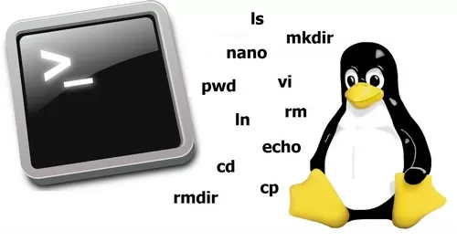
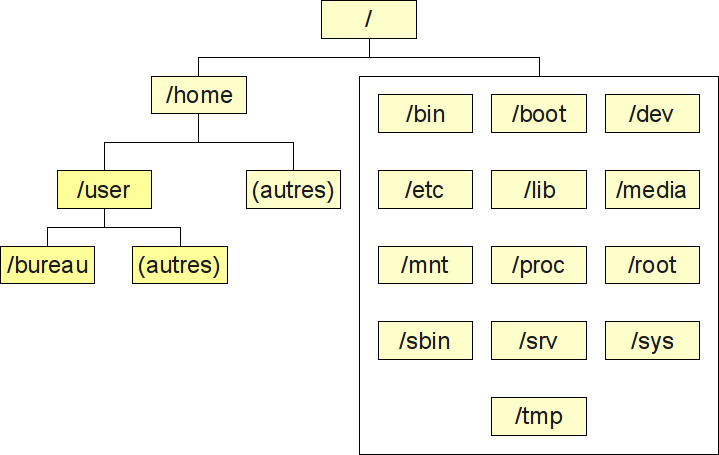
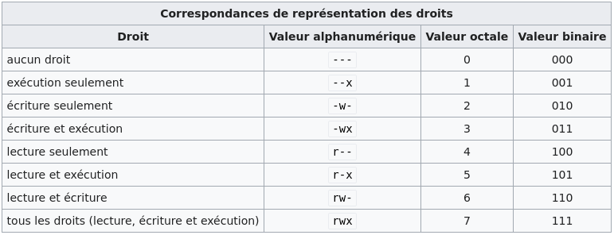

# COMMANDES DE BASE LINUX
<a id="markdown-commandes-de-base-linux" name="commandes-de-base-linux"></a>




## PLAN
<a id="markdown-plan" name="plan"></a>

<!-- TOC -->

- [COMMANDES DE BASE LINUX](#commandes-de-base-linux)
    - [PLAN](#plan)
    - [INTRODUCTION](#introduction)
        - [D'OU VIENT LINUX?](#dou-vient-linux)
        - [LES DISTRIBUTIONS](#les-distributions)
    - [ARBORESCENCE DU SYSTÈME DE FICHIER](#arborescence-du-syst%C3%A8me-de-fichier)
        - [FICHIERS SYSTEME](#fichiers-systeme)
        - [LES PERIPHERIQUES](#les-peripheriques)
        - [AUTRES PERIPHERIQUES](#autres-peripheriques)
    - [LES PRINCIPALES COMMANDES](#les-principales-commandes)
        - [Commande pwd](#commande-pwd)
        - [Commande cd](#commande-cd)
        - [Commande ls](#commande-ls)
        - [Commande cat](#commande-cat)
        - [Commande cp](#commande-cp)
        - [Commande rmdir](#commande-rmdir)
        - [Commande rm](#commande-rm)
        - [Commande touch](#commande-touch)
        - [Commande locate](#commande-locate)
        - [Commande find](#commande-find)
        - [Commande grep](#commande-grep)
        - [Commande sudo](#commande-sudo)
        - [Commande df](#commande-df)
        - [Commande du](#commande-du)
        - [Commande head](#commande-head)
        - [Commande tail](#commande-tail)
        - [Commande diff](#commande-diff)
        - [Commande tar](#commande-tar)
        - [Commande chmod](#commande-chmod)
        - [Commande chown](#commande-chown)
        - [Commande kill](#commande-kill)
        - [Commande ping](#commande-ping)
        - [Commande wget non natif](#commande-wget-non-natif)
        - [Commande uname](#commande-uname)
        - [Commande top / htop non natif](#commande-top--htop-non-natif)
        - [Commande history](#commande-history)
        - [Commande man](#commande-man)
        - [Commande echo](#commande-echo)
        - [Commande zip, unzip](#commande-zip-unzip)
        - [Commande hostname](#commande-hostname)
        - [Commande lsblk](#commande-lsblk)
        - [Commande ln](#commande-ln)
        - [Commande sed](#commande-sed)
    - [LES EDITEURS DE FICHIERS](#les-editeurs-de-fichiers)

<!-- /TOC -->

## INTRODUCTION
<a id="markdown-introduction" name="introduction"></a>

Cette liste bien qu'incomplète présente les principales commandes sur Linux pour pouvoir utiliser le terminal de commande et effectuer les principales tâches qu'un utilisateur ou administrateur est susceptible d'accomplir.

### D'OU VIENT LINUX?
<a id="markdown-d'ou-vient-linux%3F" name="d'ou-vient-linux%3F"></a>

Linux ou GNU/Linux est une famille de systèmes d'exploitation open source de type Unix fondé sur le noyau Linux, créé en 1991 par Linus Torvalds


Le système Unix a été créé par AT&T au début des années 1970 et s'est notamment répandu dans le monde universitaire. Dès la fin de l'année 1977, des chercheurs de l'université de Californie apportèrent de nombreuses améliorations au système Unix et le distribuèrent sous le nom de Berkeley Software Distribution (BSD). Finalement, les distributions BSD furent purgées du code AT&T, et librement disponibles en 1991. La distribution de BSD a toutefois été l'objet d'une procédure judiciaire d'AT&T au début des années 1990.
La mascotte GNU.


En 1983, Richard Stallman annonce son projet de développer un système d'exploitation libre compatible UNIX appelé GNU3, en invitant la communauté hacker à le rejoindre et participer à son développement. Dès 1985, certaines pièces maîtresses sont opérationnelles, dont le compilateur GCC4. Le projet GNU commence vers 1990 à travailler sur le noyau de système d'exploitation Hurd, mais son développement prendra plus de dix ans.

En 1991, l’étudiant finlandais Linus Torvalds, indisposé par la faible disponibilité du serveur informatique UNIX de l’université d'Helsinki, entreprend le développement d’un noyau de système d'exploitation, qui prendra le nom de « noyau Linux ».

Il choisit rapidement de publier son noyau sous licence GNU GPL. Cette décision rend compatibles juridiquement les systèmes GNU et Linux. Dès lors, pour combler le vide causé par le développement inachevé de Hurd, GNU et le noyau Linux sont associés pour former un nouveau système d'exploitation (parfois considéré comme variante de GNU) : GNU/Linux ou Linux.

### LES DISTRIBUTIONS
<a id="markdown-les-distributions" name="les-distributions"></a>


- [DEBIAN](https://www.debian.org/index.fr.html)
- [RED HAT](https://www.redhat.com/fr)
- [CENT OS](https://www.centos.org/)

## ARBORESCENCE DU SYSTÈME DE FICHIER
<a id="markdown-arborescence-du-syst%C3%A8me-de-fichier" name="arborescence-du-syst%C3%A8me-de-fichier"></a>

Arborescence type d'une installation Debian sur le disque système:



### FICHIERS SYSTEME
<a id="markdown-fichiers-systeme" name="fichiers-systeme"></a>

Ce que contiennent les différents fichiers système:


### LES PERIPHERIQUES
<a id="markdown-les-peripheriques" name="les-peripheriques"></a>

Exemple de périphériques dans le fichier "/dev/":


### AUTRES PERIPHERIQUES
<a id="markdown-autres-peripheriques" name="autres-peripheriques"></a>

- /dev/null	Tout ce qui est envoyé à ce périphérique est détruit
- /dev/zero	On peut lire une infinité de zéros depuis ce périphérique
- /dev/random	On peut lire des nombres aléatoires depuis ce périphérique


## LES PRINCIPALES COMMANDES
<a id="markdown-les-principales-commandes" name="les-principales-commandes"></a>

### Commande pwd
<a id="markdown-commande-pwd" name="commande-pwd"></a>

Utilisez la commande pwd pour trouver le chemin du répertoire de travail (dossier) dans lequel vous êtes actuellement. La commande retournera un chemin absolu (complet), qui est en fait un chemin de tous les répertoires qui commence par une barre oblique (/). Un exemple de chemin absolu est /home/utilisateur.

### Commande cd
<a id="markdown-commande-cd" name="commande-cd"></a>

Pour naviguer dans les fichiers et répertoires de Linux, utilisez la commande cd. Elle nécessite soit le chemin d’accès complet, soit le nom du répertoire, selon le répertoire de travail dans lequel vous vous trouvez.

Disons que vous êtes dans /home/utilisateur/Documents et que vous voulez aller dans Photos, un sous-répertoire de Documents. Pour ce faire, il vous suffit de taper la commande suivante : cd Photos.

Un autre scénario est possible si vous voulez passer à un répertoire complètement nouveau, par exemple, /home/utilisateur/Films. Dans ce cas, vous devez taper cd suivi du chemin absolu du répertoire : cd /home/utilisateur/Films.

- cd .. (avec deux points) pour se déplacer d’un répertoire vers le haut
- cd pour aller directement au dossier principal (home)
- cd - (avec un tiret) pour passer à votre répertoire précédent

### Commande ls
<a id="markdown-commande-ls" name="commande-ls"></a>

La commande ls est utilisée pour visualiser le contenu d’un répertoire. Par défaut, cette commande affichera le contenu de votre répertoire de travail actuel.

Si vous voulez voir le contenu d’autres répertoires, tapez ls et ensuite le chemin d’accès du répertoire. Par exemple, tapez ls /home/utilisateur/Documents pour voir le contenu de Documents.

Il existe des variantes que vous pouvez utiliser avec la commande ls :
```bash
    ls -R # énumérera également tous les fichiers dans les sous-répertoires
    ls -a # affichera les fichiers cachés
    ls -al # listera les fichiers et les répertoires avec des informations détaillées comme les autorisations, la taille, le propriétaire, etc.
```

### Commande cat
<a id="markdown-commande-cat" name="commande-cat"></a>

cat (abréviation de concatenate) est l’une des commandes Linux les plus fréquemment utilisées. Elle est utilisée pour lister le contenu d’un fichier sur le résultat standard (sdout). Pour exécuter cette commande, tapez cat suivi du nom du fichier et de son extension. Par exemple : cat fichier.txt.

Voici d’autres façons d’utiliser la commande cat :
crée un nouveau fichier:
```bash
cat > nomDeFichier 
```
joindre le contenu de deux fichiers (1 et 2) et enregistre le résultat de ces derniers dans un nouveau fichier (le 3):
```bash
cat nomDeFichier1 nomDeFichier2>nomDeFichier3 
```

### Commande cp
<a id="markdown-commande-cp" name="commande-cp"></a>

Utilisez la commande cp pour copier les fichiers du répertoire actuel dans un autre répertoire. Par exemple, la commande cp scenery.jpg /home/utilisateur/Photos créera une copie de scenery.jpg (de votre répertoire actuel) dans le répertoire Photos.

```bash
cp /chemin/du/fichier_source /chemin/du/fichier_destination
cp -r /chemin/du/fichier_source /chemin/du/fichier_destination # récursivité
```

### Commande rmdir
<a id="markdown-commande-rmdir" name="commande-rmdir"></a>

Si vous avez besoin de supprimer un répertoire, utilisez la commande rmdir. Cependant, rmdir ne vous permet de supprimer que les répertoires vides. Préférer rm -rf

### Commande rm
<a id="markdown-commande-rm" name="commande-rm"></a>

La commande rm est utilisée pour supprimer les répertoires et leur contenu. Si vous voulez seulement supprimer le répertoire – comme alternative à rmdir – utilisez rm -r.

```bash
rm -rf /chemin/vers/fichier.ext
```

:warning: Soyez très prudent avec cette commande et vérifiez à nouveau dans quel répertoire vous vous trouvez. Cela effacera tout et il n’y aura pas d’annulation.

### Commande touch
<a id="markdown-commande-touch" name="commande-touch"></a>

La commande touch vous permet de créer un nouveau fichier vierge via la ligne de commande Linux.<br> 
Par exemple, entrez touch /home/username/Documents/Web.html pour créer un fichier HTML intitulé Web dans le répertoire Documents.

### Commande locate
<a id="markdown-commande-locate" name="commande-locate"></a>

Vous pouvez utiliser cette commande pour localiser un fichier, tout comme la commande de recherche dans Windows. De plus, l’utilisation de l’argument -i avec cette commande la rendra insensible à la casse, ce qui vous permettra de rechercher un fichier même si vous ne vous souvenez pas de son nom exact.

Pour rechercher un fichier qui contient deux mots ou plus, utilisez un astérisque (*). Par exemple, la commande « locate -i school*note » permettra de rechercher tout fichier contenant les mots « school » et « note« , qu’ils soient en majuscules ou en minuscules.

### Commande find
<a id="markdown-commande-find" name="commande-find"></a>

Comme la commande locate, l’utilisation de find permet également de rechercher des fichiers et des répertoires. La différence est que vous utilisez la commande find pour localiser des fichiers dans un répertoire donné.

Par exemple, la commande find /home/ -name notes.txt permet de rechercher un fichier appelé notes.txt dans le répertoire home et ses sous-répertoires.

Il existe d’autres variations dans l’utilisation de find :

- Pour trouver des fichiers dans le répertoire actuel, utilisez:
```bash
find ./ -name notes.txt
```
Pour rechercher des répertoires, utilisez:
```bash
find / -type d -name notes.txt
```

### Commande grep
<a id="markdown-commande-grep" name="commande-grep"></a>

Une autre commande de base de Linux qui est sans aucun doute utile pour une utilisation quotidienne est grep. Elle vous permet de rechercher tout le texte d’un fichier donné.
Par exemple, grep blue notepad.txt recherchera le mot blue dans le fichier notepad. Les lignes qui contiennent le mot recherché s’afficheront entièrement.

Synthaxe de base:
```bash
grep [options] recherche [FICHIER]
```
Exemple:
```bash
grep python README.md   # recherche le mot python dans le fichier README.md
```

> grep s'utilise souvent à la suite d'une commande affichant des résultat afin de filtrer ceux-ci d'avantage.
```bash
ps -ef | grep firefox # de tout les processus actifs, récupérer ceux contenant le mot firefox
```

### Commande sudo
<a id="markdown-commande-sudo" name="commande-sudo"></a>

Abréviation de « SuperUser Do« , cette commande vous permet d’effectuer des tâches qui nécessitent des autorisations administratives ou de root. Cependant, il n’est pas conseillé d’utiliser cette commande pour un usage quotidien car une erreur pourrait facilement se produire si vous avez fait quelque chose de incorrect.

> [WIKI UBUNTU](https://doc.ubuntu-fr.org/sudo)

### Commande df
<a id="markdown-commande-df" name="commande-df"></a>

Utilisez la commande df pour obtenir un rapport sur l’utilisation de l’espace disque du système, indiquée en pourcentage et en Ko. Si vous voulez voir le rapport en mégaoctets, tapez df -m.

```bash
df -h
```

### Commande du
<a id="markdown-commande-du" name="commande-du"></a>

Si vous voulez vérifier l’espace occupé par un fichier ou un répertoire, la commande du (Disk Usage) est la réponse. Cependant, le résumé de l’utilisation du disque indiquera les numéros de bloc du disque au lieu du format habituel de la taille. Si vous voulez le voir en octets, kilo-octets et méga-octets, ajoutez l’argument -h à la ligne de commande.

```bash
du -sh /chemin/vers/dossier/ # affiche la taille du fichier
```

### Commande head
<a id="markdown-commande-head" name="commande-head"></a>

La commande head est utilisée pour visualiser les premières lignes de n’importe quel fichier texte. Par défaut, elle affichera les dix premières lignes, mais vous pouvez modifier ce nombre à votre convenance. Par exemple, si vous ne voulez afficher que les cinq premières lignes, tapez head -n 5 nomdefichier.ext.

### Commande tail
<a id="markdown-commande-tail" name="commande-tail"></a>

Celle-ci a une fonction similaire à celle de la commande head, mais au lieu d’afficher les premières lignes, la commande tail affichera les dix dernières lignes d’un fichier texte. Par exemple, tail -n nomdefichier.ext.

### Commande diff
<a id="markdown-commande-diff" name="commande-diff"></a>

Abréviation de différence, la commande diff compare le contenu de deux fichiers ligne par ligne. Après avoir analysé les fichiers, elle affiche les lignes qui ne correspondent pas. Les programmeurs utilisent souvent cette commande lorsqu’ils ont besoin d’apporter des modifications au programme au lieu de réécrire l’intégralité du code source.

La forme la plus simple de cette commande est diff fichier1.ext fichier2.ext

### Commande tar
<a id="markdown-commande-tar" name="commande-tar"></a>

La commande tar est la commande la plus utilisée pour archiver plusieurs fichiers dans un tarball – un format de fichier Linux commun qui est similaire au format zip, avec la compression étant optionnelle.

Cette commande est assez complexe et comporte une longue liste de fonctions telles que l’ajout de nouveaux fichiers dans une archive existante, la liste du contenu d’une archive, l’extraction du contenu d’une archive, etc.

Pour plus d'informations: https://doc.ubuntu-fr.org/tar

### Commande chmod
<a id="markdown-commande-chmod" name="commande-chmod"></a>

Chmod est une autre commande Linux, utilisée pour modifier les permissions de lecture, d’écriture et d’exécution des fichiers et des répertoires. Comme cette commande est assez compliquée, vous pouvez lire le tutoriel complet afin de l’exécuter correctement.



### Commande chown
<a id="markdown-commande-chown" name="commande-chown"></a>

Sous Linux, tous les fichiers sont la propriété d’un utilisateur spécifique. La commande chown vous permet de changer ou de transférer la propriété d’un fichier à un utilisateur spécifique. Par exemple, chown linuxuser2 fichier.ext fera de linuxuser2 le propriétaire du fichier.ext.

### Commande kill
<a id="markdown-commande-kill" name="commande-kill"></a>

Si vous avez un programme qui ne répond pas, vous pouvez l’arrêter manuellement en utilisant la commande kill. Celle-ci enverra un certain signal à l’application qui se comporte mal et lui demandera de s’arrêter.

Il y a un total de soixante-quatre signaux que vous pouvez utiliser, mais les gens n’utilisent généralement que deux signaux :

- SIGTERM (15) — demande à un programme de s’arrêter de fonctionner et lui donne un peu de temps pour enregistrer tous ses progrès. Si vous ne spécifiez pas le signal lors de la saisie de la commande d’arrêt, ce signal sera utilisé.
- SIGKILL (9) — oblige les programmes à s’arrêter immédiatement. Les progrès non sauvegardés seront perdus.

Outre la connaissance des signaux, vous devez également connaître le numéro d’identification du processus (PID) du programme que vous voulez arrêter. Si vous ne connaissez pas le PID, il vous suffit d’exécuter la commande ps ux.

Après avoir connu le signal que vous voulez utiliser et le PID du programme, entrez la syntaxe suivante :
```bash
kill [option de signal] PID.
``` 

### Commande ping
<a id="markdown-commande-ping" name="commande-ping"></a>

Utilisez la commande ping pour vérifier votre état de connectivité à un serveur. Par exemple, en entrant simplement ping google.com, la commande vérifiera si vous êtes en mesure de vous connecter à Google et mesurera également le temps de réponse.
```bash
ping www.google.com # ou IP
``` 

### Commande wget (non natif)
<a id="markdown-commande-wget-non-natif" name="commande-wget-non-natif"></a>

La ligne de commande Linux est super utile – vous pouvez même télécharger des fichiers sur Internet à l’aide de la commande wget. Pour ce faire, il suffit de taper wget suivi du lien de téléchargement.<br>
ex:
```bash
wget https://www.legaragenumerique.fr/wp-content/uploads/2019/10/logo-web-garage_numerique.png
```

### Commande uname
<a id="markdown-commande-uname" name="commande-uname"></a>

La commande uname, abréviation de Unix Name, imprimera des informations détaillées sur votre système Linux comme le nom de la machine, le système d’exploitation, le noyau, etc.

### Commande top / htop (non natif)
<a id="markdown-commande-top-%2F-htop-non-natif" name="commande-top-%2F-htop-non-natif"></a>

Comme un terminal équivalent au gestionnaire de tâches dans Windows, la commande top affichera une liste des processus qui sont en cours d’exécution et la quantité de CPU utilisée par chaque processus. Il est très utile de surveiller l’utilisation des ressources du système, en particulier de savoir quel processus doit être arrêté en cas de surconsommation de ressources.<br>
Htop offre un visuel plus graphique avec l'utilisation des ressources systèmes en plus.

### Commande history
<a id="markdown-commande-history" name="commande-history"></a>

Lorsque vous utilisez Linux depuis un certain temps, vous remarquerez rapidement que vous pouvez exécuter des centaines de commandes chaque jour. Ainsi, l’exécution de la commande history est particulièrement utile si vous voulez revoir les commandes que vous avez entrées auparavant.

### Commande man
<a id="markdown-commande-man" name="commande-man"></a>

Équivalent Windows : help
Affiche les pages du manuel système.
Chaque argument donné à man est généralement le nom d'un programme, d'un utilitaire, d'une fonction ou d'un fichier spécial.

Exemple d'utilisation:
```bash
man git # affiche les informations pour l'utilisation de git
```
'q' pour quitter.<br><br>

> Référence: https://doc.ubuntu-fr.org/man

### Commande echo
<a id="markdown-commande-echo" name="commande-echo"></a>

Cette commande est utilisée pour déplacer certaines données dans un fichier. Par exemple, si vous voulez ajouter le texte « Bonjour, je suis John » dans un fichier appelé nom.txt, vous devez taper echo Bonjour, je suis John >> nom.txt

### Commande zip, unzip
<a id="markdown-commande-zip%2C-unzip" name="commande-zip%2C-unzip"></a>

Utilisez la commande zip pour compresser vos fichiers dans une archive zip, et utilisez la commande unzip pour extraire les fichiers zippés d’une archive zip.

Pour plus d'informations: https://doc.ubuntu-fr.org/zip

### Commande hostname
<a id="markdown-commande-hostname" name="commande-hostname"></a>

Si vous voulez connaître le nom de votre hôte/réseau, il vous suffit de taper hostname. En ajoutant un -I à la fin, vous obtiendrez l’adresse IP de votre réseau.<bbr>
Ceci peux être modifié dans le fichier /etc/hostname et /etc/hosts.<br>
* Note: Après modification redémarrer le service réseau par la commande:
```bash
sudo systemctl restart networking
```

### Commande lsblk
<a id="markdown-commande-lsblk" name="commande-lsblk"></a>

Cette commande permet de lister les disques sur la machines, les partitions et leur point de montage ainsi que la taille de chaque disque / partition.

### Commande ln
<a id="markdown-commande-ln" name="commande-ln"></a>

La commande ln permet de réaliser un lien avec un autre fichier ou répertoire. Ce lien peut soit être physique, soit être symbolique.
La structure est la suivante:
```bash
ln -s nom_du_fichier_pointé nom_du_lien_sym
```
Une fois un lien symbolique créé, le fichier serat visible et éditable dans les deux répertoires où il est référencé.

### Commande sed
<a id="markdown-commande-sed" name="commande-sed"></a>

La commande sed (Stream EDitor) est utilisée pour transformer le contenu d'un flux d'entrée, comme par exemple les caractères d'un fichier texte affiché à l'écran. En résumé, elle permet de modifié le texte d'un fichier.

- Substituer
```bash
sed s/motifRecherché/motifSubstitut/ # substitue motifRecherché par motifSubstitut
sed -i 's/Paris/Montréal/g' fichier.txt # substitue toutes les ocurrences de Paris par Montréal
```

- Supprimer
```bash
sed -i '4d; 7d' test.txt # les lignes 4 et 7 du fichier test.txt sont effacées
sed -i '/^#/d' test.txt # les lignes commençant par # sont éffaçées
```

> [WIKI SED](https://doc.ubuntu-fr.org/sed)

## LES EDITEURS DE FICHIERS
<a id="markdown-les-editeurs-de-fichiers" name="les-editeurs-de-fichiers"></a>

Il existe plusieurs éditeurs de fichiers sur Linux:
- les éditeurs non graphique qui permettront d'éditer les fichiers dans le terminal tels que VI, VIM ou NANO qui s'utilisent de la manière suivante:
```bash
vi nom_du_fichier.txt
vim nom_du_fichier.txt
nano nom_du_fichier.txt
```
- Les éditeurs graphiques qui ouvrent leur propres interface afin d'éditer le fichier comme GEDIT, VISUAL CODE, NOTEPAD++, etc.
Ils s'utilisent de la même manière que pour les autres éditeurs:
```bash
gedit nom_du_fichier.txt
```

> [WIKI NANO](https://doc.ubuntu-fr.org/nano)