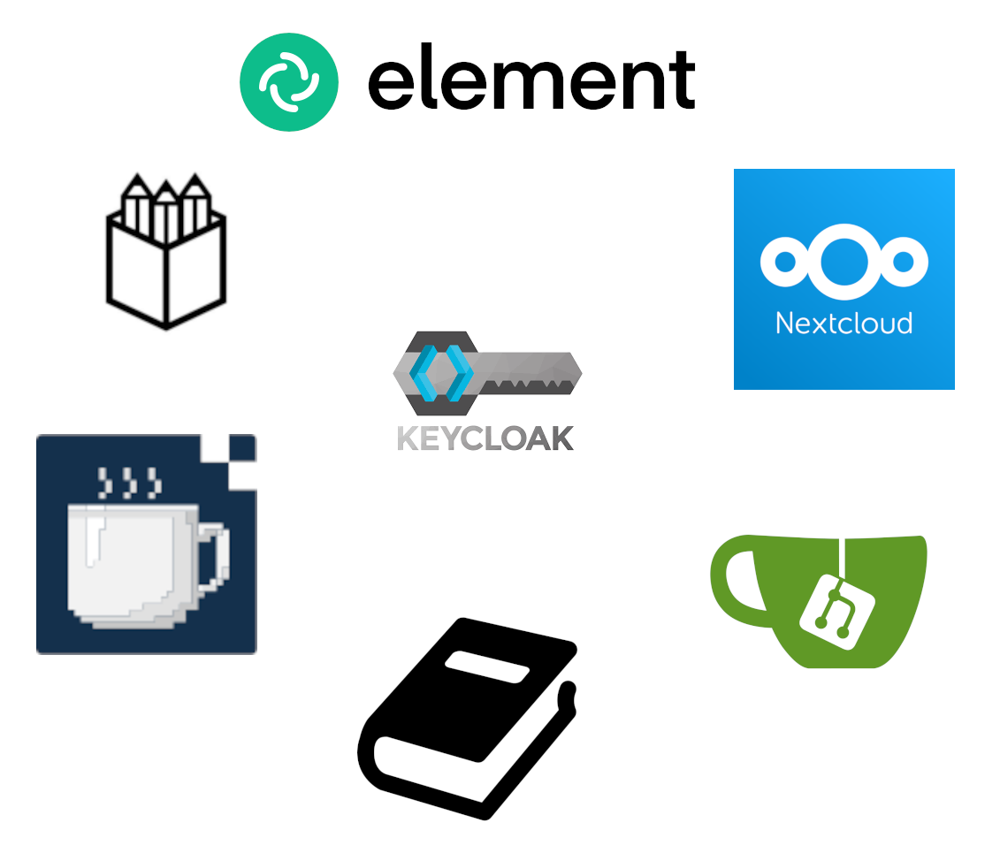

# ECOSYSTEME DU GARAGE NUMERIQUE

  

## LE GARAGE :computer:

Le [garage numérique](https://www.legaragenumerique.fr) est une association créée en 2014 par des habitants du quartier des Amandiers (Père Lachaise/Ménilmontant) afin de faciliter les usages de l’outil informatique pour les habitants et les associations du quartier.

## UN COMPTE POUR TOUT! :key:

[keycloak](https://github.com/keycloak/keycloak) est un [gestionnaire d'identité](https://fr.wikipedia.org/wiki/Authentification_unique) qui permet de centraliser l'identification pour un service informatique avec un seul [compte](https://id.legaragenumerique.fr/account/).

## LES SERVICES :link:

Un compte du garage numérique donne accès à tous ces services:

:pushpin: [Nextcloud](https://nextcloud.legaragenumerique.fr) est un outil de travail collaboratif permettant de stocker des fichiers, les partager ainsi que de les éditer via [onlyoffice](https://www.onlyoffice.com/fr/office-suite.aspx) dans son navigateur web un peu comme Google drive.

:pushpin: [Element](https://element.legaragenumerique.fr) est un chat avec un système de salons permettant de discuter et faire de la visio.
La communauté du garage compte plus d'une centaine de membres qui auront surement une réponse à votre problème technique.

  > :books: Documentation du garage: https://garagenum.gitlab.io/doc/cours/outils-garage/element/

:pushpin: [Gitea](https://git.legaragenumerique.fr) est une [SCM](https://fr.wikipedia.org/wiki/Git) qui permet de gérer le versionnage du code et de le stocker à la manière de Github ou Gitlab.

:pushpin: [Penpot](https://penpot.legaragenumerique.fr) est un logiciel permettant de maquéter des sites web suos forme graphique. C'est une version open source de [Figma](https://www.figma.com/fr/).

:pushpin: [Workadventure](https://play.adventure.legaragenumerique.fr) est un outil de travail collaboratif sous forme de jeu RPG 16 bits. Après avoir personnaliser son avatar, vous pouvez vous rendre à différents endroits de la map pour rencontrer des collaborateurs, discuter, faire du partage d'écran ou des visioconférences.

:pushpin: [Quiz](https://quizz.legaragenumerique.fr) est une application de quiz permettant de s'exercer sur des différents sujets techniques de l'informatique.

:pushpin: [Le board](https://leboard.legaragenumerique.fr) est un [tableau kanban](https://fr.wikipedia.org/wiki/Tableau_kanban) qui permet d'organiser les tâches d'un projet sous forme de fiches. Il sert au garage à organiser son flux de travail sur les réparations et reconditionnement d'ordinateurs.

## EN CAS DE SOUCIS :sob:

> Si vous rencontrez des difficultés avec votre compte ou tout autre service du garage, merci d'envoyer un mail avec un maximum de détail à cette adresse: contact@legaragenumerique.fr
