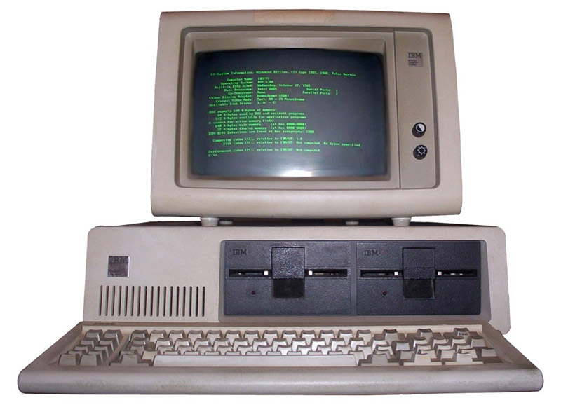
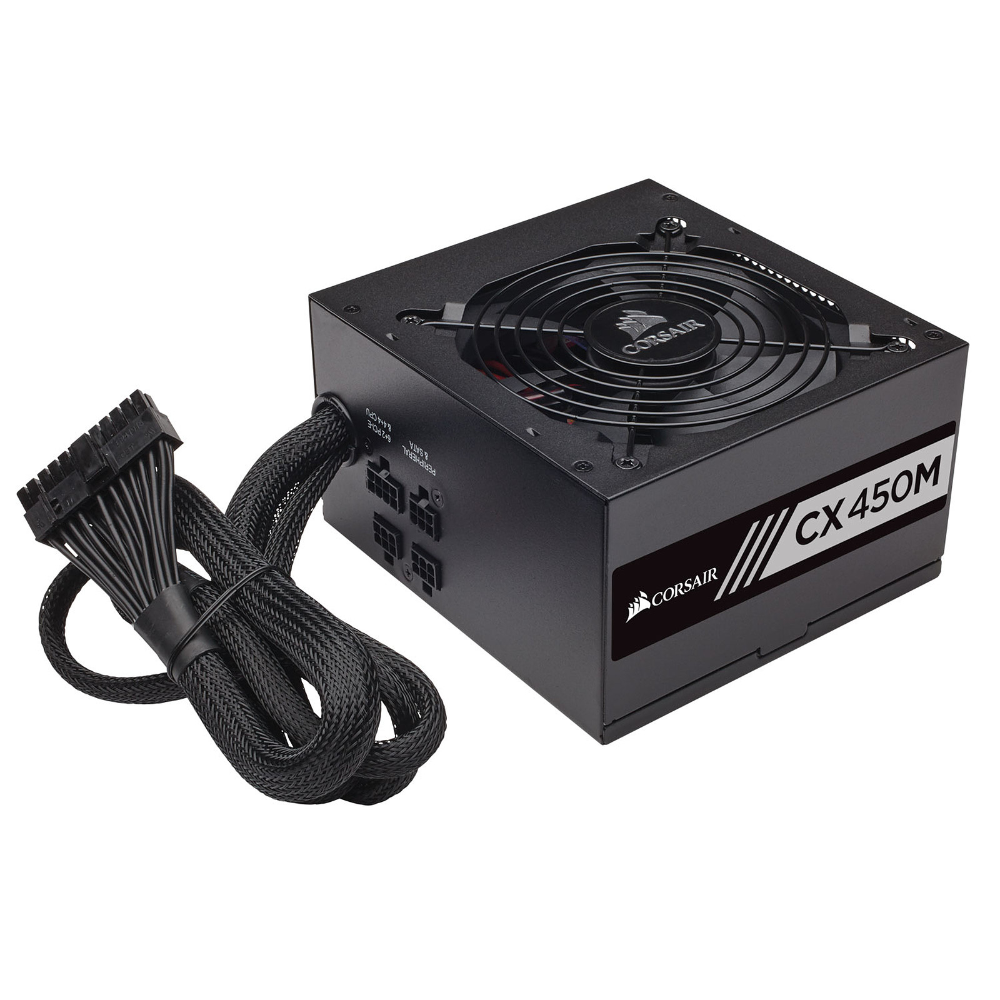
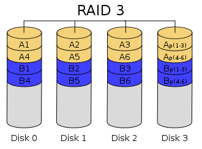

# INSTALLATIONS / LES COMPOSANTS



## PLAN
<!-- TOC -->

- [INSTALLATIONS / LES COMPOSANTS](#installations--les-composants)
    - [PLAN](#plan)
    - [INTRODUCTION](#introduction)
    - [HARDWARE / FONCTIONNEMENT](#hardware--fonctionnement)
        - [A LES COMPOSANTS INTERNES](#a-les-composants-internes)
            - [CARTE MERE](#carte-mere)
            - [CPU](#cpu)
            - [STOCKAGE](#stockage)
            - [MEMOIRE VIVE](#memoire-vive)
            - [ALIMENTATION](#alimentation)
            - [CARTE GRAPHIQUE](#carte-graphique)
            - [CARTE RESEAU](#carte-reseau)
        - [B LES COMPOSANTS EXTERNES / PERIPHERIQUES](#b-les-composants-externes--peripheriques)
            - [MONITEUR](#moniteur)
            - [CLAVIER](#clavier)
            - [SOURIS](#souris)
            - [AUTRES](#autres)
    - [BIOS / UEFI](#bios--uefi)
        - [LE BIOS](#le-bios)
        - [L'UEFI](#luefi)
    - [LES TYPES DE PARTITIONS:](#les-types-de-partitions)
        - [DEFINITION](#definition)
        - [MBR / GPT](#mbr--gpt)
            - [A MBR](#a-mbr)
            - [B GPT](#b-gpt)
        - [LES OUTILS](#les-outils)
    - [LES SYSTÈME DE FICHIERS:](#les-syst%C3%A8me-de-fichiers)
        - [DEFINITION](#definition)
        - [WINDOWS](#windows)
            - [A FAT32 / EXFAT](#a-fat32--exfat)
            - [B NTFS](#b-ntfs)
        - [LES OUTILS](#les-outils)
        - [LINUX](#linux)
            - [A EXT4](#a-ext4)
            - [B SWAP](#b-swap)
            - [C RAID](#c-raid)
        - [LES OUTILS](#les-outils)
            - [GPARTED](#gparted)

<!-- /TOC -->

## INTRODUCTION

Un ordinateur conventionnel nécessite deux composants de nature différente: le premier physique (hardware) et le deuxième immatériel (code, software).
Le hardware constituent les organes de la machine quand le software y incarne l'esprit, et c'est l'osmose de ces deux composants (en plus de tout le reste) qui va déterminer le fonctionnement de la machine.

## 1) HARDWARE / FONCTIONNEMENT

### A) LES COMPOSANTS INTERNES

#### CARTE MERE

La carte mère est le socle sur lequel tous les éléments viennent s'emboîter. Elle accueille tous les composants de votre ordinateur, et conditionne ses possibilités d'évolution. Selon le nombre de slots (emplacements) qu'elle présente, vous pourrez par la suite ajouter des barrettes de mémoire, changer le processeur ou intégrer une carte graphique… Elle embarque également le chipset, responsable de la transmission des informations entre les composants et l'ordinateur. Elle compte diverses options additionnelles, comme les cartes Wi-Fi, carte son, etc...


> NOTE: C'est la carte mère qui détermine quel processeur (via le socket) on va pouvoir y ajouter

#### CPU

Le processeur est la tête pensante de votre ordinateur. Plus il est puissant, plus les informations sont traitées rapidement! Ses entités de calcul sont appelées des cœurs. Il existe ainsi des processeurs à deux, quatre ou six cœurs. Son efficacité dépend également de sa fréquence, exprimée en gigahertz (GHz).


> DEFINITION: Un hertz est la mesure de la fréquence de répétition d'un événement par seconde.

Les premiers ordinateurs du début des années 1950 avaient une 
fréquence d’horloge de processeur de quelques centaines de kHz. 

Les ordinateurs personnels du début des années 1980 avaient une 
fréquence d’horloge de processeur comprise entre 1 et 8 MHz.

Aujourd'hui, un processeur a une fréquence de 3,2 GHz soit 
3 200 000 000 de cycles par secondes où le processeur 
Effectue des opérations.


#### STOCKAGE

HDD ou SSD sont les supports qui contiennent les données de l'OS et autres quand l'ordinateur est allumé ou éteint. Sa capacité est exprimée en Mo, Go ou To et possède également une vitesse de lecture et d'écriture variant en fonction du type de disque.
Une nouvelle norme plus rapide à émergée: le NVMe pour Non Volatile Memory Express, c'est comparable dans la construction au SSD, mais la connectique de type Express permet un vitesse d'accès plus rapide encode que le SSD en Sata.


#### MEMOIRE VIVE

Il s'agit d'un espace de stockage réservé à votre processeur ou à l'OS. Pendant que vous travaillez, il y place toutes les données temporaires lui permettant d'être réactif. Plus la mémoire RAM est importante, plus votre PC est réactif. Elle se mesure en gigaoctets (Go).

Une notion importante est la génération de la RAM (DDR2, DDR3, DDR4) qui détermine la compatibilité avec une génération de procésseur.

L'autre notion importante est la fréquence de fonctionnement de celles-ci, elle doit être aligné le plus possible à la vitesse du processeur.


#### ALIMENTATION

C'est la pièce apportant du courant au reste des composants, sa puissance est exprimée en Watts. Sa puissance doit être au moins égale à la somme de la consommation électrique de chaque composants.



#### CARTE GRAPHIQUE

C'est le composant responsable de l'affichage, il est composé d'in "mini ordinateur" avec son processeur (GPU) sa mémoire vive (VRAM) et est dédié à tout les calculs inhérants à l'affichage graphique.
Son raccordement à la carte mère se fait via un port PCI Express 16 broches pour maximiser le flux de transfert de données avec le CPU.


#### CARTE RESEAU

Souvent intégrée sur la carte mère, la carte réseau peux se décliner en périphérique externe pour ajouter une interface plus performante voir plusieurs interfaces en cas de besoin réseau spécifique.


### B) LES COMPOSANTS EXTERNES / PERIPHERIQUES


#### MONITEUR

Le moniteur permet l'affichage du signal video envoyé par la machine,
Sans affichage, il est compliqué d'intéragir avec celle-ci.

#### CLAVIER

Le clavier est un IHM (Interface Humain Machine) qui permet l'intéraction avec la machine.

#### SOURIS

La souris est un IHM graphique qui permet l'intéraction avec la machine aussi.

#### AUTRES

Il existe une multitude de périphériques pouvant nécessiter l'installation de drivers ou directement par "plug and play" (les drivers étant intégrés au périphérique)

## 2) BIOS / UEFI

### LE BIOS


Le BIOS, de l'anglais Basic Input Output System (en français : « système élémentaire d'entrée/sortie ») est un ensemble de fonctions, contenu dans la mémoire morte (ROM) de la carte mère d'un ordinateur, lui permettant d'effectuer des opérations de base, lors de sa mise sous tension.
Par exemple l'identification des périphériques d’entrée/sortie connectés et la lecture d'un secteur sur un disque, un CD ou une partie d'une clé USB.
Par extension, le terme est souvent utilisé pour décrire l'ensemble du micrologiciel de la carte mère. 
C'est en quelque sorte le centre de contrôle de la carte mère.


Les grandes rubriques les plus utiles sont:
- SECURITY
C'est dans ce menu que l'on pourra activer / désactiver le secure boot, le TPM ([plus d'infos](https://learn.microsoft.com/fr-fr/windows/security/information-protection/tpm/trusted-platform-module-overview)) ou tout autre forme de sécurité sur le BIOS de la machine.
- BOOT
Ici, nous pouvons modifier les support au démarrage, gérer l'ordre de priorité de ceux-ci ainsi que les options Fastboot.
- ADVANCED 
Dans ce menu "avançé", nous pouvons overclocké le CPU, changer les configurations USB, activé la virtualisation des composants, etc...

> Attention: tout mauvais réglage peux déteriorer les composants prématurément, se renseigner avant de faire n'importe quoi!

### L'UEFI

Le standard UEFI (Unified Extensible Firmware Interface) 
définit une interface entre le micrologiciel (firmware) et le système d'exploitation (OS) d'un ordinateur.
Cette interface succède sur certaines cartes-mères au BIOS dit LEGACY.

L'UEFI offre de nombreux avantages sur le BIOS: 
- fonctionnalités réseau en standard (PXE)
- interface graphique de bonne résolution
- gestion intégrée d'installations multiples de systèmes d’exploitation
- affranchissement de la limite des disques à 2,2 To.

L'UEFI est écrit en C, ce qui rend sa maintenance plus souple et reste acceptable en raison des coûts décroissants de la mémoire. 
Développé pour assurer l'indépendance entre système d'exploitation et plate-forme matérielle sur laquelle il fonctionne, l'UEFI est disponible sur les plates-formes Itanium (IA-64), x86 (32 et 64 bits) et ARM. 


## LES TYPES DE PARTITIONS:

### DEFINITION

une partition, région est une section d'un support de stockage (disque dur, SSD, Nvme, carte-mémoire). Le partitionnement est l'opération qui consiste à diviser le volume physique du support en volumes logiques dans lesquelles le système d'exploitation peut gérer les informations de manière séparée, généralement en y créant un système de fichiers, une manière d’organiser l’espace disponible.


### MBR / GPT

La table de partitionnement du MBR date du début des années 1980. Dès la fin des années 1990, les limitations qu'elle impose sont apparues trop contraignantes pour les matériels les plus modernes. Intel a alors développé un nouveau format de table de partitionnement, format qui fait partie de ce qui devint UEFI. La GPT étant un sous-ensemble des spécifications de UEFI.

#### A) MBR

Le master boot record ou MBR (parfois aussi appelé zone amorce ou enregistrement d'amorçage maître) est le nom donné au premier secteur adressable d'un disque dur (cylindre 0, tête 0 et secteur 1, ou secteur 0 en adressage logique) dans le cadre d'un partitionnement Intel. Sa taille est de 512 octets.
Le MBR contient la table des partitions (les quatre partitions primaires) du disque dur. Il contient également une routine d'amorçage dont le but est de charger le système d'exploitation, ou le chargeur d'amorçage (boot loader) s'il existe, présent sur la partition active.


#### B) GPT

Dans le domaine du matériel informatique, une table de partitionnement GUID, en anglais GUID Partition Table (GPT), soit Globally Unique Identifier Partition Table, est un standard pour décrire la table de partitionnement d'un disque dur.
Bien qu'il fasse partie du standard EFI Extensible Firmware Interface (qu'Intel propose en remplacement du PC BIOS), il est aussi utilisé sur certains BIOS à cause des limitations de la table de partitionnement du MBR qui limite la taille des partitions à 2,2 To (2 puissance 41 octets).
GPT gère les disques durs et partitions jusqu'à 9,4 Zo (9,4 × 10 puissance 21 octets ou 9,4 trilliards d'octets soit 9,4 × 10 puissance 9 To ou 2 puissance 73 octets).


### LES OUTILS

L'outil principal pour le partitionnage est [FDISK](https://fr.wikipedia.org/wiki/Fdisk) pour Windows ou Linux. Seule la présentation diffère, pour Windows elle est sous la forme de menus alors que pour Linux c'est sous la forme de ligne de commande.

## LES SYSTÈME DE FICHIERS:

### DEFINITION

Le système de fichiers est la structure qui permet de stocker les fichiers et dossiers afin que le système d’exploitation puisse retrouver ces derniers.
L’opération de création du système de fichiers se nomme formatage.

### 1) WINDOWS

#### A) FAT32 / EXFAT

FAT32 (FAT pour file allocation table, « table d’allocation de fichiers ») est un système de fichiers inventé par Microsoft. Utilisant des adresses sur 28 bits, il permet de constituer des unités d’allocation de taille réduite sur des disques de taille importante : il en résulte une plus grande étendue de gestion que ses prédécesseurs FAT12 et FAT16 (code plus important en mémoire et exécution un peu plus lourde), mais de substantielles économies d’espace disque, le demi bloc par fichier perdu en moyenne n’étant jamais plus grand que 256 kilo-octets.

Contrairement à ce que son nom semble indiquer, le système de fichiers FAT32 n’utilise pas des adresses disque de 32, mais de 28 bits (alors que FAT12 utilise bien des adresses disque de 12 bits, et FAT16 de 16 bits). 
limitations:
    - taille maximale d’un fichier : 4 Gio moins 1 octet, ou 4 294 967 295 octets (232-1) 
    - nombre maximum de fichiers : environ 268 000 000 (228 = 268 435 456) 

#### B) NTFS

NTFS (de l'anglais New Technology File System) est un système de fichiers développé par Microsoft Corporation pour sa famille de systèmes d'exploitation Windows NT, à partir de Windows NT 3.1, Windows 2000 est utilisé depuis par tous leurs successeurs (XP, Server 2003, 7, etc.).

NTFS est le successeur du système de fichiers FAT comme système de fichiers de prédilection des systèmes d'exploitation Microsoft Windows antérieurs.
NTFS dispose de nombreuses améliorations techniques par rapport à la FAT et au HPFS (High Performance File System), comme un support amélioré des métadonnées, et l'utilisation de structures de données avancées pour améliorer les performances, la fiabilité et l'utilisation de l'espace disque, ainsi que des extensions supplémentaires, telles que la liste de contrôle d'accès (ACL) et la journalisation du système de fichiers.

> **Note** Liste des systèmes de fichiers principaux: https://fr.wikipedia.org/wiki/Liste_des_syst%C3%A8mes_de_fichiers


### LES OUTILS

- Gestion du disque est l'outil principal de formatage de disque Windows en mod graphique.
C'est une interface qui permet de manipuler les disques ainsi que leur partitions.


L'outil plus ancien en ligne de commande est un utilitaire appelé Diskpart. Pour y accéder, il s'uffit d'ouvrir un terminal et d'y entrer la commande:
```
diskpart
```

Pour plus d'information sur l'utilitaire, vous pouvez lister les commandes utilisables dans le menu help:
```
help format
```


[Documentation Diskpart](https://learn.microsoft.com/fr-fr/windows-server/administration/windows-commands/diskpart)

### 2) LINUX

Sur Linux, les partitions se matérialisent de manière différente que Windows (disque1, partiton C:), les disques physiques sont référençé par leur chemin (/dev/sda) car sur Linux tout est fichier. Le premier disque détecté s'appelera /dev/sda, le deuxième /dev/sdb, ainsi de suite.

Les partitions sur chaque disque apposeront simplement un numéro à la suite du chemin du disque: /dev/sda1 pour la première partition, /dev/sda2 pour la deuxième, etc...

[Documentation partitions Linux](https://doc.ubuntu-fr.org/partitions)

#### A) EXT4

Le système de fichier principal utilisé par Linux est le [EXT4](https://fr.wikipedia.org/wiki/Ext4). C'est le type par défaut utilisé pour l'installation du système d'exploitation [GNU/LINUX](https://fr.wikipedia.org/wiki/Linux), il permet une taille de 16Tio maximum et une indéxation de 4 Milliards de fichiers.

#### B) SWAP

Le type de partition SWAP est spécifique aux systèmes Linux. Il vise à étendre la mémoire (physique) disponible du système d'exploitation en dédiant une partition disque.


#### C) RAID

Le RAID (Redundant Array of Independent Disks) est un ensemble de techniques de virtualisation du stockage permettant de répartir des données sur plusieurs disques durs afin d'améliorer soit les performances, soit la sécurité ou la tolérance aux pannes de l'ensemble du ou des systèmes. 
Beaucoup utilisé en entreprise, cela permet de soit sécurisé les données, soit augmenter les performances d'accès aux données (soit les deux pour certains RAIDs).

Les types de RAID sont:
- Le RAID 0, également connu sous le nom "d'entrelacement de disques" ou de "volume agrégé par bandes", est une configuration RAID permettant d'augmenter significativement les performances de la grappe en faisant travailler plusieurs disques durs en parallèle.


- Le RAID 1 consiste en l'utilisation plusieurs disques redondants, chaque disque de la grappe contenant à tout moment exactement les mêmes données, d'où l'utilisation du mot "miroir".


- Le RAID 2 est aujourd'hui désuet. Il combine la méthode du RAID 0 (volume agrégé par bande) à l'écriture d'un code de contrôle d'erreur par code de Hamming (code ECC) sur un disque dur distinct. Or, l'écriture de ce code de contrôle est désormais directement intégrée dans les contrôleurs de disques durs. Cette technologie offre un bon niveau de sécurité, mais de mauvaises performances.

- Le RAID 3 et 4 sont semblables à ceci près que le premier opère par octets et le second par blocs. Le RAID 4 ne nécessite pas autant de synchronisme entre les disques. Le RAID 3 tend donc à disparaître au profit du RAID 4 qui offre des performances nettement supérieures.



- Le RAID 5 combine la méthode du volume agrégé par bandes (striping) à une parité répartie. La parité, qui est incluse avec chaque écriture, se retrouve répartie circulairement sur les différents disques. Chaque bande est donc constituée de plusieurs blocs de données et d'un bloc de parité. Ainsi, en cas de défaillance de l'un des disques de la grappe, pour chaque bande il manquera soit un bloc de données soit le bloc de parité. Si c'est le bloc de parité, ce n'est pas grave, car aucune donnée ne manque. Si c'est un bloc de données, on peut calculer son contenu à partir des autres blocs de données et du bloc de parité. L'intégrité des données de chaque bande est préservée. Donc non seulement la grappe est toujours en état de fonctionner, mais il est de plus possible de reconstruire le disque une fois échangé à partir des données et des informations de parité contenues sur les autres disques.


- Le RAID 6 est une évolution du RAID 5 qui accroît la sécurité en utilisant plusieurs informations redondantes au lieu d'une. Il peut donc résister à la défaillance de plusieurs disques. Les fondements mathématiques utilisés pour les informations de redondance du RAID 6 sont beaucoup plus complexes que pour le RAID 5; de ce fait les implémentations de l'algorithme se limitent souvent à 2 (soit la perte de 2 disques).
Si la sécurité est plus grande, le coût en matériel est plus élevé et la vitesse est moindre. La puissance CPU nécessaire pour calculer les redondances et surtout pour reconstruire un volume défectueux est également nettement plus importante.


- Le RAID 10 permet d'obtenir un volume agrégé par bande avec un bon niveau de fiabilité (puisque basé sur des grappes répliquées). Chaque grappe contenant au minimum deux éléments et un minimum de deux grappes étant nécessaire, il faut au minimum quatre unités de stockage pour créer un volume RAID 1+0.
Sa fiabilité est assez grande puisqu'il faut que tous les éléments d'une grappe soient défectueux pour entraîner un défaut global. La reconstruction est assez performante puisqu'elle ne mobilise que les disques d'une seule grappe et non la totalité.


- [Documentation Ubuntu](https://doc.ubuntu-fr.org/raid_logiciel)
- [Documentation Malekal](https://www.malekal.com/mdadm-creer-gerer-raid-linux/)

### LES OUTILS

#### GPARTED

Gparted est l'équivalent Linux du gestionnaire de disque Windows. Il possède une interface graphique qui permet une visualisation du découpage en partitions du disque physique.

[](https://gparted.org/)

Toute manipulation nécessite la validation avant d'être opéré sur le disque, vous pouvez valider à chaque étapes ou valider plusieurs étapes (actions) à la fin.

[Documentation Gparted](https://gparted.org/documentation.php)

:warning: les partitions Linux peuvent être déplacées de gauche à droite seulement.