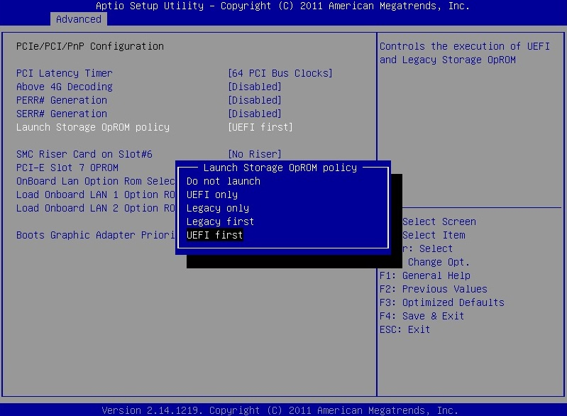
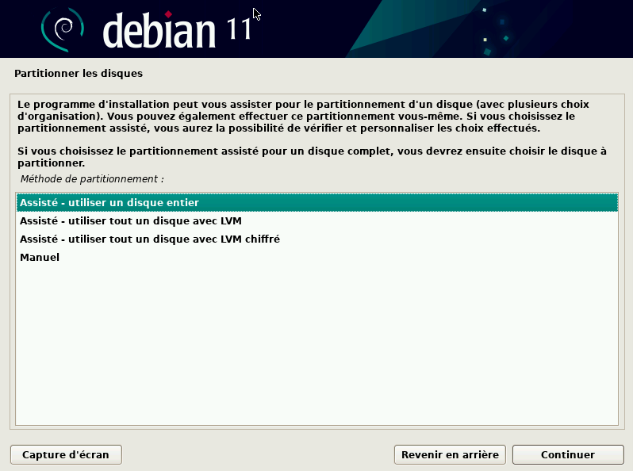

# INSTALLATION LINUX

## PLAN

- [INSTALLATION LINUX](#installation-linux)
    - [PLAN](#plan)
    - [LES REGLAGES BIOS](#les-reglages-bios)
        - [ACCES BIOS](#acces-bios)
        - [LEGACY MODE](#legacy-mode)
        - [BOOT PRIORITY](#boot-priority)
    - [INSTALLATION](#installationn)
        - [LES SUPPORTS](#les-supports)
            - [A PAR LE RESEAU](#a-par-le-reseau)
            - [B PAR USB](#b-par-usb)
        - [LES ETAPES](#les-etapes)
            - [Type d'installation](#type-dinstallation)
            - [Languge système](#languge-syst%C3%A8me)
            - [Nom de la machine](#nom-de-la-machine)
            - [Domaine](#domaine)
            - [Mot de passe des utilisateurs](#mot-de-passe-des-utilisateurs)
            - [Support d'installation](#support-dinstallation)
            - [Partitionnement](#partitionnement)
            - [Adresses pour les paquets](#adresses-pour-les-paquets)
            - [Utilitaires supplémentaires](#utilitaires-suppl%C3%A9mentaires)
    - [POST INSTALLATION](#post-installation)

## LES REGLAGES BIOS

### A) ACCES BIOS

En fonction des constructeurs des machines ou des cartes meres, les touches d'accès au BIOS diffèrent. Cela va de Echap à F2, F8, F12, etc.

Le mieux est de vérifiez sur le site constructeur de la machine pour plus de renseignements.

### B) LEGACY MODE

Pour installer une distribution Linux, il faut vérifier que que le SECURE BOOT soit désactivé dans l'onglet SECURITÉ et sélectionner le mode de démarrage sur LEGACY (par défaut, les cartes mère modernes sont configurés sur UEFI).

Une fois ces changements effectuer, appuyer F10 pour sauvegarder les changements et redémarrer la machine.

### C) BOOT PRIORITY

Le boot priority est la priorité au démarrage ou par quel support la machine va démarrer.
C'est par l'intermédiaire de ce menu que l'on va indiquer à la machine vers quel support celle-ci va trouver le support d'installation de l'OS (Operating System).

Généralement, le possibilités sont:
- NETWORK ou PXE si une machine propose un service d'installation par le réseau.
- HDD (disque dur) par défaut une fois l'installation d'une OS éffectué.
- USB correspond à un support branché en usb proposant une installation (clef usb généralement)

## INSTALLATION

### LES SUPPORTS

Plusieurs choix s'offrent à nous pour installer une distribution Linux, par le réseau (Pre eXecution Environment) si un serveur offre une image Linux Debian sur le réseau, ou par USB, aussi appelé clef bootables.

#### A) PAR LE RESEAU

Une fois dans le menu BIOS, il suffira de sélectionner la carte réseau (onboard NIC) dans l'ordre au démarrage avant de redémarrer la machine.

Une fois que la machine à détecté le PXE, le menu des système d'exploitations disponibles s'affichent:

#### B) PAR USB

La méthode USB se fait par l'intermédiaire d'un outil qui va créer les partitions nécessaires au BIOS pour reconnaitre la clef comme un support d'installation d'OS.
Il existe de nombreux outils pour créer des "clefs bootables", pour beaucoup d'OS, il suffira de formater la clef avant d'y copier les fichiers contenus dans l'iso de l'OS.

- Créer un support d'installation pour Windows: https://support.microsoft.com/fr-fr/windows/cr%C3%A9er-un-support-d-installation-pour-windows-99a58364-8c02-206f-aa6f-40c3b507420d

- Créer un support d'installation pour Linux: Généralement, une simple copie des fichiers contenus sur l'ISO d'installation vers le support USB suffit.

### LES ETAPES

#### Type d'installation

#### Languge système

Choisir la disposition de clavier correspondant à la langue choisie (français AZERTY pour la langue française)

#### Nom de la machine

#### Domaine

Selon les procédures internes des entreprises, sinon laisser vide.

#### Mot de passe des utilisateurs

- Il est déconseillé de créer un mot de passe pour l'utilisateur "root"

- Pour l'utilisateur final, choisir un nom et un mot de passe fort (long avec caractères spéciaux)

 

#### Support d'installation

Ici, on choisi la méthode de partitionnement:

- Disque en entier, Cette option va utiliser toute la place disponible sur le disque pour créer une partition unique où le système d'exploitation sera installé.

- LVM (Logical Volume Manager, ou gestionnaire de volumes logiques en français) permet la création et la gestion de volumes logiques sous Linux. L'utilisation de volumes logiques remplace en quelque sorte le partitionnement des disques.
C'est un système beaucoup plus souple, qui permet par exemple de diminuer la taille d'un système de fichier pour pouvoir en agrandir un autre, sans se préoccuper de leur emplacement sur le disque

- LVM chiffré (idem que LVM mais chiffré en cas de retrait physique du disque de la machine, celui-ci demandera une clef pour déchiffrer les données)

- Manuel, permet de faire son partitionnement et son organisation des données du système d'exploitation.

#### Partitionnement

Dans cette fenêtre, on peux choisir de séparé les différents systèmes de fichiers du système d'exploitation.

On peux tout mettre sur la même partition ou séparer les données de l'utilisateur des données utilisée par le système.

Dans le partitionnement des disques, on peux utilisé le partitionnement RAID qui permet d'utiliser deux disques pour une partition(en cas de défaillance d'un disque, le second conserve les données en attendant le remplacement du premier)

Une fois le choix de partitionnement éffectué, un écran demandant la validation des choix apparaît afin de valider les changements. 

#### Adresses pour les paquets

Il s'agit de donner l'adresse utilisée pour que le système d'exploitation retrouve les paquets sur le web. Généralement, on laisse l'adresse par défaut (deb.debian.org)

#### Utilitaires supplémentaires

Ici, on choisi les utilitaires tels que les environnements de bureau, serveur web (utilisé dans le développement web), serveur SSH (utilisé pour se connecter à des machines distantes pour les administrateurs système).

## POST INSTALLATION

- Penser à modifier l'ordre de démarrage (BOOT SEQUENCE) pour sélectionner l'entrée DEBIAN créée par le GRUB. (plus d'informations sur le GRUB: https://doc.ubuntu-fr.org/grub-pc)

- Une fois le démarrage terminé, vous pouvez vous connecter au compte visiteur en entrant le mot de passe visiteur (ou celui que vous avez entré lors de l'installation).

### Script de post-installation Garage

Pour customiser son installation Debian, vous pouvez utiliser le script de post installation du Garage à l'adresse suivante: git@gitlab.com:garagenum/tools/minetest/minetest-mcq_editor.git