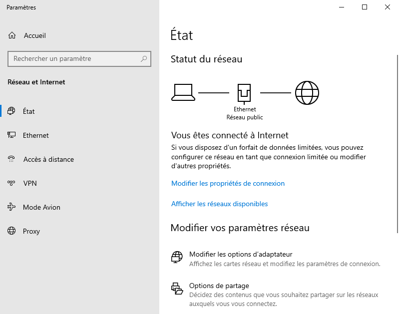
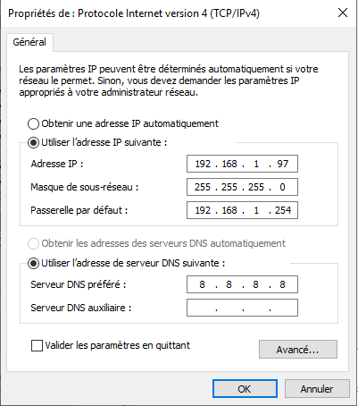
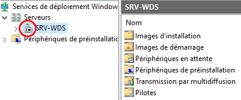
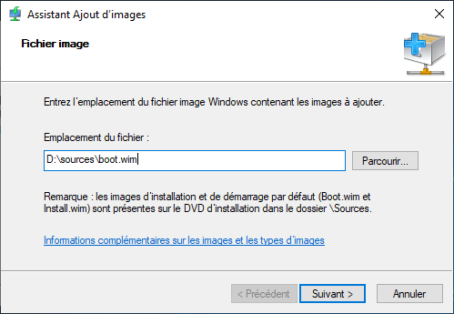

# PXE / WDS


## PLAN
<!-- TOC -->

- [PXE / WDS](#pxe--wds)
    - [PLAN](#plan)
    - [INTRODUCTION](#introduction)
    - [PXE PRE EXECUTION ENVIRONMENT POUR LINUX](#pxe-pre-execution-environment-pour-linux)
        - [PRINCIPE](#principe)
        - [INSTALLATION](#installation)
            - [LES PRÉ REQUIS](#les-pr%C3%A9-requis)
        - [CONFIGURATION](#configuration)
    - [WDS WINDOWS DEPLOYMENT SERVICE](#wds-windows-deployment-service)
        - [PRINCIPE](#principe)
        - [PRÉ REQUIS](#pr%C3%A9-requis)
            - [IP STATIQUE](#ip-statique)
            - [RÔLE DHCP](#r%C3%B4le-dhcp)
        - [INSTALLATION DES RÔLES](#installation-des-r%C3%B4les)
            - [VIA LA LIGNE DE COMMANDE:](#via-la-ligne-de-commande)
            - [VIA ROLES ET FONCTIONNALITES:](#via-roles-et-fonctionnalites)
        - [CONFIGURATION](#configuration)
        - [INSTALLATION DES IMAGES](#installation-des-images)
            - [IMAGE DE DEMARRAGE](#image-de-demarrage)
            - [IMAGE D'INSTALLATION](#image-dinstallation)
            - [AUTOMATISATION AVEC WINDOWS ADK](#automatisation-avec-windows-adk)
    - [REFERENCES](#references)

<!-- /TOC -->

## INTRODUCTION

la méthode de boot dite PXE permet à une station de travail de démarrer depuis le réseau en récupérant une image de système d'exploitation qui se trouve sur un serveur.
L'image ainsi récupérée peut être le système d'exploitation brut ou bien le système d'exploitation personnalisé avec des composantes logicielles (suite bureautique, utilitaires, packs de sécurité, scripts, etc.). 

Il permet également de « streamer » un OS complet ainsi que ses applications associées, directement sur la station de travail sans disque dur, on parle alors de "live"

L'équivalent pour Windows s'appel WDS pour Windows Deployment Service

## PXE (PRE EXECUTION ENVIRONMENT) POUR LINUX

### PRINCIPE

Une serveur contenant les images d'installations va être déployé sur le réseau afin de fournir aux machines clientes se connetant au réseau de pouvoir démarrer l'installation d'une OS sur le réseau.


- Workflow:


### INSTALLATION

#### LES PRÉ REQUIS

- Serveur DHCP
C'est le serveur adressant la machine sur le réseau (voir plus bas dhcpd.conf)
```bash
sudo apt install isc-dhcp-server -y
```
- Serveur TFTP
C'est l'applicatif qui va servir les fichiers sur le réseau par l'intermédiaire de son protocole (FTP).
```bash
sudo apt install tftpd-hpa -y
```
- Serveur NFS
Il est nécessaire pour certaines images pour conserver certains fichiers disponibles après le démarrage de l'OS réseau.
```bash
sudo apt install nfs-kernel-server -y
```
- Serveur LAMP (Linux Apache MySQL Php)
C'est une suite applicative permettant de créer un menu plus évolué et de servir les fichiers avec le protocol HTTP
```bash
sudo apt install apache2 php libapache2-mod-php php-mysql php-curl php-gd php-intl php-json php-mbstring php-xml php-zip wget -y
```

- Création des dossiers pour les distributions:
```bash
sudo mkdir -p /var/lib/tftpboot
cd /var/lib/tftpboot
sudo mkdir debian-32 debian-64 ubuntu-live
sudo wget http://boot.ipxe.org/undionly.kpxe
sudo wget http://boot.ipxe.org/ipxe.efi
```

### CONFIGURATION

La configuration suppose que le réseau utilisé est de type domestique (192.168.1.0) et que le serveur PXE utilise l'adresse 192.168.1.100.

> Note: Cette configuration est à adapter en fonction de votre infrastructure réseau, ici, le serveur PXE a pour IP 192.168.1.100

- /etc/dhcp/dhcpd.conf

C'est le fichier de configuration du serveur dhcp, c'est lui qui fournit une adresse réseau à la machine et pointe vers le fichier install.ipxe

```
default-lease-time 600;
max-lease-time 7200;

allow unknown-clients;

#authoritative;
option subnet-mask 255.255.255.0;

option space PXE;
option PXE.mtftp-ip code 1 = ip-address;
option PXE.mtftp-cport code 2 = unsigned integer 16;
option PXE.mtftp-sport code 3 = unsigned integer 16;
option PXE.mtftp-tmout code 4 = unsigned integer 8;
option PXE.mtftp-delay code 5 = unsigned integer 8;
option arch code 93 = unsigned integer 16;

option space ipxe;
option ipxe-encap-opts code 175 = encapsulate ipxe;
option ipxe.priority code 1 = signed integer 8;
option ipxe.keep-san code 8 = unsigned integer 8;
option ipxe.skip-san-boot code 9 = unsigned integer 8;
option ipxe.syslogs code 85 = string;
option ipxe.cert code 91 = string;
option ipxe.privkey code 92 = string;
option ipxe.crosscert code 93 = string;
option ipxe.no-pxedhcp code 176 = unsigned integer 8;
option ipxe.bus-id code 177 = string;
option ipxe.san-filename code 188 = string;
option ipxe.bios-drive code 189 = unsigned integer 8;
option ipxe.username code 190 = string;
option ipxe.password code 191 = string;
option ipxe.reverse-username code 192 = string;
option ipxe.reverse-password code 193 = string;
option ipxe.version code 235 = string;
option iscsi-initiator-iqn code 203 = string;
# Feature indicators
option ipxe.pxeext code 16 = unsigned integer 8;
option ipxe.iscsi code 17 = unsigned integer 8;
option ipxe.aoe code 18 = unsigned integer 8;
option ipxe.http code 19 = unsigned integer 8;
option ipxe.https code 20 = unsigned integer 8;
option ipxe.tftp code 21 = unsigned integer 8;
option ipxe.ftp code 22 = unsigned integer 8;
option ipxe.dns code 23 = unsigned integer 8;
option ipxe.bzimage code 24 = unsigned integer 8;
option ipxe.multiboot code 25 = unsigned integer 8;
option ipxe.slam code 26 = unsigned integer 8;
option ipxe.srp code 27 = unsigned integer 8;
option ipxe.nbi code 32 = unsigned integer 8;
option ipxe.pxe code 33 = unsigned integer 8;
option ipxe.elf code 34 = unsigned integer 8;
option ipxe.comboot code 35 = unsigned integer 8;
option ipxe.efi code 36 = unsigned integer 8;
option ipxe.fcoe code 37 = unsigned integer 8;
option ipxe.vlan code 38 = unsigned integer 8;
option ipxe.menu code 39 = unsigned integer 8;
option ipxe.sdi code 40 = unsigned integer 8;
option ipxe.nfs code 41 = unsigned integer 8;

###RESEAUX###
subnet 192.168.1.0 netmask 255.255.255.0 {
        option broadcast-address 192.168.1.255;
        option routers 192.168.1.254;
        option domain-name-servers 8.8.8.8, 1.1.1.1;
        range 192.168.1.150 192.168.1.199;
        ping-check = 1;
        next-server 192.168.1.100;

#      PXE
        if option arch = 00:07 or option arch = 00:09 {
                if exists user-class and option user-class = "iPXE" {
                        filename "http://192.168.1.100/install.ipxe";
                } else {
                        filename "ipxe/ipxe.efi";
                }
        } else if option arch = 00:06 {
                if exists user-class and option user-class = "iPXE" {
                        filename "http://192.168.1.100/install.ipxe";
                } else {
                        filename "ipxe/ipxe32.efi";
                }
        } else {
                if exists user-class and option user-class = "iPXE" {
                        filename "http://192.168.1.100/install.ipxe";
                } else {
                        filename "undionly.kpxe";
                }
        } 
}

```

- /etc/default/isc-dhcp-server

```
# Path to dhcpd's config file (default: /etc/dhcp/dhcpd.conf).
#DHCPDv4_CONF=/etc/dhcp/dhcpd.conf
#DHCPDv6_CONF=/etc/dhcp/dhcpd6.conf

# Path to dhcpd's PID file (default: /var/run/dhcpd.pid).
#DHCPDv4_PID=/var/run/dhcpd.pid
#DHCPDv6_PID=/var/run/dhcpd6.pid

# Additional options to start dhcpd with.
#       Don't use options -cf or -pf here; use DHCPD_CONF/ DHCPD_PID instead
#OPTIONS=""

# On what interfaces should the DHCP server (dhcpd) serve DHCP requests?
#       Separate multiple interfaces with spaces, e.g. "eth0 eth1".
INTERFACESv4=<INTERFACE-LAN>
INTERFACESv6=""
```

- /etc/default/tftpd-hpa

C'est le fichier qui va déterminer où se trouvent les fichiers proposés sur le réseau pour l'installation des postes clients.

```
TFTP_USERNAME="tftp"
TFTP_DIRECTORY="/var/lib/tftpboot"
TFTP_ADDRESS="192.168.1.100:69"
TFTP_OPTIONS="--secure"
RUN_DAEMON="yes"
```

- /var/www/html/install.ipxe

C'est le fichier qui va contenir le menu des distributions installables à partir du PXE.
Il va donner le chemin des distributions ainsi que les arguments à passer à la machines pour que celle-ci démarre corectement l'image de l'OS.

```
#!ipxe

##################################### VARIABLES ###############################################
set menu-timeout 72000
set submenu-timeout ${menu-timeout}
isset ${menu-default} || set menu-default item1
set server_ip 192.168.1.100

# HS
#console --picture http://boot.ipxe.org/ipxe.png

##################################### MENU ###############################################
menu
item --gap --           - INSTALLATIONS
item --gap --           -------------DEBIAN-32------------------
item debian-32          Debian-32
item --gap --           -------------DEBIAN-64------------------
item debian-64          Debian-64
item --gap --           ----------------------------------------
item --gap --           - LIVE-OS
item --gap --           -------------UBUNTU-LIVE----------------
item ubuntu-live        Ubuntu-Live
item --gap --           -------------SORTIR---------------------
item shell              Shell iPXE
item exit               Exit

choose --timeout ${menu-timeout} --default ${menu-default} target && goto ${target}

##################################### OS ###############################################

#Paramètres de démarrage pour DEBIAN-32 -- OK
:debian-32
kernel http://${server_ip}/tftpboot/debian-32/linux
initrd http://${server_ip}/tftpboot/debian-32/initrd.gz
imgargs linux DEBIAN_FRONTEND=newt --- net.ifnames=0
boot || goto menu

#Paramètres de démarrage pour DEBIAN-64 -- OK
:debian-64
kernel http://${server_ip}/tftpboot/debian-64/debian-installer/amd64/linux
initrd http://${server_ip}/tftpboot/debian-64/debian-installer/amd64/initrd.gz
imgargs linux DEBIAN_FRONTEND=newt --- net.ifnames=0
boot || goto menu

##################################### OS-LIVE ###############################################

#Paramètres de démarrage pour UBUNTU-LIVE -- OK
:ubuntu-live
kernel http://${server_ip}/tftpboot/ubuntu-live/casper/vmlinuz
initrd http://${server_ip}/tftpboot/ubuntu-live/casper/initrd
imgargs vmlinuz initrd=initrd root=/dev/nfs boot=casper netboot=nfs nfsroot=${server_ip}:/var/lib/tftpboot/ubuntu-live ip=dhcp quiet splash --
boot || goto menu


:shell
shell

:exit
exit
```

- Création du lien symbolique:

```bash
sudo ln -s /var/www/html/install.ipxe /var/lib/tftpboot/
```

- Pour les OS "live", modifier le fichier /etc/exports

```
#/etc/exports: the access control list for filesystems which may be exported
#               to NFS clients.  See exports(5).
#
# Example for NFSv2 and NFSv3:
# /srv/homes       hostname1(rw,sync,no_subtree_check) hostname2(ro,sync,no_subtree_check)
#
# Example for NFSv4:
# /srv/nfs4        gss/krb5i(rw,sync,fsid=0,crossmnt,no_subtree_check)
# /srv/nfs4/homes  gss/krb5i(rw,sync,no_subtree_check)
#

# POUR TOUTES LES DISTRIBS (ACCES FICHIERS)
/var/lib/tftpboot/ *(async,no_root_squash,no_subtree_check,ro)

# POUR UBUNTU (ACCES FICHIERS)
#/var/lib/tftpboot/ubuntu-live *(async,no_root_squash,no_subtree_check,ro)
```

- Redémarrage des services

```
sudo service isc-dhcp-server restart
sudo systemctl restart nfs-kernel-server
sudo service tftpd-hpa restart
```

- Il ne reste plus qu'à télécharger les distributions et de les placer au bon endroit sur le serveur PXE:

```
url="https://ftp.debian.org/debian/dists/stable/main/installer-amd64/current/images/netboot/netboot.tar.gz"
wget $url
mkdir netboot
tar -xzvf netboot.tar.gz -C netboot
sudo cp -r netboot/. /var/lib/tftpboot/debian-64
sudo rm -rf netboot netboot.tar.gz

url="https://cdimage.debian.org/debian-cd/current/i386/iso-cd/debian-11.3.0-i386-netinst.iso"
wget $url
sudo mount -o loop ./debian-11.3.0-i386-netinst.iso /mnt
sudo cp -r /mnt/. /var/lib/tftpboot/debian-32
sudo umount /mnt
sudo rm -rf /tmp/debian-11.3.0-i386-netinst.iso

url="https://releases.ubuntu.com/22.04/ubuntu-22.04.1-desktop-amd64.iso"
wget $url
sudo mount -o loop ./ubuntu-22.04.1-desktop-amd64.iso /mnt
sudo cp -r /mnt/. /var/lib/tftpboot/ubuntu-live
sudo umount /mnt
sudo rm -rf /tmp/ubuntu-22.04.1-desktop-amd64.iso
```

- Vérification des droits sur le dossier /var/lib/tftpboot

```
sudo chown -R root:root /var/lib/tftpboot
sudo chmod 755 /var/lib/tftpboot
```

## WDS (WINDOWS DEPLOYMENT SERVICE)


### PRINCIPE

Le principe est de déployer un Windows server avec une image d'installation réseau Windows.
Ensuite, une VM va s'y connecter pour tirer l'image d'installation et procéder au déployement de l'OS.

Pour installer un service de déployement WDS, certains pré requis sont nécessaires comme l'installation du rôle DHCP pour avoir les applicatifs permettant au serveur de délivrer des adresses IP sur le réseau pour les machines clientes s'y connectant ainsi que la configuration d'une IP statique pour le serveur de déployement.


> Note: Généralement, c'est un serveur ou un composant réseau dédié qui s'occupe de l'adressage des machines sur le réseau où chez un particulier le modem/routeur. Dans le cas de d'un serveur WDS, il lui faut être capable d'adresser les machines clientes sur le réseau afin de pouvoir leur envoyer les fichiers d'installation.

### PRÉ REQUIS

#### IP STATIQUE

l'IP statique est nécessaire pour que notre serveur fonctionne correctement. Il doit conserver la même IP que lors de la configuration initiale au risque de ne pas remplir sa fonction correctement.

Pour configurer son interface réseau de manière à avoir l'IP statique, il faut cliquer sur l'icône réseau en bas à droite de l'écran, dans la barre des tâches, puis sur Paramètre réseau et internet.


Puis cliquer sur Modifier les options d'adaptateur:



Faites un clic doit sur votre connexion réseau pour ouvrir le menu et choisir Propriétés:


Dans la liste d'éléments utilisé par la connexion, choisir Protocole Internet version 4 (TCP/IPv4), puis Propriétés:


Renseigner les informations suivantes une fois le mode Manuel sélectionné:



> Notes: Les informations s'obtiennent grâce à la commande ipconfig /all dans le terminal cmd.exe
- Au niveau de l'adresse IP, renseigner l'adresse IPv4 obtenue par la commande.
- Pour le masuqe de sous-réseau laisser le 255.255.255.0
- Pour la passerelle par défaut, renseigner la Gateway ou gw obtenue par la commande.
- Pour le serveur DNS préféré, choisir 8.8.8.8 (Google) ou 1.1.1.1 (Cloudflare).

:warning: <strong>Penser à cocher la case Valider ([x]) les paramètres en quittant!</strong>

#### RÔLE DHCP

Pour installer le rôle DHCP, il faut ouvrir l'interface du gestionnaire de serveur accessible via la touche Windows.

Une fois devant le tableau de bord (Dashboard), cliquer en haut à droite sur Gérer puis sur Ajouter des rôles et Fonctonnalités.

Trouver serveur DHCP dans la liste des rôles installables puis l'installer.

> Note: Si vous n'avez pas encore configuré l'IP statique, vous aurez un message d'erreur de la part de Windows.

### INSTALLATION DES RÔLES

Pour utiliser les services de déploiement Windows, il est préférable d’avoir un second disque dur (ou à minima une seconde partition) pour stocker les fichiers propres au service.

> Note: Ce n'est pas une obligation mais entre dans les bonnes pratiques en production, pensez à ajouter un deuxième disque sur le serveur WDS pour y stocker les images d'installation.


#### VIA LA LIGNE DE COMMANDE:

- Autrement, nous povons aussi le faire via la ligne de commande:


#### VIA ROLES ET FONCTIONNALITES:

Nous pouvons 


Une fois installé, la console de gestion des services de déploiement Windows sera disponible via la section « Outils » du gestionnaire de serveur ou dans les outils d’administration disponibles en tuile dans le Menu Démarrer. 
Il est également possible d’exécuter directement la commande:
```bash
WdsMgmt.msc
```


### CONFIGURATION

Une fois installé, WDS nécessite d'être configuré. Faire un clic droit sur le serveur pour faire apparaître le menu:


Les conditions à remplir pour déployer un service WDS s'affichent alors:
- Le serveur sera autonome (pas de dépendance avec AD)
- Le service DHCP est configuré et actif sur le réseau
- Le service DNS ne sera pas utile et le rôle DNS n’est pas installé sur le serveur
- Les données de WDS seront stockées sur le disque E du serveur qui a été préalablement formaté en NTFS, dans un dossier dédié que j’ai nommé de façon très originale : WDS. 

Sans service Active Directory, il convient de configurer le serveur en mode autonome:


Cliquez sur Parcourir et indiquez l’endroit sur le serveur où vous souhaitez que les services de déploiement stockent les informations nécessaires à leur fonctionnement.


Dans la fenêtre de configuration du serveur DHCP, laissez cocher les deux options. Des configurations sur le service DHCP seront ajouter automatiquement pour permettre « l’amorçage PXE », plus simplement appelé « boot PXE ».


La dernière étape consiste à définir le comportement du serveur WDS lorsqu’il recevra les requêtes des clients. Il peut soit les ignorer et ne pas répondre, soit répondre seulement aux clients connus, soit aux clients connus et inconnus.

Dans notre cas, cochez la case « Répondre à tous les ordinateurs clients ». Vous pouvez cocher la case en dessous si vous souhaitez approuvez en amont les clients. Dans ce cas, les ordinateurs seront listés dans la partie « Périphériques en attentes » de la console WDS et il faudra manuellement les autoriser à utiliser le service de déploiement.


e service WDS sera alors en cours de configuration. Une fois la progression achevée, vous pouvez fermer l’assistant de configuration des services.

A ce stade, le serveur a bien été configuré mais le service n’a pas encore démarré. Nous pouvons le voir grâce à la présence d’une icône noire sur le nom du serveur.



Pour le lancer, faites un clic droit sur le nom du serveur, cliquez sur « Toutes les tâches » et ensuite sur « Démarrer ».


Notre service WDS est désormais installé et configuré ! Si vous allez dans le dossier sur votre second disque dur, vous trouverez l’arborescence suivante, créée automatiquement lors de la configuration des services de déploiement :


Afin de fonctionner, il faut ajouter dans la console de gestion du service des images au format « .wim ». Ces images sont des systèmes d’exploitation « généralisés » qui pourront par la suite être déployés sur d’autre machine.

### INSTALLATION DES IMAGES


#### IMAGE DE DEMARRAGE

L’image de démarrage va servir comme son nom l’indique à démarrer l’installation, à « booter », ou plus précisément à lancer l’installateur de Windows qui permettra par la suite d’installer le système d’exploitation lui-même.

Nous allons prendre celle qui se trouve sur un ISO de Windows car autant utiliser ce qui est déjà fait (et bien fait !). En résumé, nous n’avons pas besoin de créer nous-mêmes une image de démarrage car Microsoft l’a fait pour nous.

Dans votre serveur, insérez un CD d’installation d’un OS Windows (le fichier ISO), ou "monter" cet ISO dans un lecteur virtuel.


Dans la console de gestion du service WDS, faites un clic droit sur le nœud « Images de démarrage » et cliquez sur « Ajouter une image de démarrage ».


Cliquez sur Parcourir et recherchez le fichier « boot.wim » présent sur le CD d’installation de Windows 10 qui a été inséré dans le serveur. Ce fichier se situe dans le dossier « Sources » du CD.



Donnez un nom à l’image de démarrage en cours d’ajout dans WDS.
Si toutes les informations sont conformes, vous pouvez valider l’import en cliquant sur Suivant.


Une fois l'image chargée, rendez-vous dans la console de gestion WDS:


#### IMAGE D'INSTALLATION

L'image d'installation peu être personnalisée selon les besoins de l'entreprise, ici nous allons utilisé l'image d'installation de base Windows contenue sur l'ISO d'installation dans le fichier source:


Il faut créer un groupe d’image pour stocker notre image d’installation. Donnez un nom à ce groupe.
Ensuite, cliquez sur Parcourir et recherchez le fichier d’installation .wim que vous avez copié précédemment sur le serveur.


Les versions du système d’exploitation contenues dans le fichier d’installation .wim seront listées par l’assistant. Là mon fichier ne contient qu’une seule version. Je vous conseille de décocher la case « Utiliser le nom et la description par défaut… » pour attribuer vous-même un nom à cette image.


Une fois l’opération terminée, l’image d’installation sera disponible dans la console WDS.
Désormais vous pouvez lançer une installation du Windows sur une autre machine en lançant celle-ci en mode PXE (boot réseau) en étant connecter au même réseau que e serveur WDS!

Une fois l'installation lançée, entrer les acréditations administrateur du serveur WDS pour finir de lançer l'installation:


#### AUTOMATISATION AVEC WINDOWS ADK

Afin d’automatiser le déploiement d’un OS Windows préconfiguré, nous allons nous servir de Windows ADK (Assessment Deployment Kit) qui est une suite logicielle propre à Microsoft incluant de nombreux outils permettant d’analyser les performances d’une machine mais également de personnaliser et d’automatiser des déploiements.

Vous pouvez suivre ce process pour l'installation de Windows ADK sur un Windows Server:
- https://neptunet.fr/fichier-reponses-wds/

Vous pouvez suivre ce process pour créer une image personnalisée de Windows pour le deployement WDS:
- https://neptunet.fr/capture-master-wds/


## REFERENCES

- [Devops Tales](https://devopstales.github.io/linux/pxe1)
- [Wiki Ubuntu](https://doc.ubuntu-fr.org/ipxe)
- [IPXE](https://ipxe.org/docs)
