# INSTALLATION WINDOWS


## PLAN
<!-- TOC -->

- [INSTALLATION WINDOWS](#installation-windows)
    - [PLAN](#plan)
    - [INTRODUCTION](#introduction)
    - [WINDOWS 10](#windows-10)
        - [CREATION D'UNE CLEF BOOTABLE](#creation-dune-clef-bootable)
            - [OUTIL WINDOWS MEDIACREATIONTOOL.EXE POUR WINDOWS 10](#outil-windows-mediacreationtoolexe-pour-windows-10)
            - [OUTILS EXTERNES](#outils-externes)
                - [RUFUS POUR WINDOWS](#rufus-pour-windows)
                - [WoeUSB POUR LINUX](#woeusb-pour-linux)
    - [WINDOWS SERVER](#windows-server)
        - [TELECHARGEMENT DE L'IMAGE WINDOWS SERVER 2022](#telechargement-de-limage-windows-server-2022)
        - [PROCESSUS D'INSTALLATION DE L'OS SUR UNE MACHINE VIERGE](#processus-dinstallation-de-los-sur-une-machine-vierge)

<!-- /TOC -->

## INTRODUCTION

L'installation d'un système d'exploitation Windows se fait par l'intermédiaire d'un support d'installation.
Ce support peux être un CD / DVD, une clef USB préparée au préalable ou via le réseaux par une méthode appelée PXE (Pre Execution Environment) en partant d'une machine sans OS installée.
Ici, nous traiterons de l'installation via un support USB.

## WINDOWS 10

### CREATION D'UNE CLEF BOOTABLE

Plusieurs outils permettent de créer une clef dite bootable avec une OS Windows permettant l'installation.

#### OUTIL WINDOWS (MEDIACREATIONTOOL.EXE POUR WINDOWS 10)

Depuis Windows 10, il est possible de créer un support d'installation d'OS par l'intermédiaire de l'outil MediaCreationTool.
Le téléchargement de l'image Windows se fera de manière automatique nécessitant une connexion internet.
Il vous faut également le support d'installation:
- Clef USB d'au moins 8 Go
- DVD

Il ne reste plus qu'à démarrer MediaCreationTool en cliquant sur l'éxécutable que vous trouverez dans le dossier "utils" de ce cours. [MediaCreationTool](utils/MediaCreationTool22H2.exe)

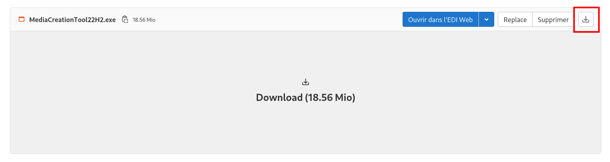

- Une fois le MediaCreationTool démarré, acceptez les termes du contrat de licence.

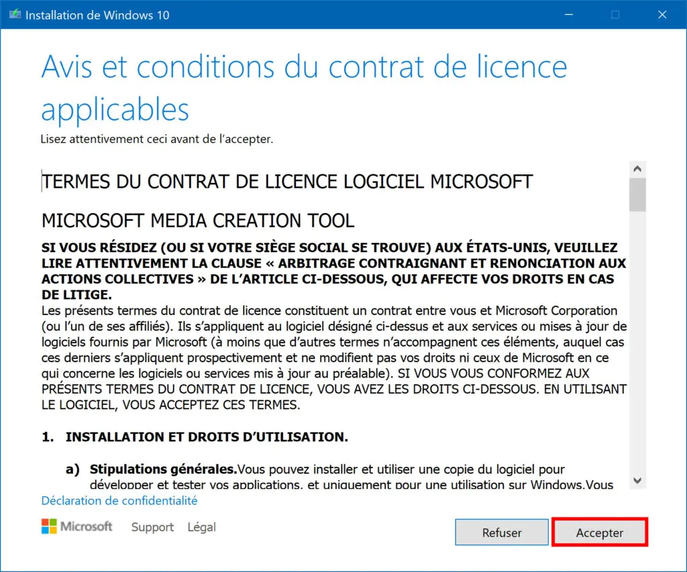

- Sélectionnez Créer un support d’installation (clé USB, DVD ou fichier ISO) pour un autre PC.

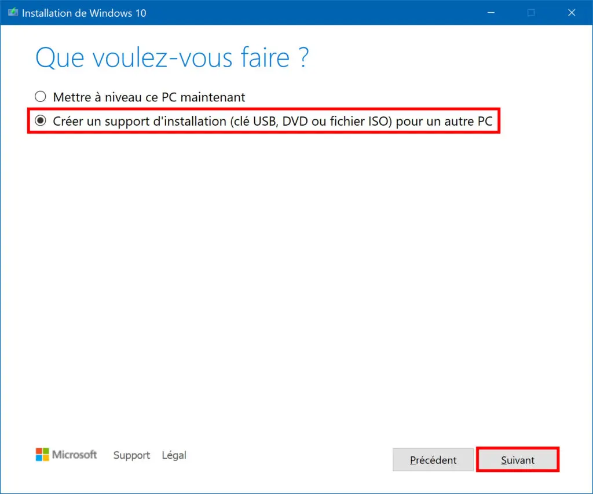

- Sélectionnez la langue et l’architecture du système (dans 99% des cas, vous aurez besoin de la version 64 bits). Si vous cochez la case Utilisez les options recommandées pour ce PC, le logiciel sélectionnera automatiquement les options adaptées à votre ordinateur.

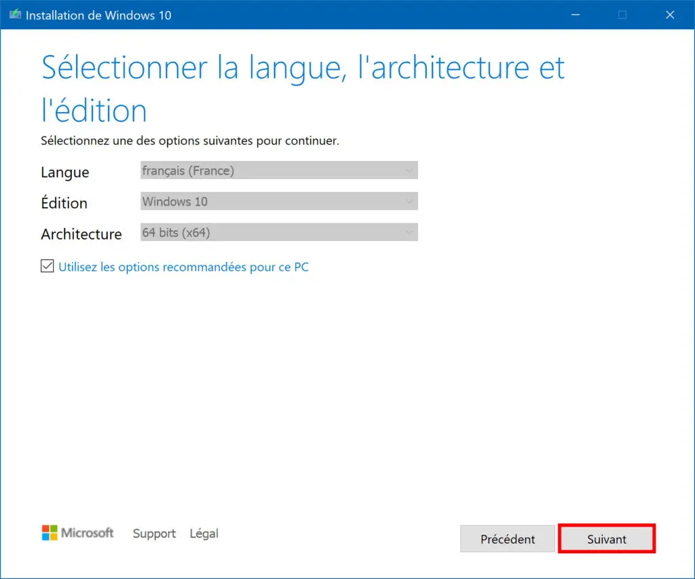

- Sélectionnez Disque mémoire flash USB.

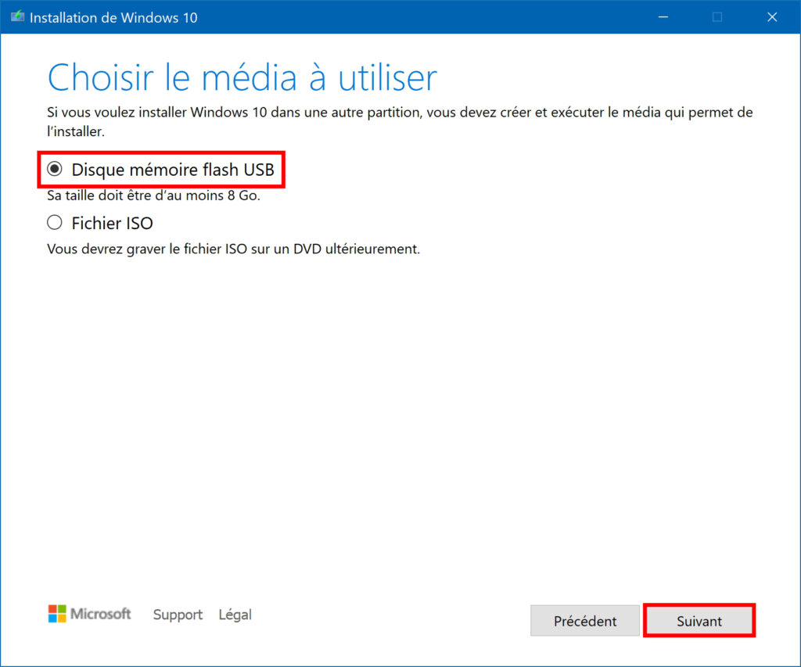

- Sélectionnez la clé USB sur laquelle les fichiers d’installation de Windows 10 seront copiés.

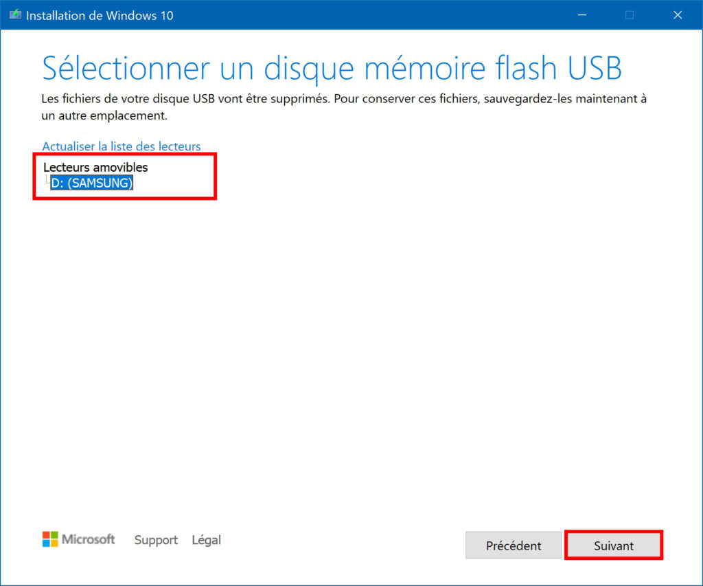

- Cliquez sur Suivant pour lancer la création de la clé USB d’installation de Windows 10.


- Le logiciel télécharge les fichiers d’installation de Windows 10 puis les copie sur la clé USB. Cette opération prend plus ou moins de temps selon la vitesse de votre connexion Internet et les performances du contrôleur USB + de la clé USB.

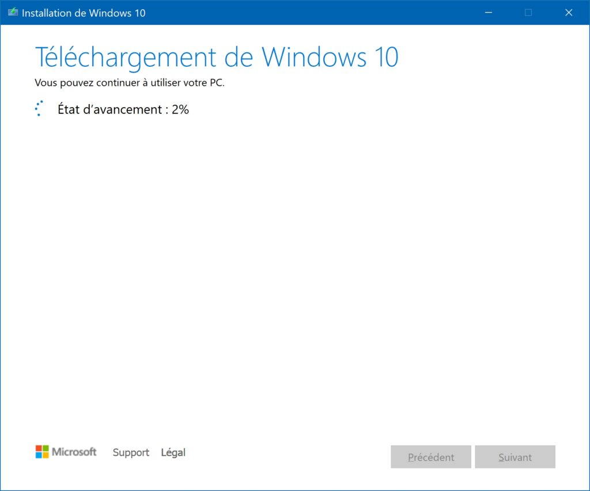

- Et voilà, votre clé USB d’installation de Windows 10 est prête, cliquez sur terminer.

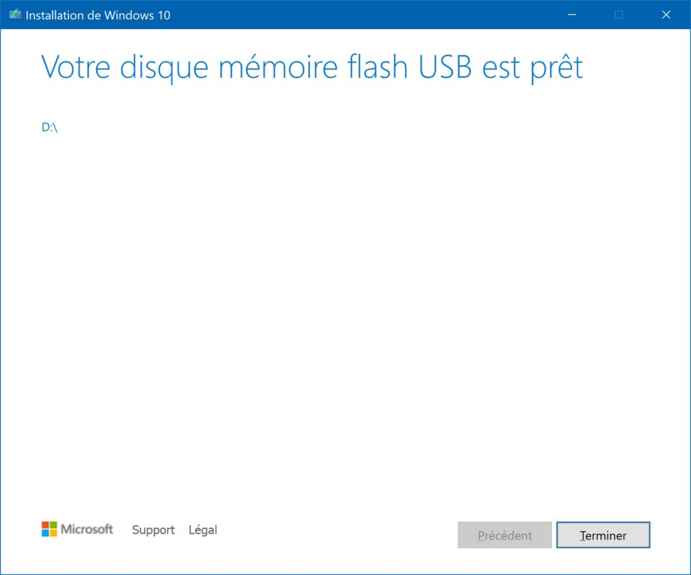

#### OUTILS EXTERNES

##### RUFUS POUR WINDOWS

Rufus s'éxécute sur un système Windows et nécessite l'image d'une OS Windows et une clef USB d'au moins 8 Go ou un support DVD.

> [TELECHARGEMENT DE L'IMAGE WINDOWS 10](https://www.microsoft.com/fr-fr/software-download/windows10ISO)

- Téléchargez le logiciel Rufus sur le [SITE RUFUS](https://rufus.ie/fr/)

- Ouvrez le logiciel Rufus en double-cliquant sur le fichier rufus.exe.

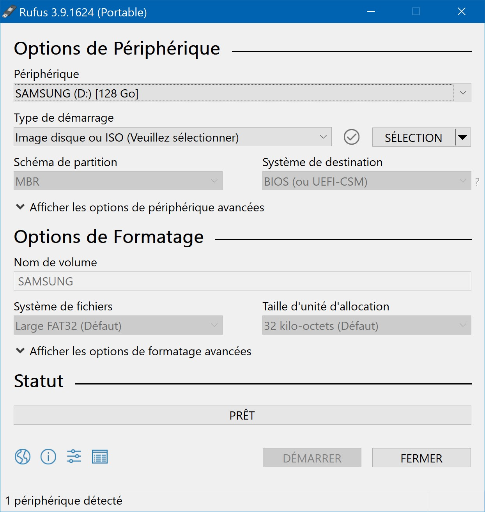

Sélectionnez les options de périphérique suivantes:
    - Périphérique : votre clé USB (vérifiez que vous avez sélectionné la bonne clé USB).
    - Type de démarrage : Image disque ou ISO.
    - Sélection : Naviguer jusque l'image du Windows à installer.
    - Schéma de partition et Système de destination:
        - GPT + UEFI (non CSM) : ordinateurs récents (PC UEFI) (⩾ 2013).
        - MBR + BIOS (ou UEFI-CSM) : ordinateurs anciens (PC BIOS) (< 2013).
    - Système de fichiers : FAT32 (si disponible) ou NTFS (requiert la désactivation du Secure Boot).
    - Nom de volume : laisser la valeur par défaut.
    - Taille d’unité d’allocation : laisser la valeur par défaut.

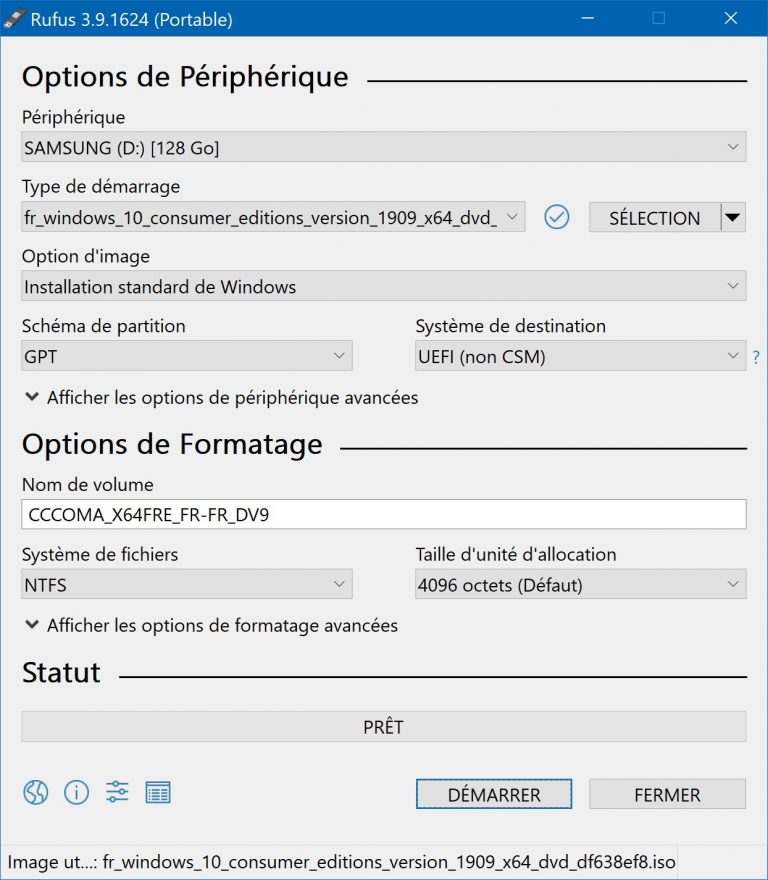

> NOTE: Il est possible de télécharger l'image d'un Windows via l'interface de Rufus.

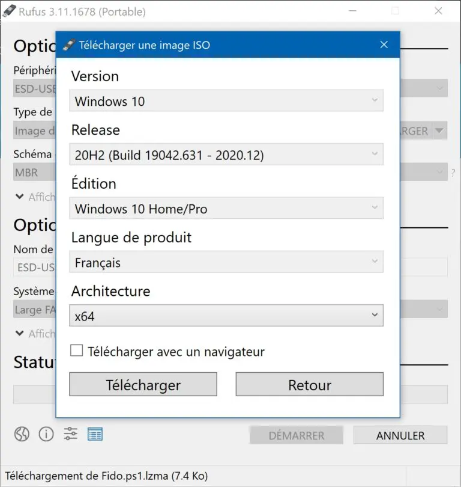

- Une fois les bonnes options choisies, cliquez sur démarrer et confirmer l'opération

- La clef bootable est prête, vous pouvez l'éjecter en toute sécurité.

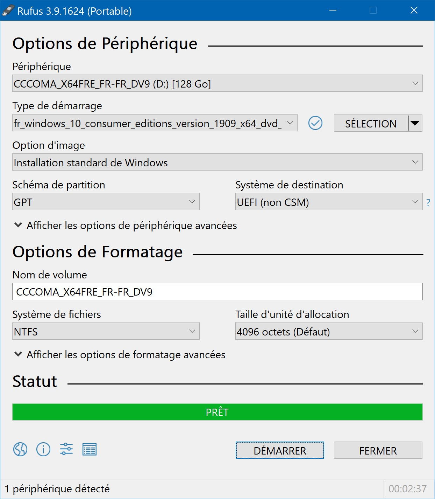

##### WoeUSB POUR LINUX

- installation:

```bash
sudo apt install git p7zip-full python3-pip python3-wxgtk4.0
sudo pip3 install WoeUSB-ng
```

:warning: Attention, les partitions de la clef USB ne doivent pas être monté sur le système de fichiers Linux

- Pour démonter une partition sur Linux:

```bash
# pour identifier le point de montage:
lsblk
# pour démonter la partiton
sudo umount /media/greg/cleUSB
```

> NOTE: Si une erreur apparaît lors de la création de la clef, le système de fichier de la partition n'est peux être pas formater en NTFS.

## WINDOWS SERVER

En entreprise, vous travaillerez sur des postes Linux ou Windows 10 (et bientôt Windows 11).
Cependant, si vous effectuez des travaux de maintenance ou déployement sur des serveurs, l'OS utilisée sera sensiblement différente, c'est Windows server.
La base reste la même, simplement que de nombreuses fonctionnalités supplémentaires seront présente afin de permettre de faire fonctionner et gérer les services inhérents à un server Windows.

### TELECHARGEMENT DE L'IMAGE WINDOWS SERVER 2022

> [WINDOWS SERVER 2022](https://www.microsoft.com/fr-fr/evalcenter/evaluate-windows-server-2022)

Lors du téléchargement de l'image Windows server, un formulaire d'informations est à remplir pour obtenir le lien de téléchargement de l'image d'une version d'évaluation (Windows...)

Le processus de création de clef reste le même que pour Windows 10

### PROCESSUS D'INSTALLATION DE L'OS SUR UNE MACHINE VIERGE

- Insérer la clef USB dans un port USB de la machine éteinte ou le DVD d'installation dans le lecteur DVD.

- Démarrer la machine et accéder au BIOS / UEFI (selon l'age de la machine)

- Changer l'ordre de démarrage (BOOT PRIORITY / BOOT ORDER) pour sélectionner la clef USB ou l'ISO selon le support que vous avez choisi.

- Appuyer sur <kbd>F10</kbd> puis <kbd>Enter</kbd> pour valider les modifications

- Une fois l'installateur Windows démarré, choisir la langue du système et du clavier puis cliquez sur Installer maintenant.

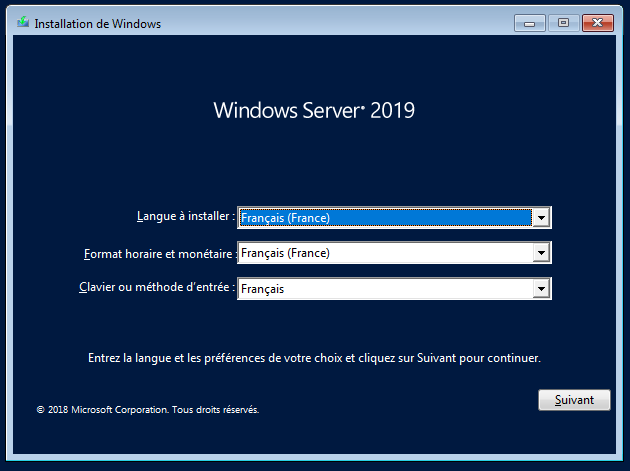

- Passez l'écran de saisie de clef produit (ou entrer en une dans le cas d'une installation "officielle" avec clef de liscence fournie par l'entreprise)

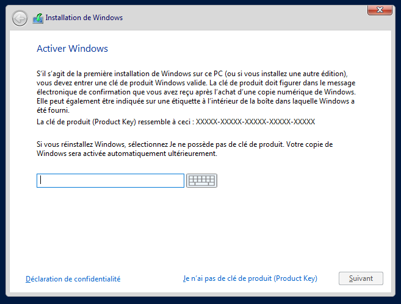

- Choisir le type d'installation (standard avec expérience de bureau)
> NOTE: La version standard sans l'expérience de bureau est dite "headless" sans interface graphique et la version "Datacenter" est une version spécifique vouée à l'installation sur des machines dans des datacenters.

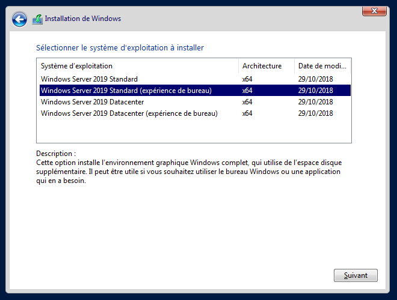

- Accepter le contrat de licence (un peu obligatoire)

- Choisir un type d'installation personnalisé

- Choisir le disque sur lequel Windows va s'installer

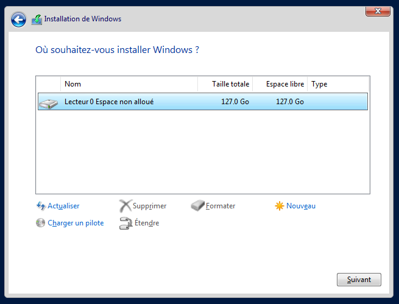

- Laisser Windows s'installer

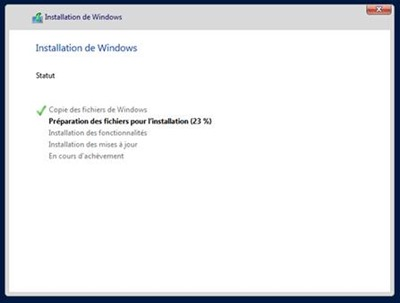

- Entrer le mot de passe administrateur

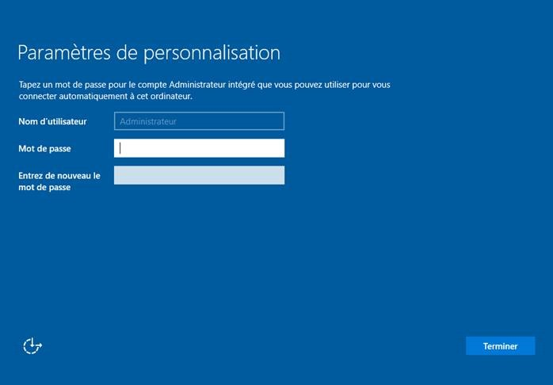

Windows server est installé!

