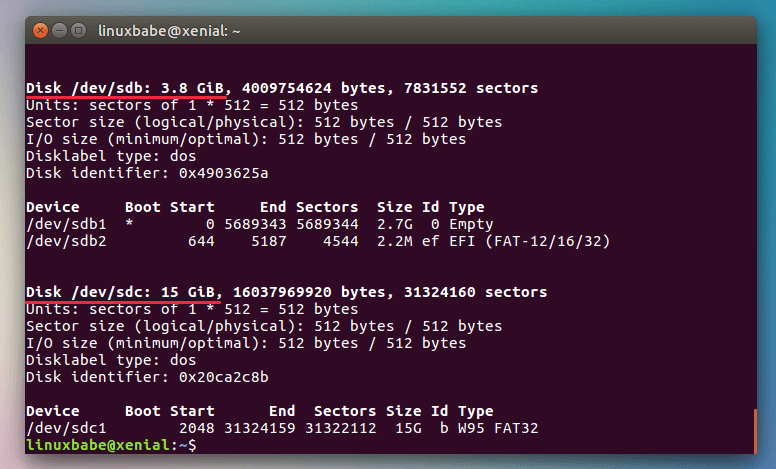
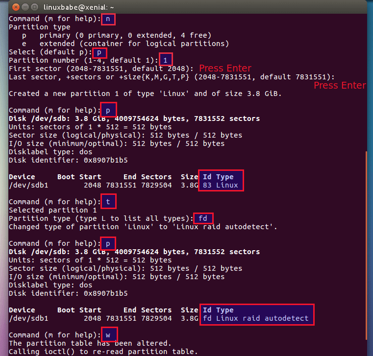
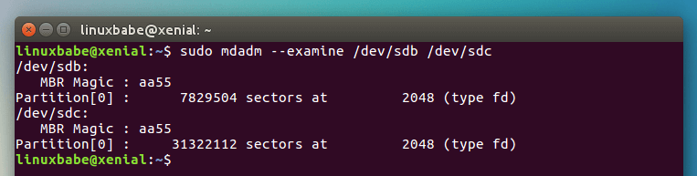
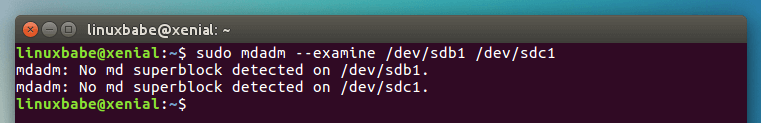
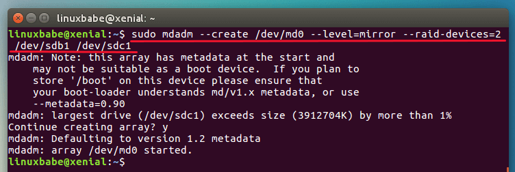
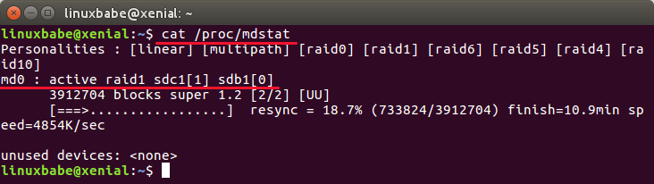
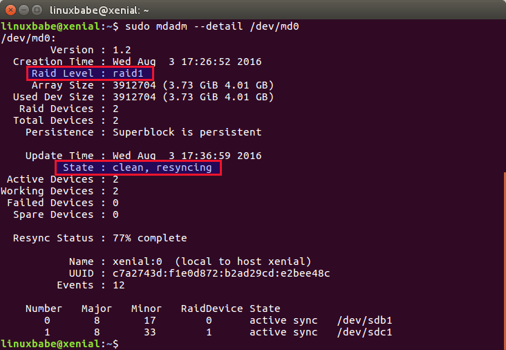
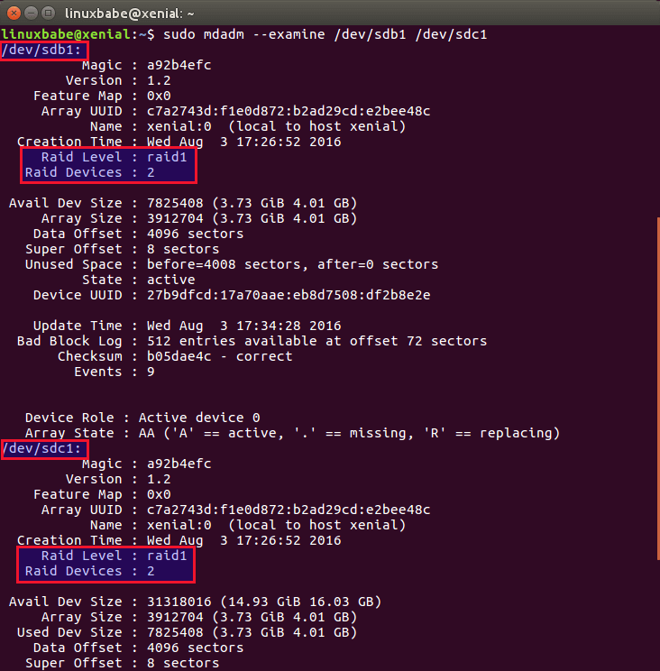
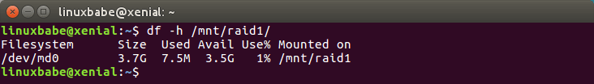

# Comment mettre en place un RAID 1 logiciel sur une distribution Linux existante

Qu'est-ce que le RAID ?

> RAID signifie Redundant Array of Inexpensive Disks (ensemble redondant de disques bon marché). RAID vous permet de transformer plusieurs disques durs physiques en un seul disque dur logique. Il existe de nombreux niveaux de RAID, tels que RAID 0, RAID 1, RAID 5, RAID 10, etc.
Le RAID 1 crée des copies identiques des données. Si vous avez deux disques durs en RAID 1, les données seront écrites sur les deux disques. Les deux disques durs auront les mêmes données.

- Avantage:
L'avantage du RAID 1 est que si l'un de vos disques durs tombe en panne, votre ordinateur ou serveur continuera de fonctionner car vous disposez d'une copie complète et intacte des données sur l'autre disque dur. Vous pouvez retirer le disque dur défaillant pendant que l'ordinateur fonctionne, insérer un nouveau disque dur, et il reconstruira automatiquement le miroir.
- Inconvénient: 
L'inconvénient du RAID 1 est que vous n'obtenez pas d'espace disque supplémentaire. Si vos deux disques durs font tous les deux 1 To, alors le volume utilisable total sera de 1 To au lieu de 2 To.
RAID matériel vs RAID logiciel.

Étapes de base pour créer un RAID 1 logiciel sous Linux: 

- Tout d'abord, vous devez avoir une distribution Linux installée sur votre disque dur. Ici /dev/sda.

- Vous avez besoin de deux disques durs qui seront nommés /dev/sdb et /dev/sdc Ces deux disques durs peuvent avoir des tailles différentes. 
> N'oubliez pas de sauvegarder vos données existantes avant de formater vos disques durs.

- Ensuite, nous créerons des systèmes de fichiers spéciaux sur /dev/sdb et /dev/sdc.

- Enfin, créez le tableau RAID 1 à l'aide de l'utilitaire mdadm.

## Étape 1 : Formater le disque dur

Insérez deux disques durs dans votre ordinateur Linux, puis ouvrez une fenêtre de terminal. Exécutez la commande suivante pour vérifier le nom du dispositif.

```bash
sudo fdisk -l
```



```bash
linux fdisk partition
```

Vous pouvez voir que le mien est /dev/sdb et /dev/sdc.

- Ensuite, exécutez les deux commandes suivantes pour créer une nouvelle table de partition MBR sur les deux disques durs. (Remarque : cela effacera toutes les partitions et les données existantes de ces deux disques durs. Assurez-vous de sauvegarder vos données.)

```bash
sudo parted /dev/sdb mklabel msdos
sudo parted /dev/sdc mklabel msdos
```

Vous pouvez créer une table de partition GPT en remplaçant "msdos" par "gpt", mais pour des raisons de compatibilité, ce tutoriel créera une table de partition MBR.

Ensuite, utilisez la commande fdisk pour créer une nouvelle partition sur chaque disque et formatez-les en tant que système de fichiers Linux autodétecté en RAID. Commencez par le faire sur /dev/sdb.

```bash
sudo fdisk /dev/sdb
```



Suivez les mêmes instructions pour créer une partition Linux autodétectée en RAID sur /dev/sdc:

- Tapez "n" pour créer une nouvelle partition.
- Tapez "p" pour sélectionner une partition principale.
- Tapez "1" pour créer /dev/sdb1.
- Appuyez sur Entrée pour choisir le premier secteur par défaut.
- Appuyez sur Entrée pour choisir le dernier secteur par défaut. Cette partition s'étendra sur l'ensemble du disque.
- En tapant "p", vous pouvez afficher des informations sur la partition nouvellement créée. Par défaut, le type de partition est Linux.
- Nous devons changer le type de partition, alors tapez "t".
- Tapez "fd" pour définir le type de partition sur Linux autodétecté en RAID.
- Tapez à nouveau "p" pour vérifier le type de partition.
- Tapez "w" pour appliquer les changements ci-dessus.

> Maintenant, nous avons deux dispositifs RAID, /dev/sdb1 et /dev/sdc1.

## Étape 2 : Installer mdadm

[MDADM](https://fr.wikipedia.org/wiki/Mdadm) est utilisé pour gérer les dispositifs MD (multiples dispositifs), également connus sous le nom de RAID logiciel Linux.  
Pour installer mdadm selon votre distribution de Linux:
* Debian/Ubuntu : sudo apt install mdadm
* CentOS/Redhat : sudo yum install mdadm
* SUSE : sudo zypper install mdadm
* Arch Linux : sudo pacman -S mdadm

Examinons les deux dispositifs:

```bash
sudo mdadm --examine /dev/sdb /dev/sdc
```



Vous pouvez voir que les deux sont de type "fd" (Linux autodétecté en RAID). À ce stade, il n'y a pas de configuration RAID sur /dev/sdb1 et /dev/sdc1, ce qui peut être déduit avec cette commande:

```bash
sudo mdadm --examine /dev/sdb1 /dev/sdc1
```



## Étape 3 : Créer un lecteur logique RAID 1

#### Exécutez la commande suivante pour créer un RAID 1. Le lecteur logique sera nommé /dev/md0.

```bash
sudo mdadm --create /dev/md0 --level=mirror --raid-devices=2 /dev/sdb1 /dev/sdc1
```



:warning: Remarque : Si vous voyez ce message : "Device or resource busy" (Appareil ou ressource occupé), vous devrez peut-être redémarrer le système d'exploitation.

Maintenant, nous pouvons le vérifier avec :

```bash
cat /proc/mdstat
```



Vous pouvez voir que md0 est actif et qu'il s'agit d'une configuration RAID 1. Pour obtenir des informations plus détaillées sur /dev/md0, vous pouvez utiliser les commandes ci-dessous :

```bash
sudo mdadm --detail /dev/md0
```



Pour obtenir des informations détaillées sur chaque dispositif RAID, exécutez cette commande :

```bash
sudo mdadm --examine /dev/sdb1 /dev/sdc1
```



## Étape 4 : Créer un système de fichiers sur le lecteur logique RAID 1

#### Formatez-le en système de fichiers ext4.

```bash
sudo mkfs.ext4 /dev/md0
```

#### Créer un point de montage /mnt/raid1 et montez le lecteur RAID 1

```bash
sudo mkdir /mnt/raid1
sudo mount /dev/md0 /mnt/raid1
```

Vous pouvez utiliser cette commande pour vérifier la quantité d'espace disque dont vous disposez.

```bash
df -h /mnt/raid1
```



> Rappelez-vous que si vous utilisez un logiciel de sauvegarde de disque tel que Clonezilla, vous devez restaurer les données sur le lecteur logique RAID, pas sur le disque physique.

#### Sauvegarder notre configuration RAID1 avec la commande suivante:

```bash
sudo mdadm --detail --scan --verbose | sudo tee -a /etc/mdadm/mdadm.conf
```

Sortie :

```bash
ARRAY /dev/md/0 level=raid1 num-devices=2 metadata=1.2 spares=1 name=xenial:0 UUID=c7a2743d:f1e0d872:b2ad29cd:e2bee48c
- devices=/dev/sdb1,/dev/sdc1
```

> Sur certaines distributions Linux telles que CentOS, le fichier de configuration pour mdadm se trouve dans /etc/mdadm/mdadm.conf. Vous devrez exécuter la commande suivante pour générer une nouvelle image initramfs après avoir exécuté la commande ci-dessus.

```bash
sudo update-initramfs -u
```

#### Pour monter automatiquement le lecteur logique RAID 1 au démarrage, ajouter une entrée dans le fichier /etc/fstab comme suit:

```bash
/dev/md0   /mnt/raid1   ext4   defaults   0   0
```

Vous pouvez également utiliser l'option x-gvfs-show, qui vous permettra de voir votre RAID1 dans la barre latérale de votre gestionnaire de fichiers.

```bash
/dev/md0  /mnt/raid1   ext4- defaults,x-gvfs-show   0   0
```

#### Comment supprimer le RAID:

Si vous ne souhaitez plus utiliser le RAID, exécutez la commande suivante pour le supprimer.

```bash
sudo umount /mnt/raid1
sudo mdadm --remove /dev/md0
```

Ensuite, éditez le fichier mdadm.conf et commentez la définition RAID :

```bash
#ARRAY /dev/md0 level=raid1 num-devices=2 metadata=1.2 spares=1 name=bionic:0 UUID=76c80bd0:6b1fe526:90807435:99030af9
#  devices=/dev/sda1,/dev/sdb1
```

:warning: De plus, éditez le fichier /etc/fstab et commentez la ligne qui active le montage automatique du dispositif RAID.

