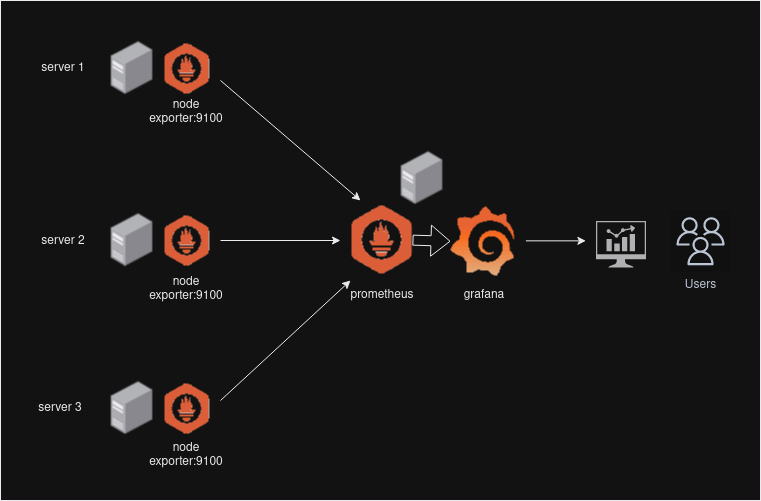

# PROMETHEUS & GRAFANA :bar_chart:

Ce projet vise à monitorer des serveurs via prometheus pour centraliser le scraping, node exporter pour les host metrics, cadvisor pour les metrics des conteneurs docker et grafana pour afficher les metrics sous forme de dashboards



## PREREQUIS :memo:

- [docker + compose plugin]() :whale:

## CONFIGURATION :wrench:

### ALERTES VIA EMAIL :mail:

#### VIA ALERTMANAGER

- Configuration de la boîte mail pour les alertes:
```bash
nano alertmanager/alertmanager.yml
```

> Renseigner les champs:

```yml

```

- Configuration des alertes:
```bash
nano alertmanager/alert.rules
```

> Renseigner les champs:

```

```

#### VIA GRAFANA

- Configuration de la boîte mail pour les alertes:
```bash
nano grafana/config/grafana.ini
```

> Renseigner les champs:

```

```

- Configuration du notifier (email) par ddefault:
```bash
nano grafana/provisioning/notifiers.yml
```

> Renseigner les champs:

```yml

```

- Commenter alermanager dans le docker-compose.yml:
```bash
sed -i "" docker-compose.yml
```

### GRAFANA SSO KEYCLOAK :key:

- Créer un client sur keycloak en confidential pour obtenir le client-secret
- Entrer le nom de domaine de votre instance grafana
- Editer le fichier grafana/grafana.ini:
```ini
[server]
# The http port  to use
http_port = 3000
# The public facing domain name used to access grafana from a browser
domain = grafana.votre-domaine.tld

...

[auth.generic_oauth]
enabled = true
scopes = openid email profile
name = Oauth
tls_skip_verify_insecure = true
allow_sign_up = true
client_id = grafana
client_secret = <client-secret-de-keycloak>
auth_url = https://votre-keycloak/auth/realms/votre-royaume/protocol/openid-connect/auth
token_url = https://votre-keycloak/auth/realms/votre-royaume/protocol/openid-connect/token
api_url = https://votre-keycloak/auth/realms/votre-royaume/protocol/openid-connect/userinfo

# Pour ne laisser que l'authentification keycloak
#disable_login_form = true
```

## UTILISATION :checkered_flag:

- Démarrer la stack:
```bash
docker compose up -d
```

> Grafana est accessible via l'adresse: http://<IP-SERVER>:3000

### NODE EXPORTER TLS :link:

Pour déployer un node exporter sur un serveur distant:
> voir branche [node-exporter](https://git.legaragenumerique.fr/GARAGENUM/prometheus-monitoring/src/branch/node-exporter)


## TO DO :bookmark_tabs:

- [x] node exporter
- [x] node exporter -> prometheus via https
- [x] alert manager config / grafana alert via mail config
- [x] provision dashboard / notifier par default
- [ ] dashboard for Grafana amd64:
    - [x] host metrics
    - [ ] cadvisor for docker
- [ ] config alertes sous grafana + images
