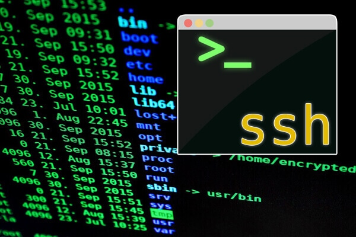
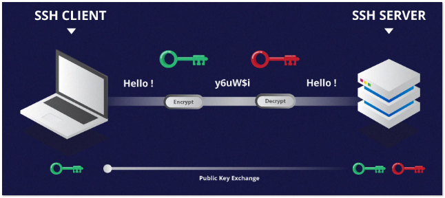
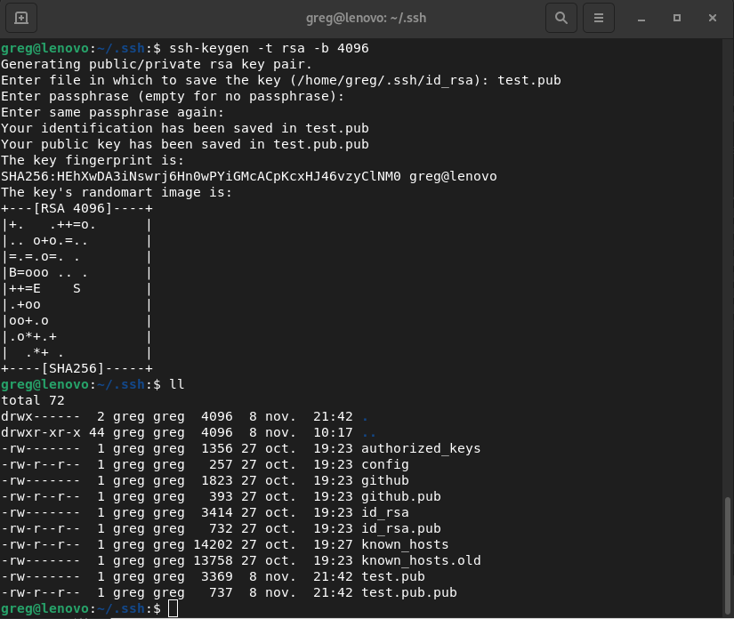
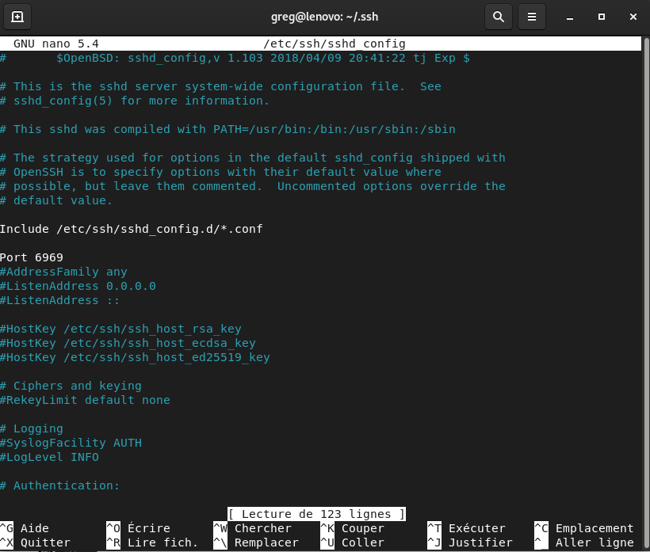
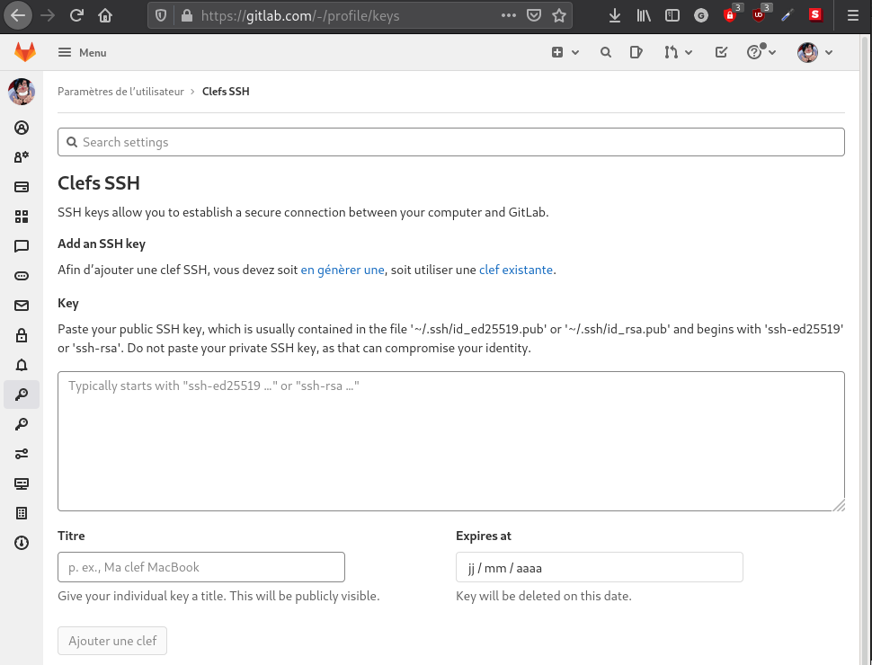

# SSH

  

## DEFINITION

Secure Shell (SSH) est à la fois un programme informatique et un protocole de communication sécurisé. 
Le protocole de connexion impose un échange de clés de chiffrement en début de connexion. Par la suite, 
tous les segments TCP sont authentifiés et chiffrés.
Le protocole SSH a été conçu avec l'objectif de remplacer les différents protocoles non chiffrés comme 
rlogin, telnet, rcp et rsh. 

Le protocole SSH existe en deux versions majeures : la version 1.0 et la version 2.0
    - La première version permet de se connecter à distance à un ordinateur afin d'obtenir un shell ou ligne de commande. Cette version souffrait néanmoins de problèmes de sécurité dans la vérification de l'intégrité des données envoyées ou reçues, la rendant vulnérable à des attaques actives. En outre, cette version implémentait un système sommaire de transmission de fichiers, et du port tunneling.
    - La version 2 qui était à l'état de brouillon jusqu'en janvier 2006 est largement utilisée à travers le monde.
    Cette version est beaucoup plus sûre au niveau cryptographique, et possède en plus un protocole de transfert de fichiers complet, le SSH file transfer protocol (SCP)

## PRINCIPE

Le client envoie sa clef publique (verte) au server, le serveur envoie sa clef publique plus une clef unique crée à partir des deux clefs publiques (rouge).
Les deux machines étant les seules à connaître la clef unique (rouge), ils utilisent celle-ci pour crypté les échanges.



## MANUAL

Comme tout binaire linux, un manuel d'utilisation est disponible via la commande:

```bash
man ssh
```

## INSTALLATION DU SERVEUR SSH

```bash
sudo apt install openssh-server -y
```

## CREATION DES CLEFS

```bash
ssh-keygen -t rsa -b 4096
```



## CONFIGURATION 

### A) ~/.SSH/CONFIG

Pour configurer les connexions vers des hôtes avec des paramètres particuliers:
```bash
nano ~/.ssh/config
```

- exemple de configuration:
```bash
Host server-prod
    Hostname 29.30.231.132
    User John
    Port 2525
    # (optionnel) pour préciser une clé ssh
    IdentityFile ~/.ssh/id_rsa.pub
```

### B) /ETC/SSHD/SSHD_CONFIG

pour configurer les accès ssh part alias pour l'hôte:
```bash
sudo nano /etc/ssh/sshd_config
```



## UTILISATION

- Exemple de commande pour se connecter à la machine "host" avec l'utilisateur "user" si le port d'écoute ssh est règlé sur le 9999:

```bash
ssh -p 9999 user@host
```

### A) ECHANGE DE CLEFS AVEC UNE AUTRE MACHINE

Cette commande sert à échanger les clefs avec une machine distante dans le but de se connecter sans demande d'accrédidations:

```bash
ssh-copy-id -i ~/.ssh/ssh-key.pub user@host
```

> Cette action permet de ne plus entrer le mot de passe à chaque connection

### B) AJOUTER UNE CLEF A GITLAB / GITHUB / GITEA

Nous pouvons attribuer une clef publique à un compte Gitlab ou Github afin de s'émanciper de la demande d'acréditation des commandes ssh ou git push ou git clone un registre distant privé.

On affiche la clef publique:
```bash
cat ~/.ssh/id_rsa.pub
```

On Copie le résultat dans l'onglet ssh keys des préférences du compte, dans l'encart prévue à cet effet (Key)  

> Notes: les parties du type de cryptage au début (ssh-rsa) ainsi que le user@host à la fin font partie intégrante de la clef, ne pas les omettre.



Pour plus d'explications: https://docs.gitlab.com/ee/ssh/index.html#see-if-you-have-an-existing-ssh-key-pair

### C) LA COPIE AVEC SCP

La commande SCP permet de copier des fichiers d'une machine à l'autre de manière chiffrée.<br>
- De la machine locale vers une machine distante:
```bash
scp /dossier/source/ user@host:/dossier/destination
```

- D'une machine distante vers la machine locale:
```bash
scp user@host:/dossier/source/ /dossier/destination/
```

* Note: remplacer "user" par le nom d'utilisateur et "host" par l'IP de la machine distante.

### D) SECURISER LA CONNECTION SSH

Afin de sécuriser la connection par ssh qui constitue une surface d'attaque, nous pouvons renforcer la sécurité en modifiant la configuration:
```bash
sudo nano /etc/ssh/sshd_config
```

```bash
# ne pas autoriser d'authentification par mot de passe, seulement par clé publique
PasswordAuthentication no
PublicKeyAuthentication yes
# ne pas autoriser de mot de passe vide
PermitEmptyPasswords no
#ne pas autoriser de login en utilisateur root
PermitRootLogin no
# autoriser seulement ces utilisateurs
AllowUsers user1 user2
```
> Penser à redémarrer le service pour recharger la configuration et valider les changements avec la commande: sudo systemctl restart ssh

### E) AUTRES COMMANDES UTILES

- Autre commande de copie de clef:
```bash
cat ~/.ssh/id_rsa.pub | ssh username@remote_host "mkdir -p ~/.ssh && cat >> ~/.ssh/authorized_keys"
```

- Commande pour redémarrer le service (en cas de changements dans les fichiers de configuration):
```bash
sudo systemctl restart ssh
# OU
sudo systemctl restart sshd
```

## REFERENCE

- [DOC UBUNTU](https://doc.ubuntu-fr.org/ssh)
- [DOC GARAGE](https://garagenum.gitlab.io/doc/divers/git/git/)