# OUTILS


## PLAN
<!-- TOC -->

- [OUTILS](#outils)
    - [PLAN](#plan)
    - [INTRODUCTION](#introduction)
    - [LES OUTILS](#les-outils)
        - [GIT SCM](#git-scm)
            - [INSTALLATION](#installation)
                - [WINDOWS](#windows)
                - [LINUX](#linux)
            - [UTILISATION](#utilisation)
        - [VIRTUALBOX](#virtualbox)
            - [INSTALLATION](#installation)
            - [UTILISATION](#utilisation)
        - [VSCODIUM](#vscodium)
            - [INSTALLATION](#installation)
            - [UTILISATION](#utilisation)

<!-- /TOC -->

## INTRODUCTION

Pour bien travailler, il faut de bon outils!
> Citation: "Les bons outils font les bons ouvriers"

Dans le cadre de la spécialité devops, les outils essentiels sont un gestionnaire de code source (Git), un outil de virtualisation pour créer des machines virtuelles de test (Virtualbox) et un éditeur de code (VScodium).

## LES OUTILS

### GIT (SCM)

Git est un gestionnaire de code source qui permet de garder les différentes versions du code produit sur des dépôts distants afin d'assurer sa conservation au delà de notre machine.

#### INSTALLATION

##### WINDOWS

Pour Windows, l'installation de Git Bash permet d'avoir l'outil Git ainsi qu'un terminal interprétant le Bash (natif à Linux mais pas à Windows)

Pour l'installer, se rendre à [cette adresse](https://git-scm.com/download/win), vous pouvez le télécharger en version dite "standalone" et en version portable.

##### LINUX

Pour Linux, Git est disponible dans les dépôts officiels et est installable via la commande:

```bash
sudo apt install git -y
```

#### UTILISATION

Une fois l'installation faite, l'utilisation de Git s'effectue généralement sur le terminal par ligne de commandes.

> NOTE: Il est utilisable par interface graphique ou par extensions dans VScodium mais la bonne pratique pour comprendre les commandes de cet outil implique son utilisation en ligne de commande via la CLI (Command Line Interface).

Vous trouverez le "workflow" ainsi que les commandes utiles dans [la doc du garage numérique](https://garagenum.gitlab.io/doc/divers/git/git/)

### VIRTUALBOX

Virtualbox est un outil de virtualisation qui permet de simuler des machines sous n'importe quel OS en dédiant une partie des ressources (CPU, Ram et espace disque) de la machine hôte celles-ci.

Cela permet de créer un environnement de test (sanbox) sans risquer d'endommager sa propre OS.
En cas de "raté" ou problème sur la VM, on peux détruire cell-ci et repartir sur une base d'OS saine (vierge).

> NOTE: Une bonne pratique est de créer une VM puis de cloner celle-ci et d'effectuer ces tests sur le clone, comme cela en cas de problème, on repart d'un clone de la VM de base sans réinstaller celle-ci de zéro.

#### INSTALLATION

Vous trouverez les installateurs pour Windows ou Linux à [cette adresse](https://www.virtualbox.org/wiki/Download_Old_Builds_6_1)

#### UTILISATION

- Une fois Virtualbox démarrer, cliquer sur Nouvelle pour créer une nouvelle machine virtuelle:

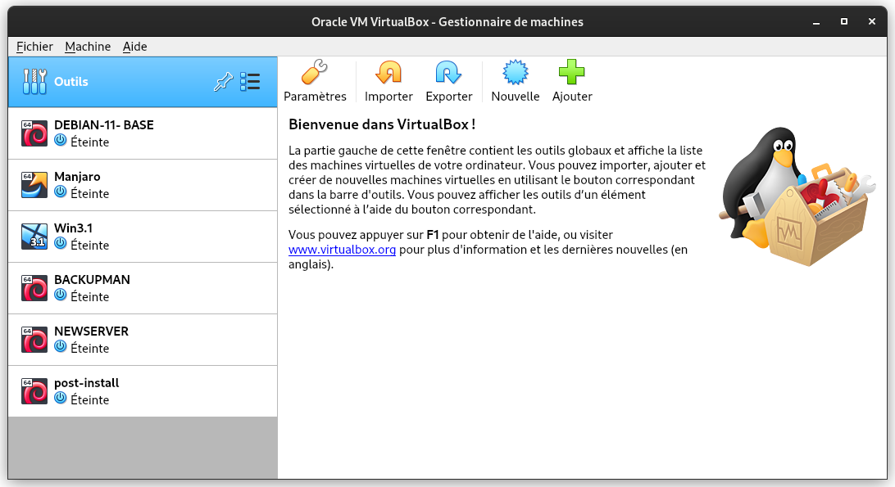

- Dans cette fenêtre, on va pouvoir choisir le nom de la VM, son type (Windows, Linux, etc...), son architecture (32 ou 64 bits) et son emplacement dans les système de fichier de la machine hôte.

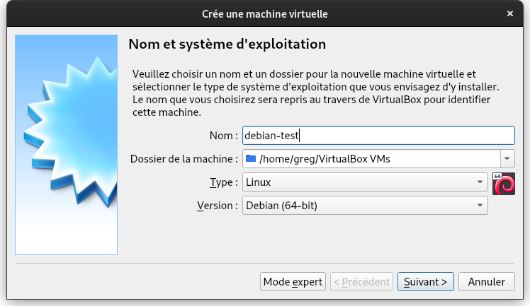

- Ensuite vient l'allocation de la mémoire vive (Ram)
> NOTE: Veiller à ne pas trop allouer de mémoire pour la VM au détriment de la machine hôte.

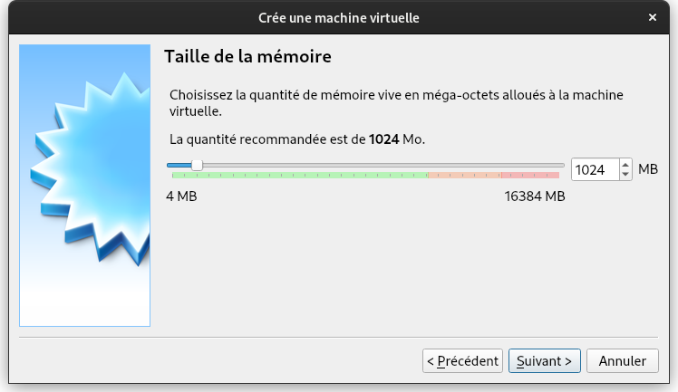

- On choisi de créer un disque dur virtuel où va s'installer l'OS de la VM
> NOTE: Vbox vous propose généralement un minimum en fonction du type d'OS sélectionné. Si vous voulez pouvoir travailler sur la VM et installer des applicatifs, il préconisé d'allouer plus que ce qui est sélectionné de base.

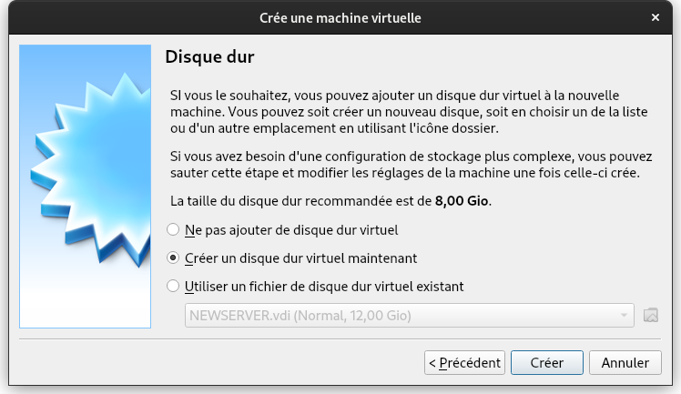

- On choisi le type de VDI même si le "dynamiquement alloué" sensé permettre l'extension automatique du volume à mesure que celui-ci se remplit n'est pas vraiment fiable.

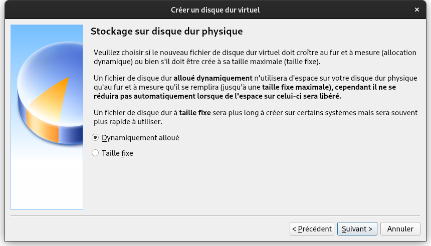

- Dans les options système, on peux choisir l'ordre de démarrage (Disquette, Disque dur, Réseau, etc...).
Dans un premier temps on insèrera une image (iso) d'une OS à installer dans le lecteur optique virtuel. Une fois l'installation faite, on mettra le disque dur en premier sur l'ordre de démarrage.

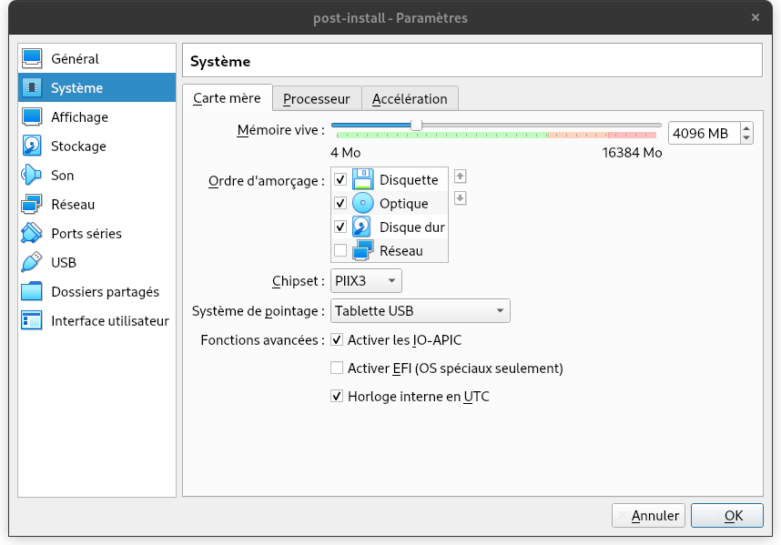

- L'affichage est généralement fonctionnel par défaut et ne nécessite aucun réglage spécifique.

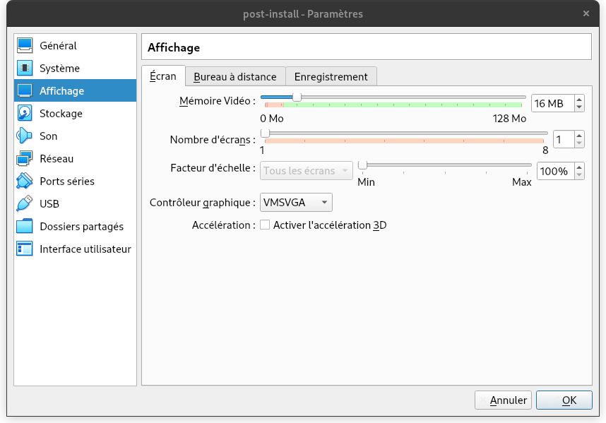

- C'est au niveau du stockage dans le lecteur optique que nous allons insérer l'ISO de l'OS à installer.

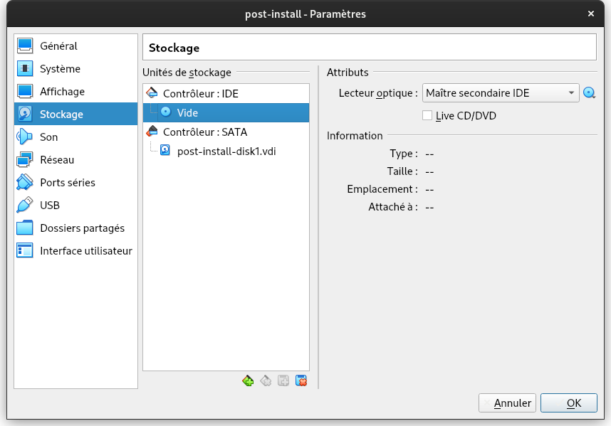

- Les réglages réseaux sont importants, ils définissent comment votre VM va se connecter au réseau. Pour des raisons pratiques, on sélectionne "Bridge" (pont) avec le matériel réseau pour que la VM soit vue par le réseau comme une machine à part entière.

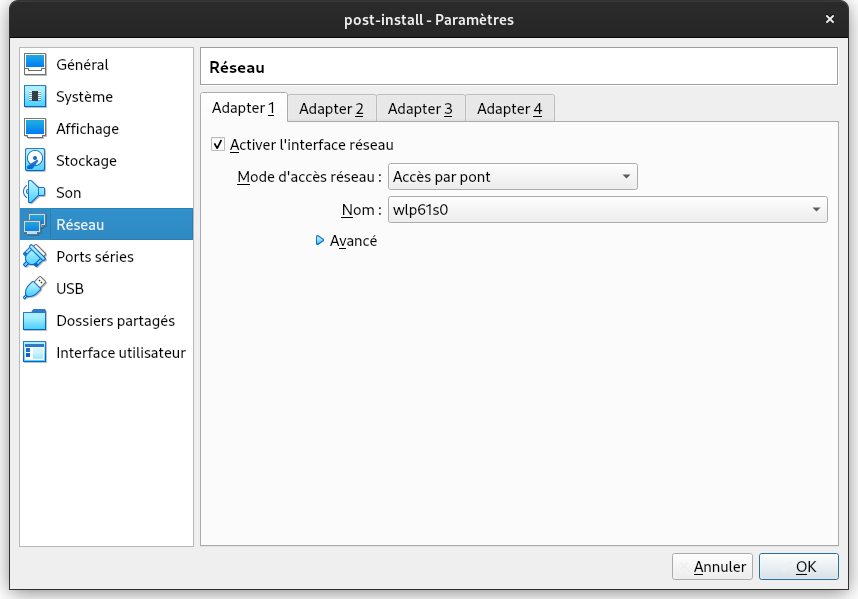

- Enfin dans l'onglet USB, on peut définir le type de Drivers (USB 1, 2 ou 3) avec lequel la VM va intéragir avec les éventuels périphériques USB que l'on va y insérer.

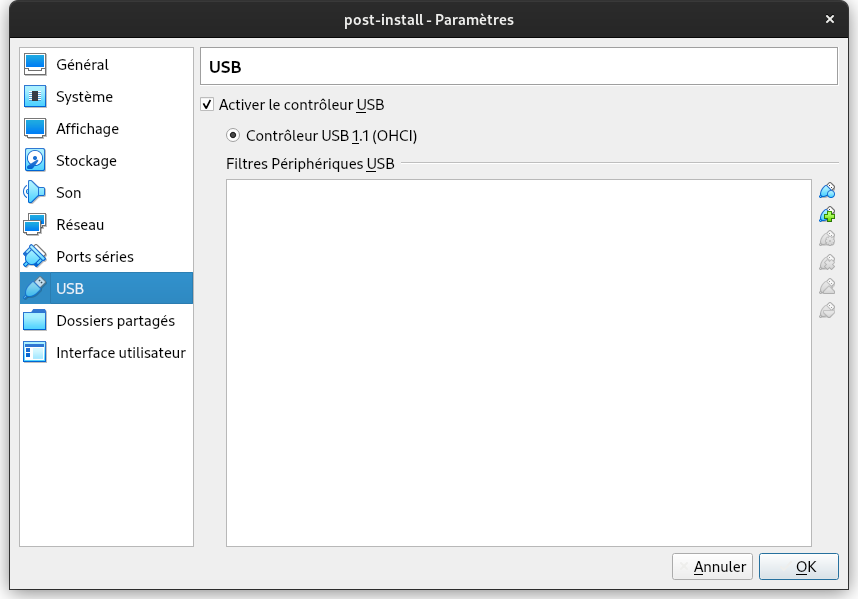

- Une fois la configuration effectuée, nous pouvons démarrer la VM qui va dans un premier temps démarrer sur le lecteur optique pour éfectuer l'installation de l'OS.

> NOTE: Voir le cours [installations](https://gitlab.com/cours2021/installations/-/tree/linux) pour les étapes d'installation d'une OS Debian.


### VSCODIUM

VScodium est un IDE (integrated development environment), est un ensemble d'outils qui permet d'augmenter la productivité des programmeurs qui développent des logiciels. 
Il comporte un éditeur de texte destiné à la programmation, des fonctions qui permettent, par pression sur un bouton, de démarrer le compilateur ou l'éditeur de liens ainsi qu'un débogueur en ligne, qui permet d'exécuter ligne par ligne le programme en cours de construction.

#### INSTALLATION

Pour son installation, selon l'OS concerné, vous pouvez vous référer à [cette page](https://vscodium.com/#install)

#### UTILISATION

Une fois démarré, interface est simple: elle fonctionne comme un navigateur web avec un principe d'onglets par fichier ouvert.

A gauche se trouve la barre de naviation qui permet:
- D'afficher l'arborescence du projet (si vous avez ouvert un dossier contenant de multiples fichier du projet)
- D'effectuer une recherche
- De contrôler le code source sur le fichier fait partie d'un dossier Git
- De lançer le projet / compiler celui-ci / débugger
- D'installer des extensions à VScodium ajoutant des fonctionnalités à l'outil

> Dans l'image ci-dessous, l'extension Docker permet de voir les containers, images, registries, etc... se trouvant sur notre machine. Cela permet d'intéragir avec l'outil Docker sans passer par la ligne de commande.

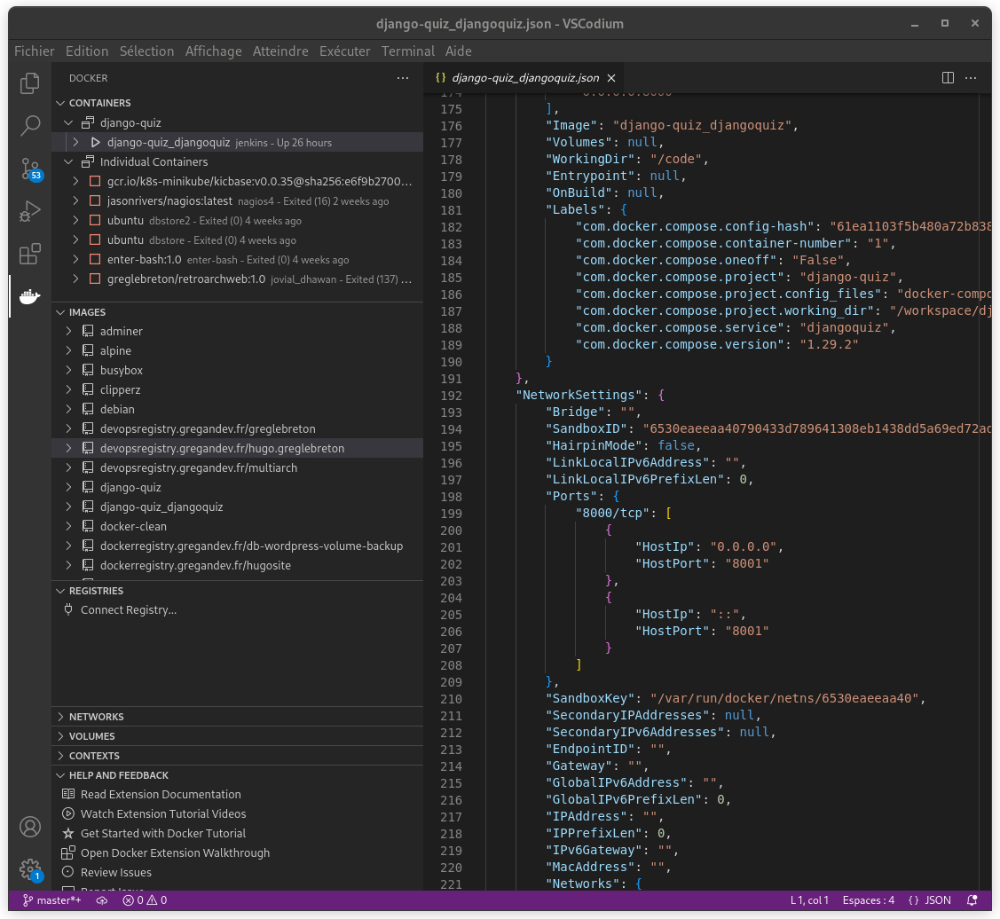

### WINDOWS WSL

> Note: Windows Subsystem for Linux

- Activer virtualisation dans le BIOS

- Ouvrir Powershell en administrateur et entrer:

```
wsl --install -d Debian
```

### TABBY

- Télécharger Tabby pour Windows:

https://github.com/Eugeny/tabby/releases/download/v1.0.189/tabby-1.0.189-setup-x64.exe


- Configurer Tabby pour utiliser le shell de Debian:

    - Aller dans Paramètres -> Profiles et connections
    - Cliquer sur New profile
    - choisir OD default(WSL / Debian) C:\Windows\system32\wsl.exe
